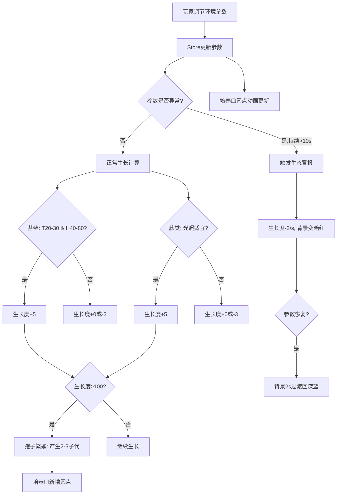

## 1. 产品概述

微型实验室生态缸模拟与杂交育种游戏——玩家在废弃实验室的虚拟培养皿中培育、杂交不同品种的发光苔藓和蕨类植物，通过实时调节温度、湿度、光照和CO₂浓度维持微型生态循环，应对生态危机事件，解锁生存成就。

- 核心目标：以模拟经营+育种杂交为核心玩法，提供沉浸式深色科幻风格实验室体验
- 目标用户：喜欢放置类/模拟经营/育种玩法的休闲玩家

## 2. 核心功能

### 2.1 功能模块

1. **主页面（单页应用）**：顶部状态栏 + 中央培养皿区 + 左侧环境控制面板 + 右侧杂交面板 + 底部统计面板

### 2.2 页面详情

| 页面名称 | 模块名称 | 功能描述 |
|----------|----------|----------|
| 主页面 | 顶部状态栏 | 显示生态警报横幅、成就提示横幅 |
| 主页面 | 中央培养皿区（CultureDish） | 圆形培养皿，渲染发光植物圆点（呼吸缩放动画），点击圆点弹出品种信息浮窗 |
| 主页面 | 左侧环境控制面板（EcoPanel） | 四个滑块调节温度/湿度/光照/CO₂，滑块上方显示当前值和增量变化箭头 |
| 主页面 | 右侧杂交面板（HybridPanel） | 品种列表、杂交操作按钮、杂交结果预览卡片 |
| 主页面 | 底部统计面板 | 存活植物总数、已杂交次数、最长连续稳定天数、成就解锁状态 |

## 3. 核心流程

### 3.1 环境参数调控流程

玩家拖动滑块 → store.setParam更新参数 → 参数变化触发植物生长度计算 → 培养皿圆点大小动画更新

### 3.2 生长模拟流程

每30秒为一个模拟天 → 检测温度湿度组合 → 苔藓/蕨类分别计算生长增量 → 生长度达100触发孢子繁殖 → 产生2-3个子代小圆点

### 3.3 杂交育种流程

选取两个品种 → 点击杂交按钮 → 基因算法生成新种（HSL插值+抗逆性加权） → 预览卡片展示 → 点击"放入培养皿"添加到store

### 3.4 生态危机流程

参数异常持续10秒 → 触发生态警报 → 生长度每秒减2 + 背景变暗红 → 参数恢复 → 背景2秒过渡回深蓝

### 3.5 核心流程图

## 4. 用户界面设计

### 4.1 设计风格

- 主背景色：深蓝黑 `#0f0f23`
- 次级背景色：`#1a1a2e`
- 面板：半透明毛玻璃效果（backdrop-filter:blur(8px)，背景rgba(255,255,255,0.06)）
- 圆角统一 `8px`
- 培养皿：圆形区域 border-radius:50%，径向渐变 #1a1a2e→#16213e
- 警报状态培养皿：渐变 #2b1a1a→#3e1a1a
- 字体：科幻感等宽/无衬线字体
- 配色：深色科幻主题，荧光色点缀

### 4.2 页面设计概览

| 页面名称 | 模块名称 | UI元素 |
|----------|----------|--------|
| 主页面 | 中央培养皿区 | 圆形区域(60%宽度)，径向渐变背景，发光圆点(呼吸缩放+微旋转)，点击浮窗 |
| 主页面 | 环境控制面板 | 20%宽度，毛玻璃面板，4个渐变色条滑块(蓝→红/蓝→白/黄→白/绿→红) |
| 主页面 | 杂交面板 | 20%宽度，毛玻璃面板，品种列表，杂交按钮，预览卡片(悬停上移4px+投影) |
| 主页面 | 顶部状态栏 | 警报横幅(暗红背景)、成就横幅(半透明磨砂，白色文字，2s自动消失) |
| 主页面 | 底部统计面板 | 右侧，3个统计数据 + 成就状态 |

### 4.3 响应式适配

- 桌面优先设计，适配 1920×1080 和 1440×900
- 使用 flex 布局自动居中
- 中央培养皿 60%，左右面板各 20%

### 4.4 动画效果

- 植物圆点：framer-motion 呼吸缩放(scale 0.95-1.05，3秒周期) + 微旋转(0-5deg)
- 环境参数增量：绿色上箭头/红色下箭头
- 杂交预览卡片：hover 上移4px + 投影
- 生态警报：背景渐变过渡
- 成就横幅：半透明磨砂背景，2秒后自动消失
