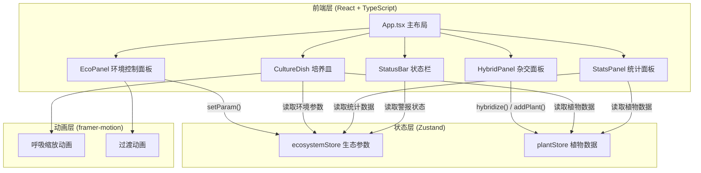
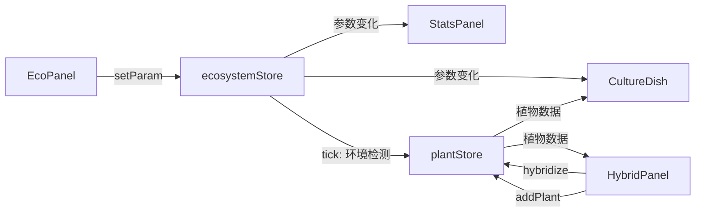

## 1. 架构设计



## 2. 技术说明

- 前端框架：React 18 + TypeScript (严格模式, target es2020)
- 构建工具：Vite + @vitejs/plugin-react
- 状态管理：Zustand
- 动画库：framer-motion
- 初始化工具：vite-init (react-ts 模板)
- 后端：无（纯前端应用）
- 数据库：无（状态全部在内存中管理）

## 3. 路由定义

| 路由 | 用途 |
|------|------|
| / | 单页应用主页面，包含所有功能模块 |

## 4. 数据模型

### 4.1 ecosystemStore 状态模型

```typescript
interface EcosystemState {
  temperature: number;    // 15-45°C，默认25
  humidity: number;       // 20-100%，默认55
  light: number;          // 500-8000lux，默认3000
  co2: number;            // 300-2000ppm，默认500
  alertActive: boolean;   // 生态警报是否激活
  alertStartTime: number | null; // 警报开始时间
  stableSeconds: number;  // 连续稳定秒数
  maxStableDays: number;  // 最长连续稳定天数
  setParam: (key: string, value: number) => void;
  tick: () => void;       // 每秒更新
}
```

### 4.2 plantStore 状态模型

```typescript
interface Plant {
  id: string;
  name: string;
  type: 'moss' | 'fern';   // 苔藓或蕨类
  glowColor: { h: number; s: number; l: number }; // 发光色HSL
  growth: number;           // 生长度 0-100
  resilience: number;       // 抗逆性 0-1
  x: number;               // 培养皿中x位置(0-1)
  y: number;               // 培养皿中y位置(0-1)
  isSpawning: boolean;     // 是否正在孢子繁殖
}

interface PlantState {
  plants: Plant[];
  hybridCount: number;
  addPlant: (plant: Plant) => void;
  hybridize: (parent1: Plant, parent2: Plant) => Plant;
  updateGrowth: (ecosystem: EcosystemState) => void;
}
```

### 4.3 数据流向图



## 5. 文件结构与调用关系

```
project/
├── package.json              # 依赖与脚本
├── vite.config.js            # Vite构建配置
├── tsconfig.json             # TypeScript严格模式配置
├── index.html                # 入口HTML，加载main.tsx
└── src/
    ├── main.tsx              # React根渲染入口 → App.tsx
    ├── App.tsx               # 主布局：组合StatusBar + EcoPanel + CultureDish + HybridPanel + StatsPanel
    ├── store/
    │   ├── ecosystemStore.ts # Zustand: 温度/湿度/光照/CO2 → 供App/EcoPanel/CultureDish/StatsPanel调用
    │   └── plantStore.ts     # Zustand: 植物品种/杂交 → 供App/HybridPanel/CultureDish调用
    └── components/
        ├── EcoPanel.tsx      # 环境控制面板 → 调用ecosystemStore.setParam
        ├── HybridPanel.tsx   # 杂交操作面板 → 调用plantStore.hybridize/addPlant
        ├── CultureDish.tsx   # 培养皿主视图 → 读取plantStore/ecosystemStore，framer-motion动画
        ├── StatsPanel.tsx    # 统计面板 → 读取plantStore/ecosystemStore
        └── StatusBar.tsx     # 状态栏 → 读取ecosystemStore警报状态
```

## 6. 性能优化策略

- CultureDish 组件使用 React.memo 包裹，避免无关刷新
- Zustand subscribe 精确选择所需切片，减少渲染范围
- 植物圆点使用 framer-motion 的 `layoutId` 优化重排
- 15+植物圆点呼吸动画时使用 `will-change: transform` 提示GPU加速
- 生长度计算使用 requestAnimationFrame 节流
