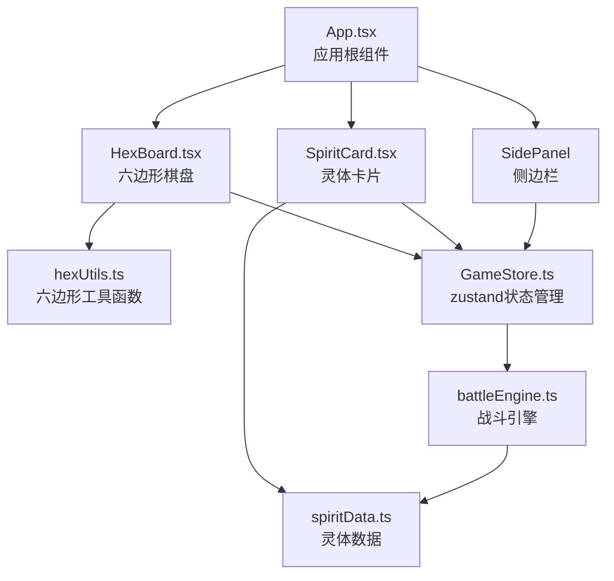

## 1. 架构设计



## 2. 技术描述

- 前端框架：React 18 + TypeScript（严格模式）
- 构建工具：Vite
- 状态管理：zustand
- 动画库：framer-motion
- 图形渲染：Canvas API + framer-motion
- 样式：CSS Modules + 全局CSS

## 3. 目录结构

```
src/
├── modules/
│   ├── board/
│   │   ├── HexBoard.tsx      # 六边形棋盘组件
│   │   └── hexUtils.ts       # 六边形网格计算工具
│   ├── entities/
│   │   ├── SpiritCard.tsx    # 灵体卡片组件
│   │   └── spiritData.ts     # 灵体数据定义
│   ├── game/
│   │   ├── GameStore.ts      # 全局状态管理
│   │   └── battleEngine.ts   # 战斗逻辑引擎
│   └── ui/
│       └── SidePanel.tsx     # 侧边栏组件
├── styles/
│   └── global.css            # 全局样式
├── App.tsx                   # 根组件
└── main.tsx                  # 入口文件
```

## 4. 数据模型

### 4.1 核心类型定义

```typescript
// 元素类型
type ElementType = 'fire' | 'water' | 'wind' | 'earth' | 'light' | 'dark';

// 地形类型
type TerrainType = 'lava' | 'ice' | 'wind' | 'stone' | 'light' | 'shadow' | 'normal';

// 六边形坐标
interface HexCoord {
  q: number;
  r: number;
}

// 灵体属性
interface SpiritStats {
  hp: number;
  maxHp: number;
  attack: number;
  defense: number;
  speed: number;
  range: number;
  special: number;
}

// 灵体定义
interface Spirit {
  id: string;
  name: string;
  element: ElementType;
  stats: SpiritStats;
  position: HexCoord | null;
  passiveSkill: string;
  activeSkills: Skill[];
  canAct: boolean;
  owner: 'player' | 'enemy';
}

// 技能定义
interface Skill {
  id: string;
  name: string;
  description: string;
  cooldown: number;
  currentCooldown: number;
  damage: number;
  range: number;
  effect: SkillEffect;
}

// 地形定义
interface Terrain {
  type: TerrainType;
  position: HexCoord;
  effect: TerrainEffect;
}

// 游戏状态
interface GameState {
  board: Terrain[][];
  spirits: Spirit[];
  currentTurn: number;
  currentPlayer: 'player' | 'enemy';
  weather: WeatherType;
  actionLog: ActionLog[];
  selectedSpirit: string | null;
  gamePhase: 'summon' | 'action' | 'battle' | 'end';
}
```

### 4.2 状态管理设计

```typescript
// GameStore actions
interface GameActions {
  initGame: () => void;
  summonSpirit: (element: ElementType, position: HexCoord) => void;
  moveSpirit: (spiritId: string, target: HexCoord) => void;
  attackSpirit: (attackerId: string, targetId: string) => void;
  useSkill: (spiritId: string, skillId: string, target: HexCoord) => void;
  endTurn: () => void;
  selectSpirit: (spiritId: string | null) => void;
  applyTerrainEffects: () => void;
  checkGameEnd: () => boolean;
}
```

## 5. 性能优化

### 5.1 渲染优化
- Canvas批量绘制六边形瓦片
- 使用requestAnimationFrame确保30fps
- 灵体动画使用framer-motion优化
- 状态更新使用zustand的选择性订阅

### 5.2 动画优化
- 所有行动动画控制在300ms内
- 使用transform而非top/left进行位置动画
- 硬件加速：will-change: transform

### 5.3 内存优化
- 对象池复用灵体实例
- 及时清理事件监听器
- 避免不必要的重渲染（React.memo）

## 6. 关键算法

### 6.1 六边形网格坐标系统
- 使用轴向坐标系统(q, r)
- 像素坐标转换：flat-top六边形布局
- 邻域查找：6个方向的偏移量

### 6.2 地形生成算法
- 随机分布6种地形，每种概率均等
- 确保至少有一定数量的普通格子
- 种子化生成可复现

### 6.3 战斗伤害计算
```
基础伤害 = 攻击力 - 防御力
地形加成 = 地形效果 × 天气系数
元素克制 = 元素克制倍率 (1.5x)
最终伤害 = (基础伤害 + 地形加成) × 元素克制
```

### 6.4 A*寻路算法
- 六边形网格的A*路径查找
- 考虑地形移动消耗
- 冰面移动消耗减半
