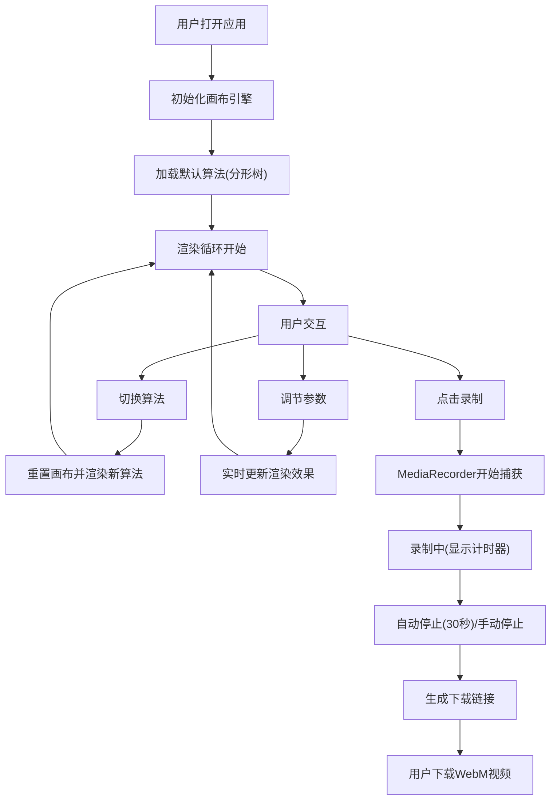

## 1. 产品概述

创意编程与交互艺术画布应用，用户通过选择不同绘制算法和调节参数，实时生成动态抽象艺术图案，并支持录制画布生成过程为视频。

- 主要用途：创意艺术生成、编程教育演示、视觉设计灵感
- 目标用户：艺术家、设计师、编程爱好者、教育工作者
- 产品价值：降低创意编程门槛，让用户无需编写代码即可生成独特的数字艺术作品

## 2. 核心功能

### 2.1 功能模块

1. **主画布区域**：实时渲染绘制算法生成的动态艺术图案
2. **左侧工具栏**：算法选择（分形树、粒子流、随机游走）、录制控制
3. **右侧控制面板**：参数调节滑块、算法参数配置
4. **底部状态栏**：显示当前算法、帧率、粒子/点数信息
5. **视频录制系统**：捕获画布内容并导出WebM格式视频

### 2.2 页面详情

| 页面名称 | 模块名称 | 功能描述 |
|-----------|-------------|---------------------|
| 主页面 | 画布渲染引擎 | 使用Canvas 2D API执行绘制算法，requestAnimationFrame优化性能 |
| 主页面 | 分形树算法 | 可调节分支角度(15°-60°)、递归深度(3-9层)，3秒生长动画 |
| 主页面 | 粒子流算法 | 可调节粒子数(100-2000)、速度(1-10)、颜色周期(1-20秒)，2000粒子时FPS≥30 |
| 主页面 | 随机游走算法 | 可调节步长(2-20)、方向变化率(0.1-0.9)、点数(500-5000)，5000点时FPS≥24 |
| 主页面 | 视频录制 | MediaRecorder API录制WebM视频，30fps，最大30秒，自动下载 |
| 主页面 | 响应式布局 | 桌面端左右面板，移动端(<768px)底部标签切换 |

## 3. 核心流程

用户打开应用 → 默认显示分形树算法 → 画布开始渲染动态图案 → 用户可切换算法或调节参数 → 画布实时更新效果 → 点击录制按钮开始录制 → 30秒后自动停止或用户手动停止 → 弹出下载提示保存视频

## 4. 用户界面设计

### 4.1 设计风格

- **设计方向**：深色科技感/赛博朋克风格，营造沉浸式创意空间
- **主背景**：#121212（深黑）
- **面板背景**：#1E1E1E（深灰）带磨砂玻璃效果 rgba(30,30,30,0.9)，backdrop-filter: blur(4px)
- **边框颜色**：#333333
- **文字颜色**：#CCCCCC（主文字）、#888888（次要文字）
- **强调色**：#4CAF50（帧率绿色）、#FF0000（录制红色）、#8B4513→#D2691E（分形树棕色渐变）、#228B22→#32CD32（叶子绿色）
- **滑块设计**：轨道#555555，圆形按钮#888888，悬停#AAAAAA
- **字体**：显示字体使用Space Mono等宽字体（科技感），正文使用Inter

### 4.2 页面设计概述

| 页面名称 | 模块名称 | UI元素 |
|-----------|-------------|-------------|
| 主页面 | 工具栏(左240px) | 算法选择按钮组、录制按钮(红色圆形，脉冲动画)、最小化/关闭按钮 |
| 主页面 | 中央画布 | 深灰背景#1A1A1A，2px光晕边框#333333，最小600x400，自适应尺寸 |
| 主页面 | 控制面板(右280px) | 面板标题(14px #CCC居中)、参数滑块组、1px分隔线#2A2A2A |
| 主页面 | 状态栏(底部32px) | 左侧算法名称(12px #888)，右侧FPS(绿色#4CAF50)和计数信息 |
| 主页面 | 录制指示器 | 右上角红色闪烁圆点(0.5秒间隔) + mm:ss计时器 |

### 4.3 动画与交互

- **过渡效果**：所有面板显隐使用framer-motion，0.3秒ease-in-out缓动
- **滑块交互**：拖动时实时更新参数并刷新画布
- **算法切换**：画布渐隐渐现过渡效果
- **录制动画**：录制按钮脉冲效果，红点闪烁动画
- **生长动画**：分形树3秒逐帧生长过程

### 4.4 响应式适配

- **桌面端(≥768px)**：左侧工具栏240px + 中央画布 + 右侧控制面板280px
- **移动端(<768px)**：工具栏和控制面板转为底部标签页切换，画布占满主要区域
- **画布自适应**：窗口大小变化时重新计算尺寸，保持最小600x400，内容不拉伸
