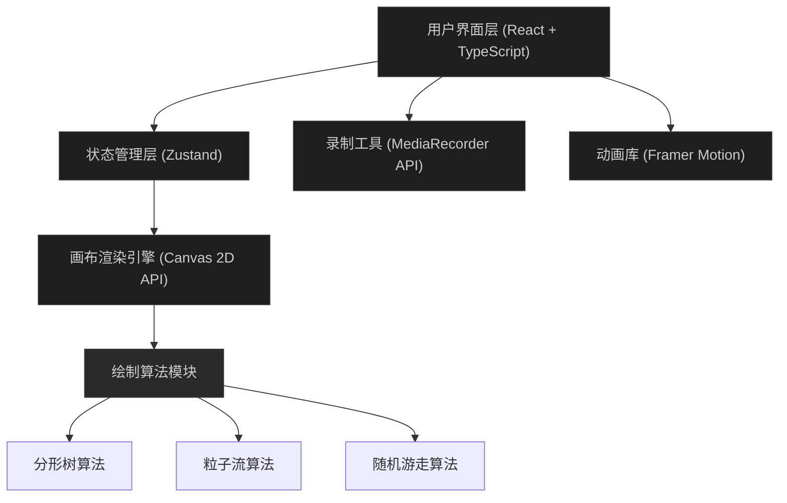

## 1. 架构设计



## 2. 技术描述

- **前端框架**：React@18 + TypeScript@5
- **构建工具**：Vite@5 + @vitejs/plugin-react@4
- **状态管理**：Zustand@4
- **动画库**：framer-motion@11
- **渲染技术**：HTML5 Canvas 2D API
- **录制技术**：MediaRecorder API (WebM格式)
- **项目初始化**：vite-init react-ts模板

## 3. 项目文件结构

```
d:\Pro\tasks\auto263/
├── package.json              # 项目依赖与脚本
├── vite.config.js            # Vite构建配置
├── tsconfig.json             # TypeScript配置(严格模式)
├── index.html                # 入口页面
└── src/
    ├── App.tsx               # 主组件，集成画布、控制面板、工具栏
    ├── canvasEngine.ts       # 画布渲染引擎，绘制算法执行
    ├── controlsPanel.tsx     # 控制面板组件，参数滑块
    ├── recorderUtils.ts      # 录制工具，MediaRecorder封装
    ├── store.ts              # Zustand全局状态管理
    ├── types.ts              # TypeScript类型定义
    └── components/
        ├── Toolbar.tsx       # 左侧工具栏
        ├── StatusBar.tsx     # 底部状态栏
        ├── Canvas.tsx        # 画布组件
        ├── RecordingIndicator.tsx  # 录制指示器
        └── MobileTabs.tsx    # 移动端标签切换
```

## 4. 状态管理定义

```typescript
// 算法类型
type AlgorithmType = 'fractalTree' | 'particleFlow' | 'randomWalk';

// 分形树参数
interface FractalTreeParams {
  branchAngle: number;    // 15-60度
  recursionDepth: number; // 3-9层
}

// 粒子流参数
interface ParticleFlowParams {
  particleCount: number;  // 100-2000
  speed: number;          // 1-10像素/帧
  colorCycle: number;     // 1-20秒
}

// 随机游走参数
interface RandomWalkParams {
  stepSize: number;       // 2-20像素
  directionChange: number; // 0.1-0.9
  pointCount: number;     // 500-5000
}

// 全局状态
interface AppState {
  currentAlgorithm: AlgorithmType;
  fractalTreeParams: FractalTreeParams;
  particleFlowParams: ParticleFlowParams;
  randomWalkParams: RandomWalkParams;
  isRecording: boolean;
  recordingTime: number;
  fps: number;
  canvasSize: { width: number; height: number };
  // Actions
  setAlgorithm: (algo: AlgorithmType) => void;
  updateParams: (algo: AlgorithmType, params: Partial<AllParams>) => void;
  startRecording: () => void;
  stopRecording: () => void;
  setFps: (fps: number) => void;
  setCanvasSize: (size: { width: number; height: number }) => void;
}
```

## 5. 核心算法模块

### 5.1 分形树算法
- 递归生成二叉树结构，每层分支两个子分支
- 生长动画：3秒内逐帧渲染，每帧新增枝干段
- 叶子半径规则：深度1-2层5px，3-4层3px，5层以上2px
- 叶子颜色随机在#228B22和#32CD32之间

### 5.2 粒子流算法
- 噪声场：使用sin/cos组合生成全局流动场
- 粒子拖尾：保存最近10个位置，透明度0.3→0.2衰减
- 颜色渐变：HSL循环，hue从0→240→360，周期可配置
- 性能优化：粒子对象池复用，批量绘制

### 5.3 随机游走算法
- 方向偏转：前一方向 + 随机偏转角度（受方向变化率控制）
- 边缘反弹：触及画布边缘时从对面边缘重新进入
- 颜色渐变：HSL hue从0→240线性随步数变化
- 性能优化：离屏canvas预绘制，每N帧合成一次

## 6. 录制模块

### 6.1 MediaRecorder配置
- MIME类型：video/webm;codecs=vp9
- 帧率：30fps
- 最大时长：30秒
- 视频比特率：2.5Mbps

### 6.2 录制流程
1. 调用canvas.captureStream(30)获取视频流
2. 创建MediaRecorder实例
3. 收集数据块到Blob数组
4. 停止时合并Blob并生成下载URL
5. 自动触发下载，文件名：art_recording_YYYYMMDD_HHMMSS.webm

## 7. 性能优化策略

- **渲染循环**：requestAnimationFrame，避免不必要的重绘
- **粒子优化**：对象池模式，避免频繁GC
- **离屏渲染**：静态元素使用离屏Canvas缓存
- **节流**：参数调节时使用requestAnimationFrame节流
- **FPS监控**：每1秒计算一次帧率，用于性能监控显示
