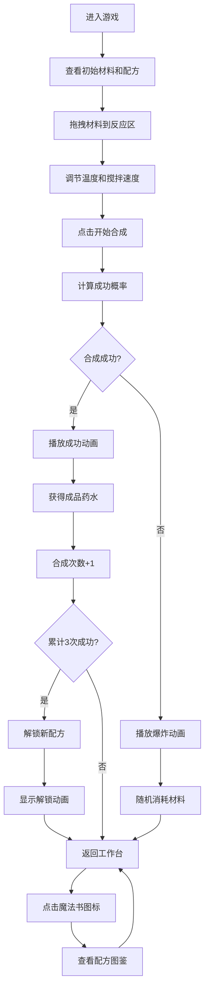

## 1. 产品概述

炼金术士药水合成模拟游戏，玩家在神秘图书馆的工作台上通过拖拽材料、调节温度和搅拌速度来合成魔法药水。成功合成可解锁新配方，操作失误可能导致爆炸或产生负面效果。

- 核心玩法：材料拖拽 + 参数调节 + 配方合成 + 图鉴收集
- 目标用户：喜欢模拟经营、收集类游戏的休闲玩家
- 产品价值：提供沉浸式的炼金体验，结合策略性操作和收集乐趣

## 2. 核心功能

### 2.1 功能模块
1. **工作台主界面**：材料栏、反应区、控制滑块、合成按钮
2. **药水合成系统**：成功率计算、结果判定、动画展示
3. **配方解锁系统**：图鉴收集、解锁动画、配方卡片
4. **游戏状态管理**：材料库存、已解锁配方、当前工作台状态

### 2.2 功能详情
| 页面/模块 | 功能点 | 功能描述 |
|-----------|--------|----------|
| 工作台 | 材料拖拽 | 从左侧材料栏拖拽材料烧瓶到中央反应区 |
| 工作台 | 温度控制 | 0-300°C 滑块调节，实时显示数值 |
| 工作台 | 搅拌控制 | 1-10 滑块调节，实时显示数值 |
| 工作台 | 合成按钮 | 点击开始合成，需至少2种材料 |
| 工作台 | 状态显示 | 顶部显示温度、搅拌速度、成功概率、材料数量 |
| 合成系统 | 成功率计算 | 基础80%，温度每偏离10°C减5%，搅拌每偏离1减10% |
| 合成系统 | 成功动画 | 药水瓶向上抛物线飞出并旋转，带粒子效果 |
| 合成系统 | 失败动画 | 爆炸碎片向四周散射，红色闪光 |
| 配方图鉴 | 图鉴展示 | 3页可翻动，展示已解锁/未解锁配方 |
| 配方图鉴 | 解锁动画 | 古旧羊皮纸样式配方卡片弹出 |
| 配方图鉴 | 魔法书图标 | 右下角图标，点击切换图鉴 |

## 3. 核心流程

玩家从材料栏拖拽材料到反应区 → 调节温度和搅拌速度 → 点击合成按钮 → 系统计算成功率 → 播放成功/失败动画 → 成功则累计合成次数，满3次解锁新配方 → 查看图鉴

## 4. 用户界面设计

### 4.1 设计风格
- **整体风格**：深色魔法图书馆主题，神秘炼金氛围
- **主色调**：深蓝紫渐变背景（#1A1A2E → #16213E），金色点缀（#FFD700）
- **辅助色**：淡蓝色边框（#3A7CA5），深紫渐变按钮（#7B2D8E → #9B59B6）
- **文字颜色**：白色、淡金色
- **字体**：标题使用哥特体风格，正文使用清晰易读字体
- **材质效果**：磨砂玻璃面板、半透明渐变、发光粒子效果

### 4.2 页面设计概览
| 页面/模块 | UI元素 | 设计描述 |
|-----------|--------|----------|
| 工作台整体 | 背景 | 径向渐变深蓝紫，微弱粒子发光 |
| 材料栏 | 左侧面板 | 磨砂玻璃效果（rgba(255,255,255,0.08)），圆角12px，宽220px |
| 材料栏 | 材料烧瓶 | 圆形（直径60px），半透明渐变色，5种基础材料 |
| 反应区 | 坩埚 | 圆形（直径160px），淡蓝色边框，拖拽进入变金色 |
| 反应区 | 粒子效果 | 微弱发光粒子环绕 |
| 控制区 | 温度滑块 | 轨道从蓝到红渐变，数值实时显示在上方 |
| 控制区 | 搅拌滑块 | 轨道从绿到紫渐变，数值实时显示在上方 |
| 控制区 | 合成按钮 | 深紫渐变，悬停放大效果 |
| 状态栏 | 顶部信息 | 温度、搅拌速度、成功概率、材料数量 |
| 图鉴入口 | 魔法书图标 | 右下角，点击打开图鉴 |
| 图鉴页面 | 配方卡片 | 古旧羊皮纸样式，边缘烧焦纹理 |
| 动画 | 拖拽 | 弹簧效果（stiffness=300, damping=20） |
| 动画 | 成功 | 药水瓶抛物线飞出并旋转 |
| 动画 | 失败 | 爆炸碎片散射 + 红色闪光 |

### 4.3 响应式设计
- **宽屏（>1024px）**：工作台居中，两侧留白
- **平板（768-1024px）**：材料栏与反应区并列，尺寸缩小
- **手机（<768px）**：材料栏折叠为顶部横向滚动图标栏，反应区缩小至80%宽度

### 4.4 性能要求
- 拖拽交互：60fps
- 材料栏滚动：无卡顿
- 图鉴翻页动画：30fps以上
