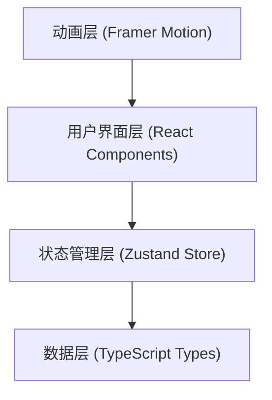

## 1. 架构设计



### 模块调用关系
- **types.ts**：定义所有共享类型，被所有模块引用
- **store.ts**：全局状态管理，使用 Zustand，被所有组件调用
- **Workbench.tsx**：核心工作台组件，读取 store 状态，调用 store 方法
- **PotionPreview.tsx**：药水预览组件，监听 store 中的合成结果
- **RecipeBook.tsx**：配方图鉴组件，展示已解锁配方
- **App.tsx**：根组件，组合所有子组件

## 2. 技术描述

- **前端框架**：React 18 + TypeScript
- **构建工具**：Vite（自动开启 HMR）
- **状态管理**：Zustand
- **动画库**：Framer Motion
- **项目初始化**：Vite + react-ts 模板

## 3. 文件结构

```
src/
├── types.ts           # 类型定义（材料、配方、药水、游戏状态）
├── store.ts           # Zustand 全局状态管理
├── App.tsx            # 根组件
├── main.tsx           # 入口文件
├── index.css          # 全局样式
├── components/
│   ├── Workbench.tsx  # 工作台组件（材料栏+反应区+控制区）
│   ├── MaterialFlask.tsx # 材料烧瓶组件
│   ├── Cauldron.tsx   # 坩埚/反应区组件
│   ├── ControlPanel.tsx # 控制面板（温度+搅拌滑块）
│   ├── PotionPreview.tsx # 药水预览与结果弹窗
│   ├── RecipeBook.tsx # 配方图鉴组件
│   └── StatusBar.tsx  # 顶部状态栏
└── data/
    └── recipes.ts     # 配方数据
```

### 数据流向
1. **读取**：组件从 useGameStore 读取状态 → 渲染 UI
2. **更新**：用户交互 → 调用 store 中的动作方法 → 更新状态 → 触发重新渲染
3. **动画**：Framer Motion 根据状态变化播放对应动画

## 4. 核心数据模型

### 4.1 材料枚举
```typescript
enum Material {
  Mercury = 'mercury',      // 水银
  Sulfur = 'sulfur',        // 硫磺
  Salt = 'salt',            // 盐
  Moonstone = 'moonstone',  // 月长石粉
  Firewort = 'firewort',    // 火焰草
}
```

### 4.2 配方接口
```typescript
interface Recipe {
  id: string;
  name: string;
  description: string;
  materials: Material[];
  optimalTemp: { min: number; max: number };
  optimalStir: { min: number; max: number };
  potionColor: string;
  effect: string;
}
```

### 4.3 游戏状态
```typescript
interface GameState {
  materials: Record<Material, number>;       // 材料库存
  unlockedRecipes: string[];                  // 已解锁配方ID
  cauldronMaterials: Material[];              // 反应区材料
  temperature: number;                        // 当前温度
  stirSpeed: number;                          // 搅拌速度
  successChance: number;                      // 成功概率
  synthesisResult: SynthesisResult | null;    // 合成结果
  isSynthesizing: boolean;                    // 是否正在合成
  showRecipeBook: boolean;                    // 是否显示图鉴
  currentPage: number;                        // 图鉴当前页
  successfulSynthesisCount: number;           // 成功合成次数
}
```

## 5. 核心算法

### 5.1 成功率计算
- 基础概率：80%
- 温度惩罚：每偏离最佳温度范围 10°C，减 5%
- 搅拌惩罚：每偏离最佳搅拌范围 1 级，减 10%
- 最低概率：0%

### 5.2 配方解锁
- 初始解锁：3 个基础配方
- 解锁条件：每成功合成 3 次，随机解锁 1 个新配方
- 总配方数：12 个

## 6. 性能优化

- 使用 React.memo 优化组件重渲染
- Framer Motion 使用 transform 和 opacity 属性保证 GPU 加速
- 拖拽操作使用 will-change 提示浏览器优化
- 图鉴翻页使用 CSS transform 而非 DOM 操作
- 粒子效果控制数量，避免过度绘制
