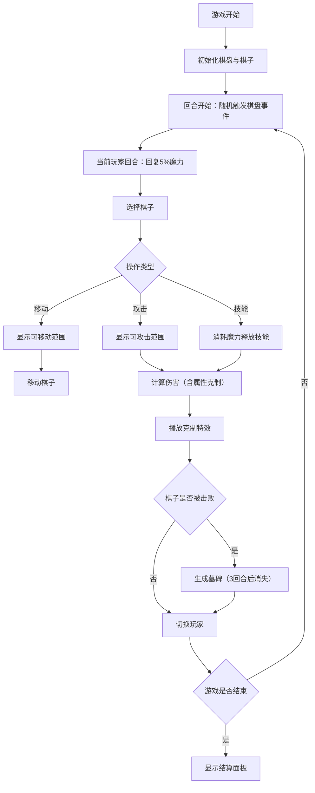

## 1. 产品概述

暗影棋盘是一款融合战棋策略与魔法元素克制关系的回合制策略游戏。玩家在8x8的暗色棋盘上操控不同阵营的魔法棋子，通过移动、攻击和技能释放与敌方对战。棋盘格子会随机触发事件，棋子属性克制关系将决定战斗结果。

- 核心玩法：回合制战棋 + 属性克制 + 随机事件
- 目标用户：策略游戏爱好者，喜欢魔法题材与战术思考的玩家
- 产品价值：提供富有深度的策略体验，结合视觉特效呈现魔法对战的沉浸感

## 2. 核心特性

### 2.1 阵营与棋子

| 阵营 | 颜色 | 棋子类型 | 核心定位 |
|------|------|----------|----------|
| 光明方 | #4FC3F7 | 战士、法师、弓手、刺客、牧师、术士 | 进攻与防御均衡 |
| 暗影方 | #AB47BC | 战士、法师、弓手、刺客、牧师、术士 | 高爆发与控制 |

### 2.2 属性系统

| 属性 | 克制关系 | 视觉特效 |
|------|----------|----------|
| 火 🔥 | 火克冰 | 橙色火焰爆裂粒子 |
| 冰 ❄️ | 冰克雷 | 冰晶碎裂飞散 |
| 雷 ⚡ | 雷克暗 | 紫色闪电链条 |
| 暗 🌑 | 暗克火 | 暗影吞噬动画 |

### 2.3 功能模块

1. **棋盘系统**：8x8网格棋盘，随机事件触发，格子状态管理
2. **棋子系统**：6种职业棋子，4种元素属性，HP/MP/技能管理
3. **战斗系统**：属性克制计算，攻击范围判定，技能释放与伤害结算
4. **事件系统**：回合开始随机触发棋盘事件（烈焰陷阱、冰封区域、雷暴领域、暗影迷雾）
5. **UI系统**：魔力值槽、棋子统计、回合信息、结算面板

### 2.4 页面详情

| 页面名称 | 模块名称 | 功能描述 |
|---------|---------|----------|
| 游戏主界面 | 顶部状态栏 | 双方魔力槽、棋子数量、回合数、对局时长 |
| 游戏主界面 | 棋盘区域 | 8x8棋盘渲染、棋子渲染、移动/攻击范围高亮 |
| 游戏主界面 | 交互层 | 拖拽棋子、点击选择、技能按钮 |
| 结算弹窗 | 结算面板 | 胜负方、剩余棋子、总回合数、对局时长 |

## 3. 核心流程

## 4. 用户界面设计

### 4.1 设计风格
- **主色调**：深紫色 #1A0A2E（棋盘背景）、暗金色 #C9A96E（边线与边框）、淡蓝色 #4FC3F7（高亮与玩家色）、紫色 #AB47BC（敌方色）
- **视觉主题**：暗黑魔法风，低多边形风格棋子，带有光晕效果
- **字体**：采用Cinzel Display作为标题字体（魔法史诗感），Inter作为正文字体
- **动画**：使用framer-motion实现流畅过渡，属性克制特效使用粒子动画
- **按钮风格**：暗金色边框，半透明背景，悬停时发光效果

### 4.2 页面设计概述

| 页面/组件 | 模块 | UI元素 |
|----------|------|--------|
| 游戏主界面 | 顶部状态栏 | 魔力值渐变条（左端阵营色，右端透明，400x16px）、棋子数量图标、回合数显示 |
| 游戏主界面 | 棋盘区域 | 8x8网格、六角形暗纹、棋子光晕（60px直径，0.3透明度）、悬停淡蓝色高亮（0.3秒渐变） |
| 游戏主界面 | 交互层 | 可移动范围（浅绿色半透明，1px虚线边）、可攻击范围（浅红色半透明，1px虚线边） |
| 特效层 | 克制特效 | 火焰爆裂、冰晶碎裂、闪电链条、暗影吞噬 |
| 结算面板 | 结束界面 | 中心扩散动画（0.8秒）、暗金边框、四角装饰图案、胜负信息统计 |

### 4.3 响应式设计
- 桌面端优先设计，棋盘采用固定尺寸
- 中等屏幕自适应缩放，保持棋盘比例
- 移动端优化触控区域，增加按钮尺寸

### 4.4 动画与特效指导
- **棋子悬停**：光晕增强，轻微上浮
- **移动范围显示**：格子逐格淡入动画
- **属性克制**：对应粒子特效，伤害数字弹跳显示
- **棋子击败**：淡出动画，墓碑渐入
- **游戏结束**：面板从中心向外环形扩散（0.8秒）
