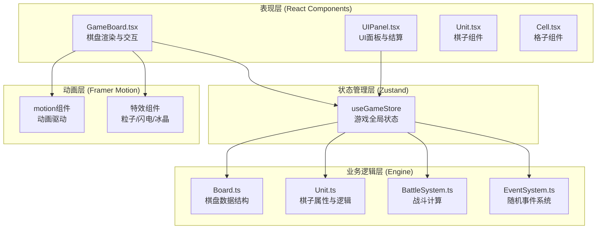
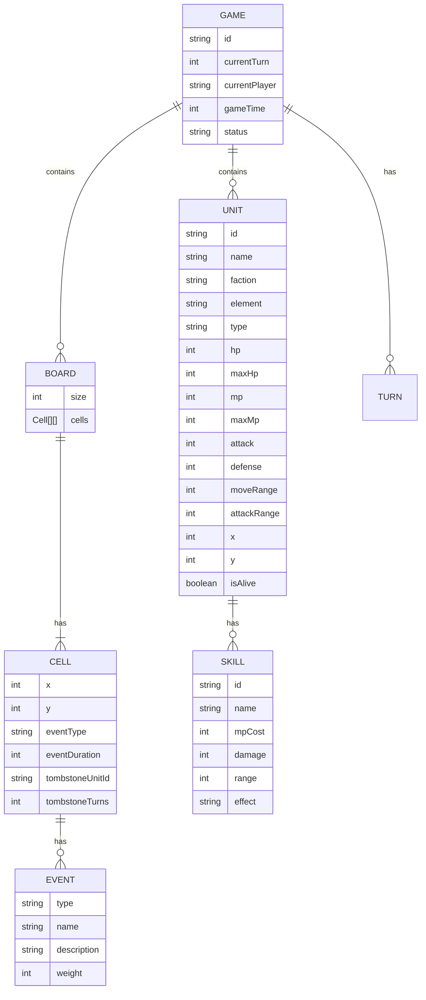

## 1. 架构设计



## 2. 技术描述

- **前端框架**：React 18 + TypeScript 5
- **构建工具**：Vite 5 + @vitejs/plugin-react
- **状态管理**：Zustand 4
- **动画引擎**：Framer Motion 11
- **其他依赖**：uuid 9
- **路径别名**：@ 指向 src/ 目录
- **包管理器**：npm

## 3. 目录结构

```
src/
├── engine/
│   ├── Board.ts          # 棋盘数据结构与格子状态
│   ├── Unit.ts           # 棋子属性与状态定义
│   └── BattleSystem.ts   # 战斗计算与技能处理
├── events/
│   └── EventSystem.ts    # 回合随机事件系统
├── components/
│   ├── GameBoard.tsx     # 棋盘主组件
│   ├── UIPanel.tsx       # UI面板与结算
│   ├── ChessUnit.tsx     # 棋子渲染组件
│   ├── BoardCell.tsx     # 棋盘格子组件
│   └── effects/          # 特效组件目录
│       ├── FireBurst.tsx
│       ├── IceShard.tsx
│       ├── Lightning.tsx
│       └── ShadowDevour.tsx
├── store/
│   └── useGameStore.ts   # Zustand状态管理
├── types/
│   └── index.ts          # 全局类型定义
├── utils/
│   └── helpers.ts        # 辅助函数
├── App.tsx
├── main.tsx
└── index.css
```

## 4. 数据模型定义

### 4.1 核心类型定义



### 4.2 属性克制关系

| 攻击者属性 | 被克制属性 | 伤害倍率 |
|----------|----------|---------|
| Fire | Ice | 2.0x |
| Ice | Thunder | 2.0x |
| Thunder | Dark | 2.0x |
| Dark | Fire | 2.0x |
| 其他 | 其他 | 1.0x |

## 5. 核心模块接口

### 5.1 Board.ts 导出接口
- `createBoard(size: number): Board` - 创建棋盘
- `getCell(x: number, y: number): Cell` - 获取格子
- `setCellEvent(x: number, y: number, event: EventType, duration: number): void` - 设置格子事件
- `coordToIndex(x: number, y: number): number` - 坐标转索引
- `indexToCoord(index: number): { x: number, y: number }` - 索引转坐标
- `getDistance(x1: number, y1: number, x2: number, y2: number): number` - 计算曼哈顿距离

### 5.2 Unit.ts 导出接口
- `createUnit(config: UnitConfig): Unit` - 创建棋子
- `calculateElementMultiplier(attackerElement: Element, defenderElement: Element): number` - 计算克制倍率
- `applyDamage(unit: Unit, damage: number): Unit` - 应用伤害
- `isInRange(unit: Unit, targetX: number, targetY: number, rangeType: 'move' | 'attack'): boolean` - 检查是否在范围内

### 5.3 BattleSystem.ts 导出接口
- `calculateDamage(attacker: Unit, defender: Unit, board: Board): number` - 计算伤害
- `executeAttack(attacker: Unit, defender: Unit, board: Board): BattleResult` - 执行攻击
- `executeSkill(attacker: Unit, defender: Unit, skill: Skill, board: Board): BattleResult` - 释放技能
- `getMovablePositions(unit: Unit, board: Board, units: Unit[]): Position[]` - 获取可移动位置
- `getAttackablePositions(unit: Unit, board: Board, units: Unit[]): Position[]` - 获取可攻击位置

### 5.4 EventSystem.ts 导出接口
- `triggerRandomEvents(board: Board, units: Unit[]): EventResult[]` - 触发随机事件
- `applyEventEffect(event: EventResult, board: Board, units: Unit[]): void` - 应用事件效果
- `decreaseEventDurations(board: Board): void` - 减少事件持续时间

## 6. 状态管理 (Zustand)

```typescript
interface GameState {
  board: Board;
  units: Unit[];
  currentTurn: number;
  currentPlayer: Faction;
  selectedUnitId: string | null;
  movablePositions: Position[];
  attackablePositions: Position[];
  mana: Record<Faction, number>;
  gameStatus: 'playing' | 'ended';
  winner: Faction | null;
  battleEffects: BattleEffect[];
  
  // Actions
  selectUnit: (unitId: string | null) => void;
  moveUnit: (unitId: string, x: number, y: number) => void;
  attackUnit: (attackerId: string, defenderId: string) => void;
  useSkill: (attackerId: string, defenderId: string, skillId: string) => void;
  endTurn: () => void;
  startNewGame: () => void;
}
```
