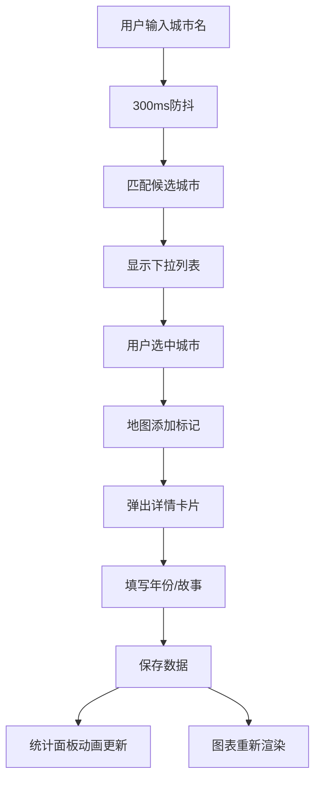

## 1. 产品概述

交互式旅行足迹地图应用，让用户在世界地图上标记旅行过的城市、记录旅行故事，并通过数据可视化展示旅行统计。面向旅行爱好者，提供直观的足迹记录和数据洞察体验。

## 2. 核心功能

### 2.1 用户角色

| 角色 | 注册方式 | 核心权限 |
|------|----------|----------|
| 普通用户 | 本地存储，无需注册 | 添加/编辑/删除城市标记、查看统计图表、记录旅行故事 |

### 2.2 功能模块

1. **地图交互模块**：Leaflet地图展示、城市标记渲染、标记点击交互
2. **城市搜索模块**：300ms防抖搜索、自动补全候选列表、200个预置城市数据库
3. **故事管理模块**：旅行故事添加/编辑/删除、150字限制、照片占位符
4. **统计面板模块**：总旅行次数动画、国家进度条、城市时间列表
5. **数据可视化模块**：年度旅行柱状图、大洲分布饼状图

### 2.3 页面详情

| 页面名称 | 模块名称 | 功能描述 |
|----------|----------|----------|
| 主页面 | 搜索栏 | 防抖300ms输入、城市自动补全下拉列表 |
| 主页面 | 地图区域 | 浅色主题Leaflet地图、圆形标记点、悬停放大效果 |
| 主页面 | 故事弹窗 | 城市详情卡片、年份/故事展示、编辑/删除操作 |
| 主页面 | 统计面板 | 数字跳转动画、圆形进度条、按年份排序城市列表 |
| 主页面 | 图表区域 | 柱状图（年度次数）、饼状图（大洲分布） |

## 3. 核心流程

用户在搜索框输入城市名称 → 300ms防抖后触发搜索 → 显示匹配城市候选列表 → 用户选中城市 → 地图自动定位并添加蓝色标记 → 弹窗显示城市信息 → 用户填写年份和旅行故事 → 提交保存 → 统计面板数字动画更新 → 图表重新渲染

## 4. 用户界面设计

### 4.1 设计风格

- **主色调**：#2c3e50（深灰蓝）
- **辅助色**：#3498db（蓝色 - 未读）、#2ecc71（绿色 - 已读）
- **背景色**：#ecf0f1（浅灰）、#f0f2f5（地图底色）
- **警告色**：#e74c3c、#f39c12、#9b59b6（饼图配色）
- **按钮样式**：圆角8px、点击缩小0.95倍0.1s反馈
- **字体**：采用现代无衬线字体，大号数字48px粗体
- **布局风格**：左70%地图 + 右30%面板，卡片式设计
- **圆角规范**：弹窗卡片12px、交互元素8px
- **阴影规范**：0 2px 8px rgba(0,0,0,0.1)

### 4.2 页面设计概览

| 页面名称 | 模块名称 | UI元素 |
|----------|----------|--------|
| 主页面 | 搜索栏 | 圆角输入框、下拉候选列表、高亮匹配文字 |
| 主页面 | 地图标记 | 半径12px圆形、蓝/绿双色、悬停放大1.3倍加深阴影 |
| 主页面 | 故事弹窗 | 圆角12px白色卡片、渐变圆形字母占位图、0.3s高度动画 |
| 主页面 | 统计数字 | 48px粗体、0.5s Ease-out跳转动画 |
| 主页面 | 进度条 | 彩色圆形SVG进度条、0到目标值填充动画 |
| 主页面 | 城市列表 | 年份标签+城市名、悬停背景高亮0.2s过渡 |
| 主页面 | 柱状图 | #3498db到#2ecc71渐变色、X轴年份Y轴次数 |
| 主页面 | 饼状图 | 柔和五色系、标签指示 |

### 4.3 响应式

- 桌面端：左地图70% + 右面板30% 横向布局
- 移动端（<768px）：面板折叠到地图下方，地图全宽
- 触摸优化：增大点击热区、禁用悬停效果改用点击

### 4.4 动画规范

- 页面加载：地图底部淡入
- 弹窗显示：0.3s背景蒙版淡入
- 按钮反馈：点击0.1s缩小到0.95倍后恢复
- 数字更新：0.5s Ease-out跳转动画
- 表单展开：0.3s高度动画
- 列表悬停：0.2s背景色过渡
- 标记悬停：放大1.3倍+阴影加深
