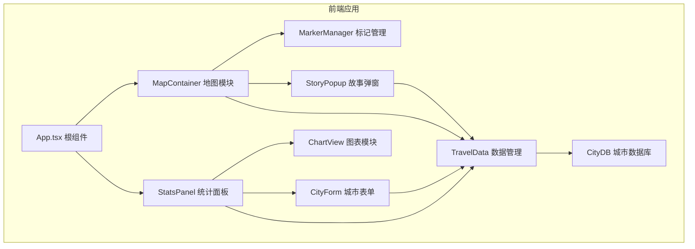
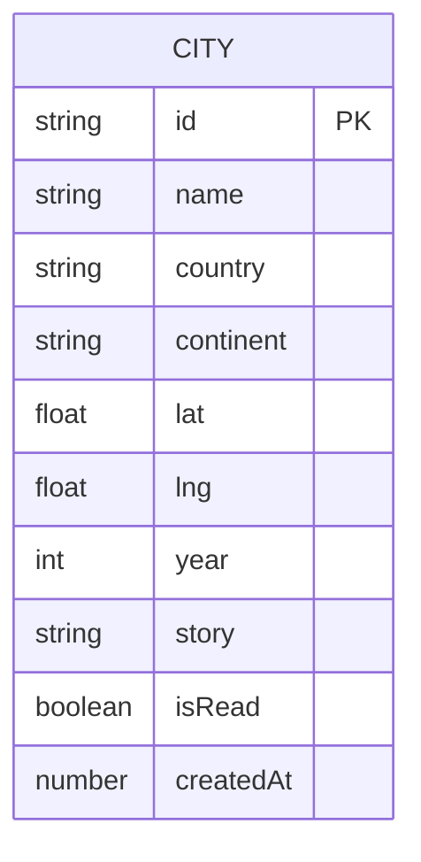

## 1. 架构设计



## 2. 技术说明

- **前端框架**: React@18 + TypeScript@5
- **构建工具**: Vite@5 + @vitejs/plugin-react
- **地图组件**: leaflet@1.9 + react-leaflet@4
- **图表组件**: chart.js@4 + react-chartjs-2@5
- **状态管理**: React Hooks (useState/useEffect/useRef) + TravelData单例模式
- **样式方案**: CSS Modules + CSS变量主题系统
- **数据存储**: 内存状态（预留localStorage持久化接口）

## 3. 模块定义

### 3.1 目录结构

| 路径 | 用途 |
|------|------|
| `src/main.tsx` | 应用入口，渲染根组件 |
| `src/App.tsx` | 根组件，布局管理 |
| `src/styles/global.css` | 全局样式与CSS变量 |
| `src/map/MapContainer.tsx` | 地图核心模块，Leaflet初始化与标记渲染 |
| `src/map/MarkerManager.ts` | 标记管理类，增删改查与样式控制 |
| `src/chart/ChartView.tsx` | 统计图表，柱状图+饼状图 |
| `src/stats/TravelData.ts` | 数据管理单例，城市CRUD API |
| `src/stats/StatsPanel.tsx` | 统计面板，数字+进度条+列表 |
| `src/stats/cityDB.ts` | 200个预置城市数据库 |
| `src/components/CityForm.tsx` | 城市添加/编辑表单 |
| `src/components/StoryPopup.tsx` | 故事详情弹出卡片 |
| `src/components/SearchBox.tsx` | 防抖搜索框+自动补全 |
| `src/hooks/useDebounce.ts` | 防抖Hook |
| `src/hooks/useAnimatedNumber.ts` | 数字跳转动画Hook |

### 3.2 核心类型定义

```typescript
interface City {
  id: string;
  name: string;
  country: string;
  continent: 'Asia' | 'Europe' | 'North America' | 'South America' | 'Africa' | 'Oceania' | 'Antarctica';
  lat: number;
  lng: number;
  year: number;
  story: string;
  isRead: boolean;
  createdAt: number;
}

interface CityInfo {
  name: string;
  country: string;
  continent: string;
  lat: number;
  lng: number;
}
```

## 4. API定义（TravelData模块）

```typescript
class TravelData {
  static getInstance(): TravelData;
  getCities(): City[];
  addCity(data: Omit<City, 'id' | 'createdAt' | 'isRead'>): City;
  updateCity(id: string, data: Partial<City>): City | null;
  deleteCity(id: string): boolean;
  getCityById(id: string): City | null;
  getStats(): { total: number; countries: number; byYear: Record<number, number>; byContinent: Record<string, number> };
  subscribe(callback: (cities: City[]) => void): () => void;
}
```

## 5. 数据模型

### 5.1 实体关系



## 6. 性能规范

| 指标 | 目标值 |
|------|--------|
| 地图初始渲染（200标记） | ≤ 800ms |
| 图表数据变更重绘 | ≤ 200ms |
| 搜索防抖间隔 | 300ms |
| 首屏可交互时间 | ≤ 2s |

## 7. 动画实现方案

| 动画 | 技术方案 |
|------|----------|
| 数字跳动 | requestAnimationFrame + Ease-out缓动函数 |
| 圆形进度条 | SVG stroke-dasharray + CSS transition |
| 表单高度展开 | CSS max-height transition 0.3s |
| 标记悬停放大 | CSS transform: scale(1.3) + transition |
| 弹窗淡入 | CSS opacity transition 0.3s |
| 按钮点击反馈 | CSS transform: scale(0.95) active伪类 |
