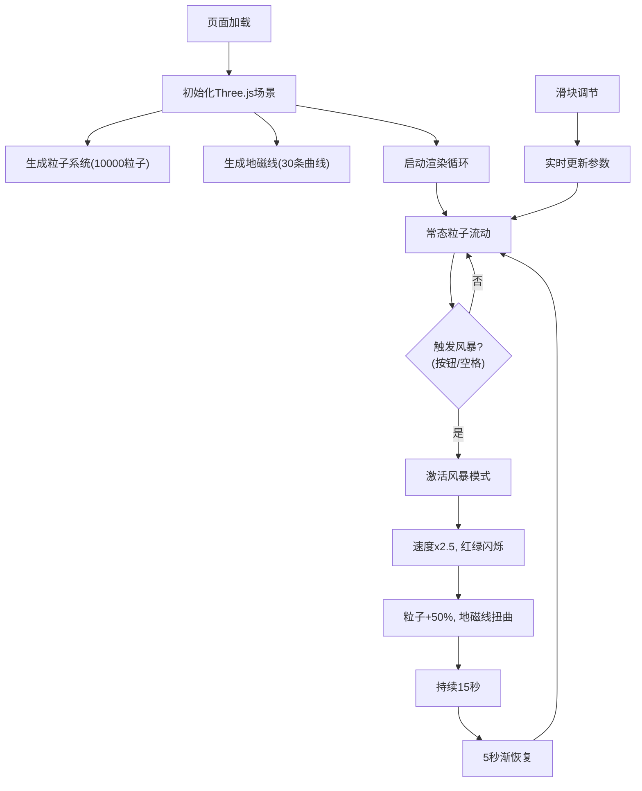

## 1. 产品概述
极光粒子轨迹与地磁风暴模拟器是一个基于WebGL的3D可视化应用，让用户沉浸式体验极光粒子沿地磁线流动的壮丽景象，并可触发生动的地磁风暴特效。
- 核心用途：科学教育可视化、艺术观赏、交互式演示
- 目标用户：天文爱好者、学生、教师、展示场景用户

## 2. 核心功能

### 2.1 功能模块
1. **3D主场景**：极光粒子层渲染、地磁线可视化、深空背景
2. **粒子系统**：8000-12000粒子动态流动、颜色渐变、脉动效果、循环流动
3. **地磁风暴模式**：速度激增、颜色闪烁、粒子增加、地磁线扭曲
4. **交互控制面板**：风暴触发按钮、速度调节、脉动幅度调节、FPS显示
5. **视角控制**：鼠标拖拽旋转、平移、滚轮缩放

### 2.2 页面详情
| 页面名称 | 模块名称 | 功能描述 |
|-----------|-------------|---------------------|
| 主页面 | 3D渲染区域 | 全屏Three.js场景，渲染极光粒子带和地磁线，深空色背景(#0a0e1a) |
| 主页面 | 控制面板 | 右下角磨砂玻璃面板，包含风暴触发按钮、速度滑块、脉动滑块、FPS数值 |
| 主页面 | 交互层 | OrbitControls相机控制、键盘空格键触发风暴 |

## 3. 核心流程
用户打开页面后，默认展示常态极光粒子流动效果。用户可通过鼠标拖拽旋转/平移视角、滚轮缩放观察极光带的3D层次。点击风暴按钮或按空格键触发地磁风暴，持续15秒后在5秒内恢复常态。用户可通过滑块实时调整粒子流动速度和脉动幅度。

## 4. 用户界面设计
### 4.1 设计风格
- 主色调：深空背景#0a0e1a，极光绿#00FF88，极光紫#AA88FF，风暴红#FF3344，地磁线青#88DDFF
- 按钮风格：圆角10px，风暴按钮#FF3355→悬停#FF5566，带脉冲光晕动画
- 字体：无衬线字体(Inter/系统默认)，文字淡青色#D0E8FF，12-14px
- 面板风格：磨砂玻璃效果，背景rgba(0,10,20,0.7)，圆角12px，边框1px rgba(255,255,255,0.1)

### 4.2 页面设计概述
| 页面名称 | 模块名称 | UI元素 |
|-----------|-------------|-------------|
| 主页面 | 3D场景 | 全屏Canvas，深度雾效，粒子带层次分明 |
| 主页面 | 控制面板 | 固定右下角20px，半透明面板，竖向排列控制项 |
| 主页面 | 滑块控件 | 轨道#2A3A50(4px高)，手柄#88DDFF(12px圆，悬停14px) |
| 主页面 | FPS显示 | #00FF88色，14px，每帧更新 |

### 4.3 响应性
桌面端优先，全屏布局。触摸设备上支持单指旋转、双指缩放和平移。

### 4.4 3D场景指导
- 环境：深空纯背景#0a0e1a，带轻微雾效增强深度
- 灯光：环境光(弱) + 点光源模拟极光辉光
- 相机：初始(0,20,100)看向原点，OrbitControls限制距离50-200
- 构图：极光带居中横向延展，地磁线从下方穿入，视觉焦点在粒子层中心
- 交互：每帧更新粒子位置和地磁线形态，风暴期间插值切换参数
- 性能：BufferGeometry+PointsMaterial，单Draw Call，目标1080p稳定60FPS
