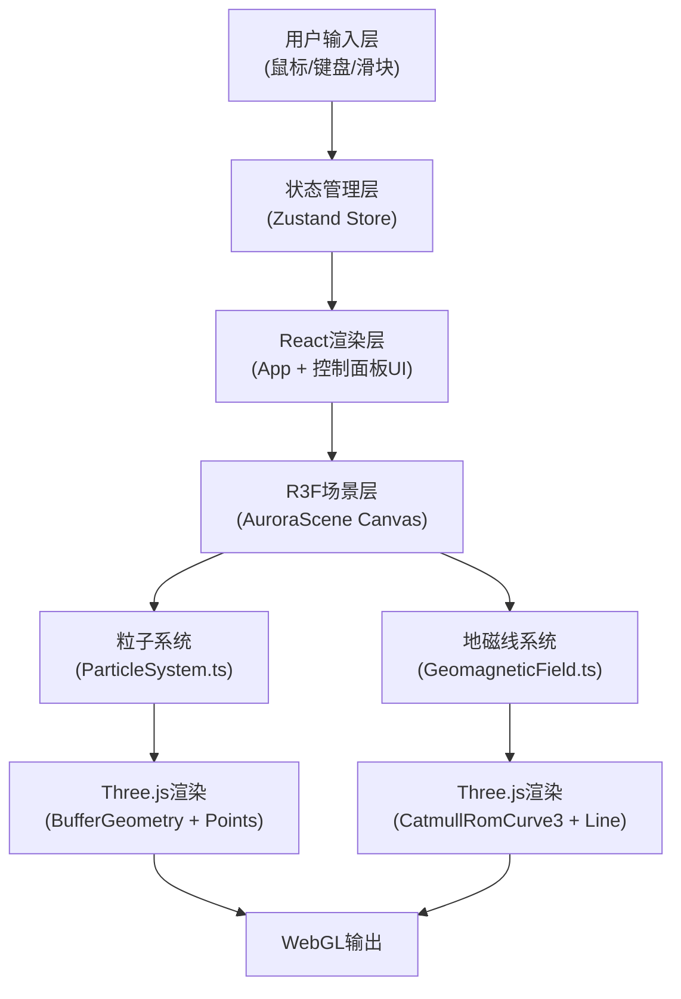

## 1. 架构设计



## 2. 技术栈说明
- 前端框架：React 18 + TypeScript 5
- 构建工具：Vite 5 + @vitejs/plugin-react
- 3D渲染：Three.js 0.160 + @react-three/fiber 8 + @react-three/drei 9
- 状态管理：Zustand 4
- 相机控制：@react-three/drei 的 OrbitControls
- 项目初始化：vite-init (react-ts模板)

## 3. 目录结构

```
auto272/
├── index.html
├── package.json
├── vite.config.js
├── tsconfig.json
└── src/
    ├── App.tsx              // 应用入口，Canvas + UI面板
    ├── AuroraScene.tsx      // R3F主场景组件
    ├── ParticleSystem.ts    // 粒子系统逻辑类
    ├── GeomagneticField.ts  // 地磁线逻辑类
    └── store.ts             // Zustand全局状态
```

## 4. 数据模型(Zustand Store)

```typescript
interface AuroraState {
  stormIntensity: number;      // 0-1，风暴强度
  isStormActive: boolean;      // 是否风暴中
  speedMultiplier: number;     // 速度倍率 0.5-3
  pulseAmplitude: number;      // 脉动幅度 0.5-2
  fps: number;                 // 当前FPS
  stormTimer: number;          // 风暴计时
  recoveryTimer: number;       // 恢复计时
  triggerStorm: () => void;    // 触发风暴
  setSpeedMultiplier: (v: number) => void;
  setPulseAmplitude: (v: number) => void;
  setFps: (v: number) => void;
  updateTimers: (dt: number) => void; // 每帧调用
}
```

## 5. 核心实现策略

### 5.1 粒子系统(ParticleSystem.ts)
- 使用 Float32Array 存储 position、color、size 属性的 BufferGeometry
- 总粒子数 12000 (常态 8000 可见 + 风暴 4000 额外)
- useRef + useEffect 在 R3F 中管理 Points 对象
- 每帧更新 shader-like 的 JS 位置计算：沿Z轴位移+边界循环+X轴带状分布+Y轴高度范围
- 颜色计算：根据X轴位置在 #00FF88 到 #AA88FF 插值，风暴期间叠加 sin 波动在绿红之间切换

### 5.2 地磁线(GeomagneticField.ts)
- 30条 CatmullRomCurve3，每条100控制点，从 (-x, -50) 弧形上升到 (-x/2, -15) 再下降到 (x, -50)
- BufferGeometry 设置为 LineSegments 或 Line，material transparent + opacity 0.3
- 风暴时对控制点Y值叠加 sin 波动增加弯曲度30%
- 曲线形状参数化，每帧根据 stormIntensity 插值更新

### 5.3 相机控制
- drei/OrbitControls：enablePan=true, enableRotate=true, enableZoom=true
- minDistance=50, maxDistance=200
- target=[0,0,0]，初始相机 [0,20,100]

### 5.4 性能优化
- 单 BufferGeometry 承载所有粒子，单 PointsMaterial
- 地磁线合并为单个 BufferGeometry (LineSegments)
- 避免每帧创建新对象，重用 TypedArray
- 粒子更新使用 for 循环遍历，避免函数调用开销

## 6. 依赖版本

```json
{
  "react": "^18.2.0",
  "react-dom": "^18.2.0",
  "vite": "^5.0.0",
  "@vitejs/plugin-react": "^4.2.0",
  "typescript": "^5.3.0",
  "@types/react": "^18.2.40",
  "@types/react-dom": "^18.2.17",
  "three": "^0.160.0",
  "@react-three/fiber": "^8.15.0",
  "@react-three/drei": "^9.92.0",
  "zustand": "^4.4.0"
}
```
