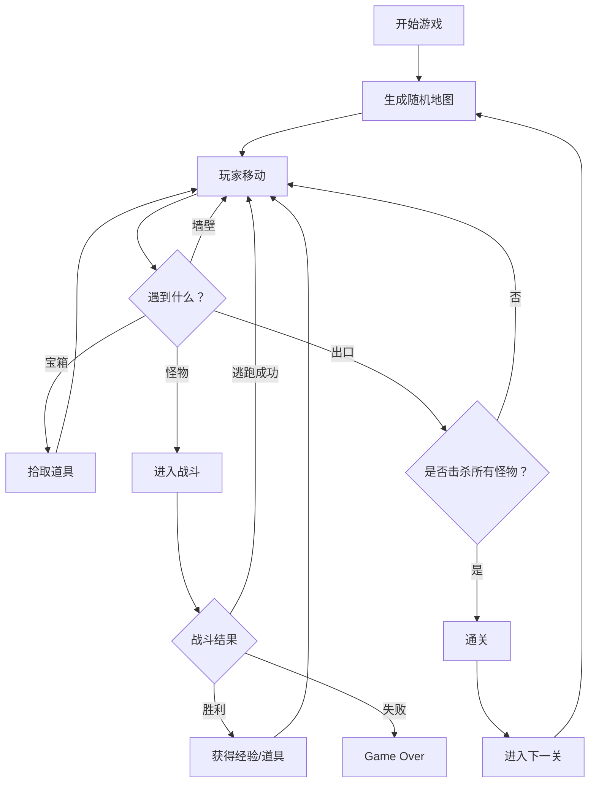

## 1. 产品概述
微型地下城随机闯关与角色养成网页游戏，将纸上桌游的随机关卡与角色成长体验搬到屏幕上，让玩家每次闯关都能体验到完全不同的地形与怪物配置。
- 目标用户：地下城探险桌游爱好者、休闲游戏玩家
- 产品价值：提供轻量级、高重玩价值的网页端Roguelike地牢探索体验

## 2. 核心功能

### 2.1 功能模块
1. **游戏主界面**：8x8网格地图、角色移动、状态面板
2. **地图生成系统**：基于种子的随机关卡生成、连通路径保证
3. **战斗系统**：回合制战斗、攻击与逃跑机制
4. **角色成长系统**：等级、经验值、属性提升
5. **背包道具系统**：道具栏、药水/武器/盾牌/钥匙
6. **关卡递进系统**：难度递增、通关奖励

### 2.2 页面详情
| 页面名称 | 模块名称 | 功能描述 |
|---------|---------|---------|
| 游戏主页面 | 游戏棋盘 | 8x8网格地图渲染、玩家移动动画、格子交互 |
| 游戏主页面 | 状态面板 | 角色信息展示、血条/经验条、道具栏、关卡信息 |
| 战斗弹窗 | 战斗界面 | 怪物信息、攻击按钮、逃跑按钮、战斗结果展示 |
| 通关弹窗 | 通关界面 | 恭喜文字、下一关按钮 |

## 3. 核心流程
玩家进入游戏 → 生成随机地牢地图 → 通过WASD或点击移动角色 → 遇到怪物触发战斗 → 战斗胜利获得经验和道具 → 找到宝箱拾取道具 → 到达出口通关 → 进入下一关（难度提升）→ 角色升级成长

## 4. 用户界面设计

### 4.1 设计风格
- **主色调**：暗紫色背景 #1A0A2E，浅灰色文字 #E0E0E0
- **强调色**：暗金色 #C9A96E（分割线）、金色 #FFD700（宝箱）、蓝色 #3498DB（玩家）、红色 #E74C3C（出口/怪物）
- **按钮风格**：圆角8px，悬停亮度提升20%，点击缩小0.95倍并反弹
- **布局风格**：左侧游戏区域（80%）+ 右侧状态面板（20%），移动端面板移到底部
- **动效风格**：framer-motion 实现平滑过渡、滑步动画、数字滚动效果

### 4.2 页面设计概述
| 页面名称 | 模块名称 | UI元素 |
|---------|---------|-------|
| 游戏主页面 | 游戏棋盘 | 60x60px格子、40px玩家圆形图标、墙壁/地板/宝箱/入口/出口配色 |
| 游戏主页面 | 状态面板 | 磨砂玻璃效果背景、60px圆形头像、血条/经验条、5个道具栏、关卡信息 |
| 战斗弹窗 | 战斗界面 | 半透明黑色遮罩、60px怪物图标、深红攻击按钮、灰色逃跑按钮、战斗结果文字 |
| 全局 | 重新开始按钮 | 右下角固定位置、重置所有状态 |

### 4.3 响应式
- **桌面端**：左侧游戏区域80% + 右侧状态面板20%
- **移动端（<768px）**：游戏区域占满顶部，状态面板移到底部
- **触控优化**：点击格子移动，按钮尺寸适合触控

## 5. 性能指标
- 游戏帧率稳定在30FPS以上
- 键盘移动响应延迟小于50ms
- 战斗计算延迟小于15ms
- 地图生成时间小于100ms
