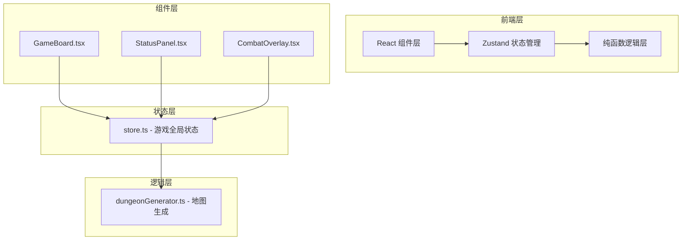

## 1. 架构设计



**数据流向**：
1. 组件（GameBoard/StatusPanel/CombatOverlay）通过 Zustand hooks 读取全局状态
2. 组件触发用户交互（移动、攻击、拾取），调用 store 中的 action 方法
3. store 中的 action 调用纯函数模块（dungeonGenerator）计算新状态
4. store 更新状态后，所有订阅组件自动重新渲染

## 2. 技术描述
- **前端框架**：React 18 + TypeScript
- **构建工具**：Vite 5 + @vitejs/plugin-react
- **状态管理**：Zustand 4
- **动画库**：framer-motion 11
- **样式方案**：内联样式 + CSS变量（无Tailwind，按需求定制样式）
- **开发语言**：TypeScript 严格模式

## 3. 核心模块定义

### 3.1 类型定义
```typescript
// 格子类型
type TileType = 'wall' | 'floor' | 'chest' | 'entrance' | 'exit' | 'specialChest';

// 怪物接口
interface Monster {
  id: string;
  name: string;
  hp: number;
  maxHp: number;
  attack: number;
  defense: number;
  x: number;
  y: number;
}

// 道具类型
type ItemType = 'potion' | 'shield' | 'weapon' | 'key';

// 道具接口
interface Item {
  type: ItemType;
  name: string;
  icon: string;
}

// 玩家接口
interface Player {
  x: number;
  y: number;
  hp: number;
  maxHp: number;
  attack: number;
  defense: number;
  level: number;
  exp: number;
  expToNext: number;
  inventory: Item[];
}

// 游戏状态接口
interface GameState {
  player: Player;
  map: TileType[][];
  monsters: Monster[];
  currentLevel: number;
  monstersKilled: number;
  isInCombat: boolean;
  currentMonster: Monster | null;
  combatResult: 'win' | 'lose' | 'flee' | null;
  gameOver: boolean;
  levelComplete: boolean;
}
```

### 3.2 文件结构
```
src/
├── store.ts              # Zustand全局状态管理
├── dungeonGenerator.ts   # 地图生成纯函数
├── components/
│   ├── GameBoard.tsx     # 游戏棋盘组件
│   ├── StatusPanel.tsx   # 状态面板组件
│   └── CombatOverlay.tsx # 战斗弹窗组件
├── App.tsx               # 根组件
├── main.tsx              # 入口文件
└── index.css             # 全局样式
```

## 4. 核心算法

### 4.1 地图生成算法
- 使用随机种子生成8x8网格
- 房间生成算法：随机放置1-3个矩形房间
- 通道连接：使用BFS确保所有房间连通
- 特殊格子放置：入口、出口、宝箱、怪物
- 连通性验证：从入口出发可到达出口和所有宝箱

### 4.2 战斗系统
- 攻击伤害计算：攻击力 - 防御力 + 随机波动（10-20点）
- 逃跑成功率：60%基础成功率
- 经验掉落：20-40点随机
- 道具掉落：30%概率掉落随机道具

### 4.3 角色成长
- 升级所需经验：100点/级
- 生命成长：+20/级
- 攻击成长：+2/级
- 防御成长：+1/级

## 5. 性能优化
- **地图缓存**：生成后的地图数据缓存，避免重复计算
- **组件 memo**：使用 React.memo 优化棋盘格子渲染
- **批量状态更新**：Zustand 批量更新减少重渲染
- **CSS transform**：移动动画使用 transform 而非 top/left
- **按需渲染**：战斗弹窗使用 AnimatePresence 条件渲染
