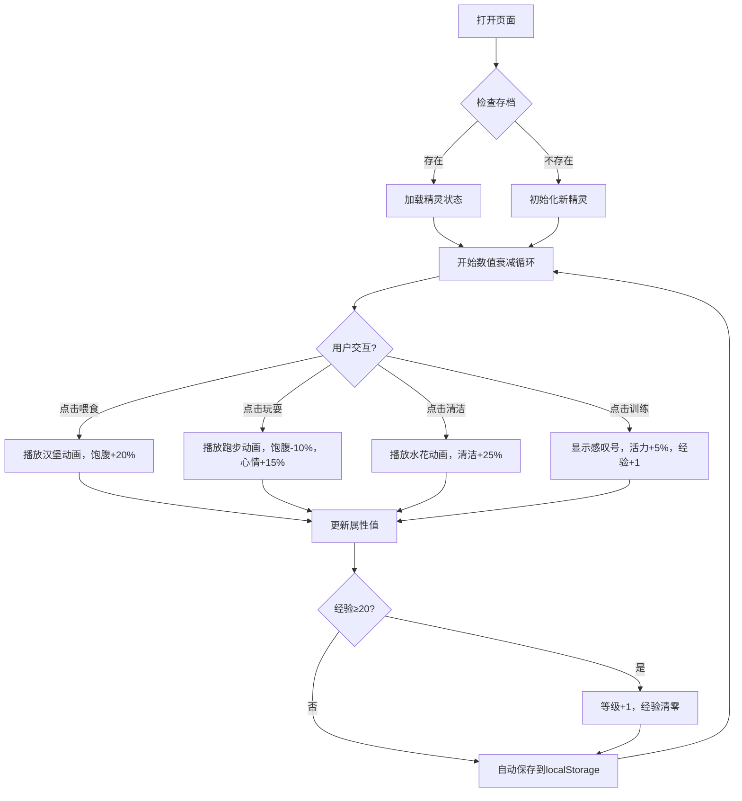

## 1. 产品概述
本项目是一个复古像素风电子宠物养成网页应用，灵感源于经典的拓麻歌子，融合现代社交媒体互动玩法。用户可领养一只像素小精灵，通过喂食、玩耍、清洁、训练等交互提升属性，同时精灵以像素动画形式在屏幕上活动。产品的核心价值在于通过怀旧的像素美术风格和实时养成机制，为用户提供轻松有趣的休闲体验，并支持社交分享和好友互动。

## 2. 核心功能

### 2.1 用户角色
| 角色 | 注册方式 | 核心权限 |
|------|----------|----------|
| 普通用户 | 无需注册，本地自动存档 | 领养精灵、日常养护、属性提升、等级升级、导出头像 |

### 2.2 功能模块
1. **主界面**：像素精灵展示区、控制面板、状态栏、标题栏
2. **精灵养成系统**：四维属性（心情、饱腹、清洁、活力）实时衰减与恢复
3. **交互系统**：喂食、玩耍、清洁、训练四种交互方式
4. **动画系统**：精灵行走、跳跃、睡觉、表情变化等像素动画
5. **升级系统**：通过训练累计经验，达到阈值自动升级
6. **数据持久化**：精灵状态自动保存到localStorage

### 2.3 页面详情
| 页面名称 | 模块名称 | 功能描述 |
|----------|----------|----------|
| 主页面 | 标题栏 | 显示精灵名称、当前等级，采用像素字体和描边效果 |
| 主页面 | 精灵画布 | 300x300像素草地，16x16像素精灵实时动画，60FPS流畅渲染 |
| 主页面 | 控制面板 | 四维属性进度条（20个像素方块组成），四个交互按钮带按压反馈 |
| 主页面 | 状态栏 | 滚动像素文字条，每2秒切换状态提示 |

## 3. 核心流程

用户打开页面 → 检查localStorage存档 → 存在则加载精灵状态，不存在则初始化新精灵 → 开始数值衰减循环（每秒0.1-0.3点） → 用户点击交互按钮 → 播放对应像素动画 → 更新精灵属性 → 判断是否升级 → 自动保存状态 → 持续运行

## 4. 用户界面设计

### 4.1 设计风格
- **整体风格**：8位复古像素风格，致敬经典掌机游戏
- **主色调**：暖色系搭配：#F4A460（沙棕）、#FF6347（番茄红）、#32CD32（酸橙绿）
- **背景色**：淡蓝色 #87CEEB 天空，带白色像素云朵图案
- **描边色**：深石板灰 #2F4F4F，所有UI元素2px描边
- **按钮风格**：像素块堆叠效果，四角2px深色阴影模拟凸起，点击时下移2px再弹起
- **字体**：Press Start 2P 像素字体，白色文字加2px黑色描边
- **图标风格**：纯像素绘制，心情=爱心、饱腹=苹果、清洁=浴缸、活力=闪电

### 4.2 页面设计概述
| 页面名称 | 模块名称 | UI元素 |
|----------|----------|--------|
| 主页面 | 标题栏 | 像素字体"小精灵名称 Lv.X"，居中显示，黑白描边 |
| 主页面 | 精灵画布 | 300x300像素草地（#7CFC00），深浅交错2x2格子纹理，精灵16x16像素点阵，每秒刷新位置 |
| 主页面 | 控制面板 | 左侧半透明面板（#FFFFFF 80%透明度，2px实线边框），四个数值条各20个5x5像素方块，颜色分段：绿/黄/红 |
| 主页面 | 交互按钮 | 四个像素按钮，分别显示汉堡、跑步、水花、感叹号图标，2px阴影凸起效果 |
| 主页面 | 状态栏 | 底部滚动文字条，8px像素字体，#2F4F4F颜色，每2秒切换提示 |

### 4.3 响应式
- 采用桌面优先设计，主内容区居中固定宽度
- 移动设备自动缩放画布，保持像素比例
- 触摸设备优化按钮点击区域

### 4.4 动画规范
- **精灵行走**：左右脚交替2帧动画
- **精灵跳跃**：身体拉伸并旋转5度，持续0.3秒
- **按钮交互**：点击时向下移动2px，播放对应像素动画2秒
- **数值条**：数值变化时方块颜色渐变过渡
- **状态文字**：每2秒平滑滚动切换
