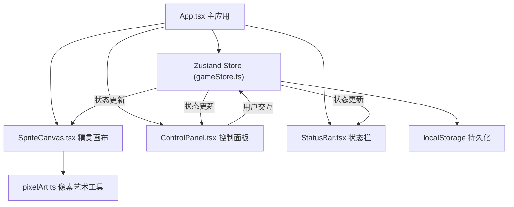

## 1. 架构设计



## 2. 技术描述

- **前端框架**：React@18 + TypeScript
- **构建工具**：Vite@5 + @vitejs/plugin-react
- **状态管理**：Zustand@4
- **渲染引擎**：Canvas 2D API（所有像素动画通过Canvas绘制，不使用DOM操作）
- **数据存储**：浏览器 localStorage（无需后端）
- **开发依赖**：@types/react、@types/react-dom、typescript

## 3. 技术栈选型理由

| 技术 | 选型理由 |
|------|----------|
| React 18 | 组件化开发，高效的虚拟DOM更新，适合UI交互频繁的场景 |
| TypeScript | 类型安全，减少运行时错误，提升代码可维护性 |
| Vite | 极速冷启动和热更新，开发体验优秀 |
| Zustand | 轻量级状态管理，API简洁，无需Provider包裹，适合小型项目 |
| Canvas 2D | 像素级绘制控制，60FPS动画性能保障，比DOM操作更高效 |
| localStorage | 无需后端服务，数据本地持久化，满足单机养成需求 |

## 4. 性能优化策略

1. **Canvas渲染优化**：
   - 使用requestAnimationFrame实现60FPS动画循环
   - 离屏Canvas预渲染精灵帧和UI元素
   - 脏矩形检测，只重绘变化区域

2. **状态更新优化**：
   - Zustand选择器订阅，避免不必要的重渲染
   - 数值衰减逻辑合并到单个setTimeout循环，每秒批量更新
   - 动画帧与状态更新分离，动画60FPS，状态更新1FPS

3. **内存管理**：
   - 组件卸载时清理动画帧和定时器
   - 像素数据缓存复用，避免重复创建

## 5. 核心数据结构

### 5.1 精灵状态 (SpriteState)
```typescript
interface SpriteState {
  name: string;
  level: number;
  experience: number;
  stats: {
    mood: number;     // 心情 0-100
    hunger: number;   // 饱腹 0-100
    cleanliness: number; // 清洁 0-100
    energy: number;   // 活力 0-100
  };
  position: { x: number; y: number };
  animation: {
    type: 'idle' | 'walk' | 'jump' | 'sleep' | 'feed' | 'play' | 'clean' | 'train';
    frame: number;
    direction: 'left' | 'right';
    rotation: number;
  };
  lastUpdate: number;
}
```

### 5.2 Store Actions
```typescript
interface GameActions {
  initSprite: (name?: string) => void;
  loadFromStorage: () => void;
  saveToStorage: () => void;
  feed: () => void;
  play: () => void;
  clean: () => void;
  train: () => void;
  updateStats: () => void;
  updateAnimation: (deltaTime: number) => void;
  checkLevelUp: () => void;
}
```

## 6. 文件结构

```
src/
├── App.tsx                 # 主应用组件，布局渲染
├── store/
│   └── gameStore.ts        # Zustand状态管理，游戏逻辑
├── components/
│   ├── SpriteCanvas.tsx    # Canvas精灵绘制组件
│   ├── ControlPanel.tsx    # 控制面板（属性条+交互按钮）
│   └── StatusBar.tsx       # 状态提示滚动条
├── utils/
│   └── pixelArt.ts         # 像素艺术模板和绘制函数
├── main.tsx                # 入口文件
└── index.css               # 全局样式
```

## 7. 关键实现要点

1. **像素绘制**：pixelArt.ts中定义16x16精灵点阵模板，使用ImageData或fillRect进行像素级绘制，支持缩放不模糊。

2. **动画循环**：SpriteCanvas组件中使用useRef管理动画帧ID，在useEffect中启动requestAnimationFrame循环，根据deltaTime计算动画帧。

3. **数值衰减**：gameStore中启动setInterval每秒调用updateStats，对四个属性分别随机衰减0.1-0.3点。

4. **交互反馈**：ControlPanel按钮点击时触发store action，同时设置2秒的动画状态，动画结束后自动恢复idle。

5. **持久化**：store订阅状态变化，使用debounce节流保存到localStorage，页面加载时自动读取恢复。

6. **升级判定**：每次train后经验+1，调用checkLevelUp判断是否≥20，满足则等级+1，经验清零。
