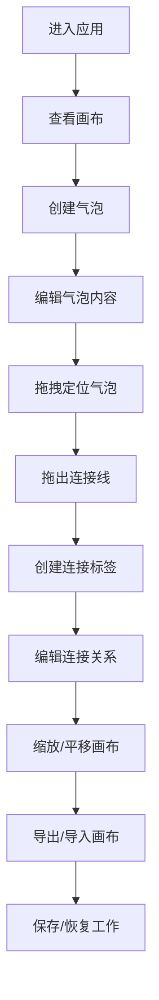

## 1. 产品概述
创意灵感便签与任务气泡墙应用，将待办事项与灵感碎片通过可视化气泡形式在无限画布上组织呈现。面向热爱记录生活、追求创意工作方式的用户，提供新颖的非线性思维工具。
- 核心目标：替代传统纯文本清单，提供更直观、更富创造力的想法组织方式
- 产品价值：通过无限画布+气泡思维导图的组合，激发创意联想，提升思维效率

## 2. 核心特性

### 2.1 功能模块
1. **画布主界面**：无限滚动画布、网格背景、缩放平移控制
2. **气泡管理**：创建/编辑/删除气泡、拖拽定位、颜色系统
3. **连接系统**：气泡间贝塞尔曲线连接、带箭头标签、关系说明
4. **控制工具**：新建气泡按钮、导出JSON、导入JSON、响应式控制面板

### 2.2 页面详情
| 页面名称 | 模块名称 | 功能描述 |
|-----------|-------------|---------------------|
| 画布主界面 | 无限画布区域 | 占满100vw×100vh视窗，支持滚轮缩放(0.2x-3x)、空白拖拽平移 |
| 画布主界面 | 气泡便签 | 双击空白创建圆形气泡(80px)，随机颜色，支持拖拽、双击编辑文字、Delete删除 |
| 画布主界面 | 连接线系统 | 从气泡边缘拖出到另一气泡创建贝塞尔曲线，颜色自动混合，带标签和删除按钮 |
| 画布主界面 | 控制面板 | 左上角悬浮半透明毛玻璃面板，含"新建气泡""导出""导入"按钮，<768px折叠为汉堡菜单 |

## 3. 核心流程

主要用户操作流程：
1. 用户进入应用，看到深色主题的无限画布与控制面板
2. 双击画布空白处或点击"新建气泡"创建气泡便签
3. 点击气泡选中，可拖拽移动位置，双击可编辑文字内容
4. 从气泡边缘拖出连线至另一气泡，创建带标签的关系连接线
5. 双击连接线标签编辑关系说明文字，点击×可删除连接
6. 使用鼠标滚轮缩放画布，拖拽空白区域平移浏览
7. 点击"导出"将当前画布状态保存为JSON文件
8. 点击"导入"加载之前保存的JSON文件恢复布局

## 4. 用户界面设计

### 4.1 设计风格
- **主色调**：深色背景#1E1E2E，气泡使用预设色环（珊瑚红#FF6B6B、青绿#4ECDC4、天蓝#45B7D1、薄荷绿#96CEB4、奶黄#FFEAA7、淡紫#DDA0DD）
- **按钮样式**：扁平样式背景#3A3A5C，悬停提亮10%，圆角6px，白色12px文字
- **字体**：现代无衬线字体，气泡文字14px居中，标签文字12px
- **布局风格**：全屏沉浸式画布，左上角悬浮控制面板（毛玻璃rgba(255,255,255,0.08)，圆角12px，内边距16px）
- **视觉细节**：气泡柔和弹性动画、连接线平滑延伸动画、网格背景动态间距

### 4.2 页面设计概述
| 页面名称 | 模块名称 | UI元素 |
|-----------|-------------|-------------|
| 画布主界面 | 背景网格 | 浅灰#E0E0E0线条，间距随缩放动态变化，深色#1E1E2E底 |
| 画布主界面 | 气泡便签 | 圆形80px、6种预设色、弹性拖拽动画、双击编辑、选中高亮 |
| 画布主界面 | 连接线 | 2px贝塞尔曲线、颜色自动混合、带箭头、中间白底圆角标签(6px)、×删除按钮 |
| 画布主界面 | 控制面板 | 毛玻璃悬浮、三按钮布局、<768px折叠为侧边栏(240px宽) |

### 4.3 响应式设计
- **桌面端**(≥768px)：左上角悬浮控制面板直接显示
- **移动端**(<768px)：控制面板折叠为左侧边缘汉堡菜单图标，点击展开为240px宽侧边栏
- **触控优化**：气泡触控区域扩展，双指缩放支持
