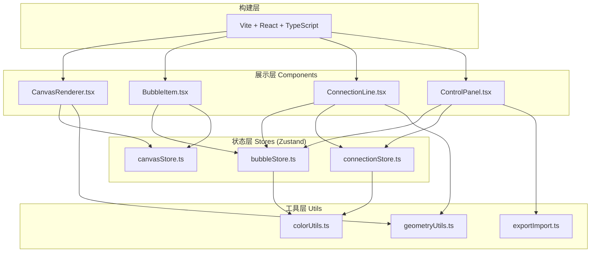
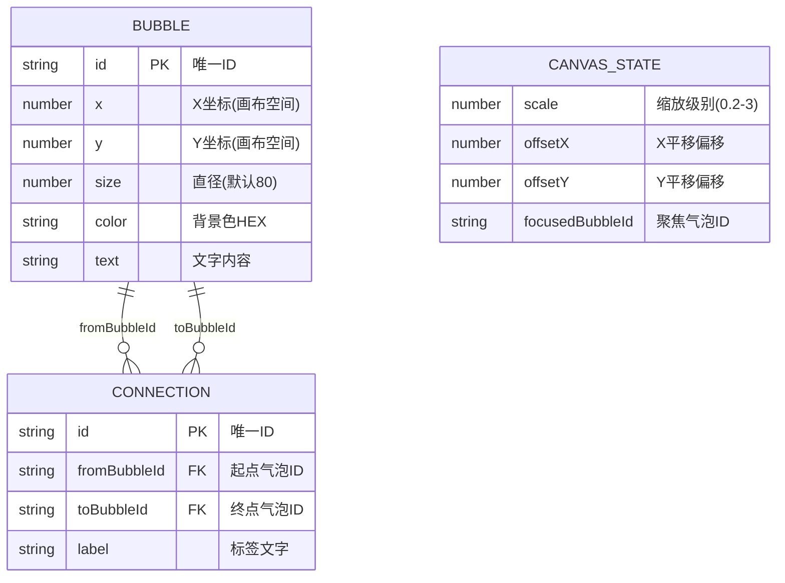

## 1. 架构设计



## 2. 技术说明
- **前端框架**：React@18 + TypeScript@5
- **构建工具**：Vite@5 + @vitejs/plugin-react@4
- **状态管理**：Zustand@4（三个独立store按职责划分）
- **动画库**：framer-motion@11（处理拖拽弹性动画、连线过渡动画）
- **样式方案**：原生CSS + CSS变量（不引入Tailwind，保持轻量高性能）
- **图标**：lucide-react（控制面板按钮图标）

## 3. 文件结构与调用关系

```
src/
├── App.tsx                           # 根组件，组合画布+控制面板
├── main.tsx                          # 入口文件，渲染App
├── index.css                         # 全局样式+CSS变量
├── canvas/
│   ├── store/
│   │   └── canvasStore.ts            # 画布状态(缩放/平移/聚焦)
│   └── components/
│       └── CanvasRenderer.tsx        # 画布渲染+鼠标事件
├── bubble/
│   ├── store/
│   │   └── bubbleStore.ts            # 气泡集合(CRUD)
│   └── components/
│       └── BubbleItem.tsx            # 单个气泡渲染+拖拽编辑
├── connection/
│   ├── store/
│   │   └── connectionStore.ts        # 连接线集合(CRUD)
│   └── components/
│       └── ConnectionLine.tsx        # 贝塞尔曲线+标签渲染
├── ui/
│   └── components/
│       └── ControlPanel.tsx          # 控制面板(新建/导出/导入)
└── utils/
    ├── colorUtils.ts                 # 颜色混合工具
    ├── geometryUtils.ts              # 几何计算(边缘点/贝塞尔)
    └── exportImport.ts               # JSON导入导出
```

**数据流向说明：**
- canvasStore → CanvasRenderer：读取scale/offset用于画布变换，接收鼠标事件更新状态
- bubbleStore → BubbleItem[]：渲染气泡列表，每个BubbleItem拖拽时更新位置
- connectionStore → ConnectionLine[]：渲染连线列表，从bubbleStore读取起止坐标
- ControlPanel → bubbleStore/connectionStore/exportImport：触发增删和导入导出

## 4. 数据模型

### 4.1 数据模型定义



### 4.2 TypeScript 类型定义

```typescript
// 气泡类型
interface Bubble {
  id: string;
  x: number;
  y: number;
  size: number;
  color: string;
  text: string;
}

// 连接线类型
interface Connection {
  id: string;
  fromBubbleId: string;
  toBubbleId: string;
  label: string;
}

// 画布状态类型
interface CanvasState {
  scale: number;
  offsetX: number;
  offsetY: number;
  focusedBubbleId: string | null;
}

// 导出数据格式
interface CanvasExport {
  version: string;
  bubbles: Bubble[];
  connections: Connection[];
  exportedAt: string;
}
```

### 4.3 Store Actions 定义

```typescript
// canvasStore actions
setScale(scale: number): void
setOffset(x: number, y: number): void
setFocusedBubble(id: string | null): void
resetView(): void
screenToCanvas(screenX: number, screenY: number): {x: number, y: number}

// bubbleStore actions
addBubble(x: number, y: number): Bubble
updateBubble(id: string, patch: Partial<Bubble>): void
removeBubble(id: string): void
getBubbleById(id: string): Bubble | undefined

// connectionStore actions
addConnection(fromId: string, toId: string): Connection
updateConnection(id: string, patch: Partial<Connection>): void
removeConnection(id: string): void
getConnectionsByBubble(bubbleId: string): Connection[]
```

## 5. 性能优化策略

### 5.1 渲染性能（200气泡+300连线保持60fps）
- **Store选择性订阅**：组件只订阅需要的状态切片，避免全量重渲染
- **React.memo包装**：BubbleItem和ConnectionLine使用memo避免无关重渲染
- **transform而非top/left**：气泡位置使用CSS transform: translate3d硬件加速
- **GPU层提升**：频繁变化元素使用will-change: transform
- **节流处理**：滚轮缩放使用requestAnimationFrame节流
- **SVG批量渲染**：连接线统一在一个SVG图层内渲染，减少DOM节点

### 5.2 动画性能
- framer-motion使用transform动画而非layout动画
- 拖拽使用硬件加速合成层，避免触发重排
- 连线绘制动画使用SVG stroke-dasharray过渡

### 5.3 内存管理
- 鼠标事件监听器在组件卸载时及时清理
- 拖拽结束后清理临时状态变量
- 避免在render阶段创建新对象/数组
