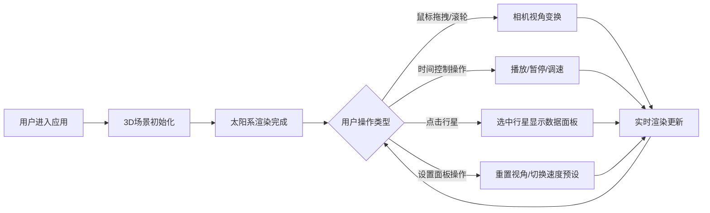

## 1. 产品概述

太阳系轨道模拟器是一款面向天文爱好者和教育工作者的三维可视化应用，通过交互式3D场景直观呈现太阳系行星运动轨迹、天体相对位置与速度关系，解决传统二维星图难以展示轨道倾角、近日点远日点速度变化及多行星公转周期对比的问题。

- 目标用户：天文爱好者、学生、教师、科普工作者
- 核心价值：以沉浸式3D交互体验降低天文知识理解门槛，直观展示天体物理规律

## 2. 核心功能

### 2.1 功能模块

1. **3D场景渲染模块**：太阳粒子光晕、六颗行星低多边形球体、轨道环线、星空背景
2. **相机交互模块**：左键旋转、滚轮缩放、右键平移、自动缓动动画
3. **时间控制模块**：播放/暂停、速度调节（0.5x-5x）、模拟时间显示
4. **行星数据面板模块**：点选行星查看详细参数（距离、角度、周期、速度等）
5. **轨道可视化模块**：半透明轨道环线、高亮选中轨道、12等分标记点
6. **设置面板模块**：重置视角、速度预设按钮组

### 2.2 功能详情

| 模块名称 | 子功能 | 功能描述 |
|---------|--------|---------|
| 3D场景渲染 | 太阳渲染 | 半径0.5单位，表面粒子发射光晕效果 |
| 3D场景渲染 | 行星渲染 | 水星、金星、地球、火星、木星、土星六颗行星，按真实比例缩小半径，低多边形球体+随机噪点纹理 |
| 3D场景渲染 | 星空背景 | 深空#0A0A1A背景，随机分布白色光点恒星（0.5-2px，透明度20%-70%） |
| 相机交互 | 视角控制 | 左键拖拽旋转、滚轮缩放（0.5-50单位）、右键平移 |
| 相机交互 | 平滑动画 | 视角切换使用ease-in-out缓动，持续0.4秒 |
| 时间控制 | 播放控制 | 播放/暂停按钮切换模拟运行状态 |
| 时间控制 | 速度调节 | 速度滑块0.5x-5x，预设按钮快捷切换 |
| 时间控制 | 时间显示 | 显示当前模拟时间（如2024-01-01 12:00）及进度条 |
| 数据面板 | 行星选择 | 点击行星选中，暂停时可查看详情 |
| 数据面板 | 参数展示 | 行星名称、半径、公转周期、当前距离（AU）、公转速度（km/s）、近日点位置箭头图 |
| 轨道可视化 | 轨道环线 | 半透明圆形环（行星色，透明度30%，线宽0.5px），12个等分标记点 |
| 轨道可视化 | 高亮显示 | 选中行星轨道高亮（透明度80%，线宽1.5px） |
| 设置面板 | 重置视角 | 一键恢复相机默认视角 |
| 设置面板 | 速度预设 | 0.5x、1x、2x、5x快捷按钮 |

## 3. 核心流程

## 4. 用户界面设计

### 4.1 设计风格

- **主色调**：深空蓝 #0A0A1A（背景）、白色 #FFFFFF（文字/UI边框）
- **行星色板**：水星灰 #B5A07C、金星黄 #E6C864、地球蓝 #4A90D9、火星红 #C1440E、木星橙 #D4A373、土星金 #D4AF37
- **UI风格**：磨砂玻璃效果（背景rgba(0,0,0,0.6)，边框1px rgba(255,255,255,0.1)，圆角8px）
- **字体**：标题24px带微弱发光效果，正文采用无衬线字体
- **动效**：平滑缓动过渡、悬停微交互、行星轨道发光高亮

### 4.2 页面布局

| 区域 | 元素 | UI细节 |
|-----|------|--------|
| 左上角 | 应用标题 | "太阳系轨道模拟器"白色24px，发光效果 |
| 右下角 | 时间控制面板 | 播放/暂停按钮、速度滑块、时间进度条、模拟时间显示 |
| 左侧 | 数据面板 | 半透明磨砂玻璃，点击行星后滑入显示 |
| 底部 | 设置面板 | 重置视角按钮、速度预设按钮组 |
| 全屏 | 3D场景 | Three.js渲染的太阳系场景 |

### 4.3 响应式适配

- **大屏（>1024px）**：所有面板固定位置显示
- **平板（768-1024px）**：面板折叠为可展开的悬浮按钮
- **手机（<768px）**：所有面板变为全屏覆盖的模态弹窗

### 4.4 3D场景指引

- **环境光照**：以太阳为中心的点光源为主光源，辅以弱环境光
- **相机设置**：PerspectiveCamera，初始距离太阳约10单位，视角可在0.5-50单位范围缩放
- **粒子效果**：太阳表面粒子光晕（粒子数<500），背景星空（粒子数<4500），总粒子数<5000
- **性能目标**：60fps流畅运行
