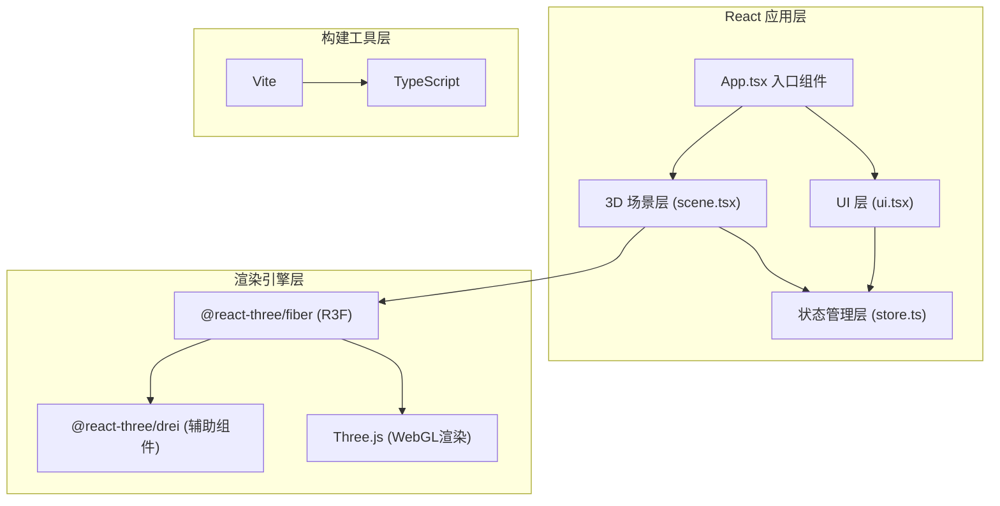

## 1. 架构设计



## 2. 技术选型

| 分类 | 技术栈 | 说明 |
|-----|-------|------|
| 前端框架 | React 18 | UI组件化开发 |
| 语言 | TypeScript | 类型安全，strict模式 |
| 构建工具 | Vite | 快速开发构建，启用@vitejs/plugin-react |
| 3D引擎 | Three.js | WebGL 3D渲染核心 |
| React-3D桥接 | @react-three/fiber | Three.js的React声明式封装 |
| 3D辅助组件 | @react-three/drei | OrbitControls、Stars等常用组件 |
| 状态管理 | zustand | 轻量级全局状态管理 |

## 3. 项目文件结构

```
auto278/
├── package.json          # 项目依赖与脚本配置
├── vite.config.js        # Vite构建配置
├── tsconfig.json         # TypeScript配置（strict:true）
├── index.html            # 入口HTML（全屏，无滚动条）
└── src/
    ├── main.tsx          # React入口，挂载<App/>
    ├── store.ts          # zustand全局状态管理
    ├── scene.tsx         # 3D场景组件（太阳、行星、轨道、动画循环）
    └── ui.tsx            # UI组件（时间控制、数据面板、设置面板）
```

## 4. 数据模型定义

### 4.1 行星数据类型

```typescript
interface PlanetData {
  id: string;
  name: string;
  color: string;
  radius: number;           // 渲染半径（单位）
  orbitRadius: number;      // 轨道半长轴（AU缩放）
  orbitEccentricity: number;// 轨道偏心率（简化模型）
  orbitInclination: number; // 轨道倾角（度）
  orbitalPeriod: number;    // 公转周期（地球日）
  orbitalSpeed: number;     // 平均公转速度（km/s）
  realRadius: number;       // 实际半径（km，用于显示）
}

interface PlanetState extends PlanetData {
  angle: number;            // 当前公转角度（弧度）
  position: [number, number, number]; // 当前3D位置
  distanceFromSun: number;  // 当前与太阳距离（AU）
}
```

### 4.2 全局状态（zustand store）

```typescript
interface AppState {
  planets: PlanetState[];
  selectedPlanetId: string | null;
  isPlaying: boolean;
  speedFactor: number;       // 0.5, 1, 2, 5
  simulationTime: Date;      // 当前模拟时间
  setSelectedPlanet: (id: string | null) => void;
  togglePlay: () => void;
  setSpeedFactor: (speed: number) => void;
  updatePlanetPositions: (delta: number) => void;
  resetView: () => void;
}
```

## 5. 核心实现要点

### 5.1 3D场景（scene.tsx）

- **太阳**：SphereGeometry（半径0.5）+ 自定义粒子系统模拟光晕，PointLight光源
- **行星**：低多边形IcosahedronGeometry + 程序化噪点纹理（使用FBM噪声），按轨道参数计算位置
- **轨道环线**：使用LineLoop绘制椭圆轨道，12个等分点使用Points标记
- **动画循环**：useFrame钩子，根据speedFactor和delta更新行星角度与位置，写入store

### 5.2 UI交互（ui.tsx）

- **时间控制面板**：右下角固定，包含Play/Pause按钮、速度滑块（0.5-5x）、时间进度条、模拟时间文本
- **数据面板**：左侧滑入，选中行星时显示名称、半径、周期、距离AU、速度km/s、近日点位置迷你图
- **设置面板**：底部居中，重置视角按钮（重置OrbitControls）、4个速度预设按钮
- **响应式**：使用CSS媒体查询适配大屏/平板/手机三种布局

### 5.3 相机与控制

- **OrbitControls**：来自@react-three/drei，配置minDistance=0.5, maxDistance=50
- **平滑过渡**：相机target和position变化使用lerp插值，easeInOutCubic缓动函数
- **行星点击**：使用raycaster检测点击，设置selectedPlanetId

### 5.4 性能优化

- 粒子总数控制在5000以内
- 行星使用InstancedMesh或共享Geometry
- 轨道线使用BufferGeometry
- UI状态变化使用zustand选择器避免不必要重渲染
