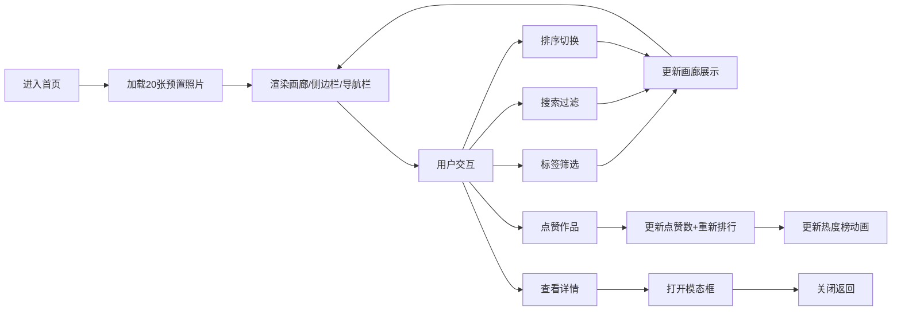

## 1. 产品概述

摄影师作品集互动展示平台，为个人摄影师提供作品在线展示与访客互动的解决方案，解决传统静态图集缺乏互动反馈的痛点。
- 主要目的：构建具有标签筛选、点赞互动、热度排行功能的现代化作品集平台
- 目标用户：个人摄影师及其访客
- 市场价值：提升作品展示的互动性，帮助摄影师了解受众偏好

## 2. 核心功能

### 2.1 用户角色
| 角色 | 注册方式 | 核心权限 |
|------|----------|----------|
| 访客 | 无需注册 | 浏览作品、按标签筛选、点赞作品、查看热度排行、搜索作品 |

### 2.2 功能模块
1. **主页面**：顶部导航栏、左侧边栏（标签筛选+热度排行）、中心作品画廊、照片详情模态框
2. **作品展示模块**：两列网格卡片、照片缩略图、标题、标签、点赞按钮
3. **交互模块**：点赞动画、标签多选筛选、排序切换、实时搜索、照片详情查看
4. **热度排行模块**：Top5热度作品、进度条动画、实时排序

### 2.3 页面详情
| 页面名称 | 模块名称 | 功能描述 |
|----------|----------|----------|
| 主页面 | 顶部导航栏 | 应用标题、防抖搜索框（200ms）、排序下拉菜单（点赞数/日期） |
| 主页面 | 侧边栏 | 标签筛选按钮组（多选高亮）、热度排行榜（Top5+进度条） |
| 主页面 | 作品画廊 | 两列网格卡片、悬停上浮效果、点赞心跳动画、数字滚动动画 |
| 主页面 | 照片详情模态框 | 大图展示、完整信息、缩放淡入/淡出动画 |

## 3. 核心流程

访客进入首页 → 浏览所有作品卡片 → 通过标签筛选/搜索/排序过滤作品 → 点击卡片查看详情 → 点赞喜欢的作品 → 查看实时更新的热度排行

## 4. 用户界面设计

### 4.1 设计风格
- **主色调**：深色主题，背景#1a1a2e，卡片#16213e，文字#e0e0e0，强调色#e94560
- **圆角风格**：卡片圆角12px，标签按钮圆角小框
- **阴影风格**：柔和阴影box-shadow: 0 4px 12px rgba(0,0,0,0.3)，悬停时加深
- **字体**：标题使用黑体加粗，整体采用现代无衬线字体
- **标签颜色**：不同标签使用不同背景色，从预设配色池中分配
- **进度条**：暖色渐变从橙色到红色，0.5s宽度过渡

### 4.2 页面设计概述
| 页面名称 | 模块名称 | UI元素 |
|----------|----------|---------|
| 主页面 | 顶部导航栏 | 固定高度、深色背景、标题左对齐、搜索框居中、下拉菜单右对齐 |
| 主页面 | 侧边栏 | 左侧固定宽度、上半部分标签按钮网格、下半部分排行列表带进度条 |
| 主页面 | 作品画廊 | CSS Grid两列布局、卡片1:1比例、悬停上浮6px（0.3s过渡） |
| 主页面 | 照片详情模态框 | 半透明黑色遮罩、内容居中缩放、右上角关闭按钮 |

### 4.3 响应式
- **桌面端**：侧边栏左侧固定，画廊两列网格
- **768px以下**：画廊切换为单列，侧边栏折叠为底部滑动面板（汉堡按钮展开，0.4s过渡）
- **触摸优化**：按钮最小触控区域44x44px，悬停效果替换为点击反馈

### 4.4 动画规范
- 卡片悬停：transform: translateY(-6px)，box-shadow加深，0.3s transition
- 点赞按钮：心跳缩放动画（scale 1→1.2→1），0.2s
- 点赞数字：滚动数字动画，0.3s
- 排序重排：卡片平滑移动，0.3s ease-in-out
- 模态框：缩放淡入0.3s，缩回淡出0.2s
- 进度条：宽度过渡0.5s
