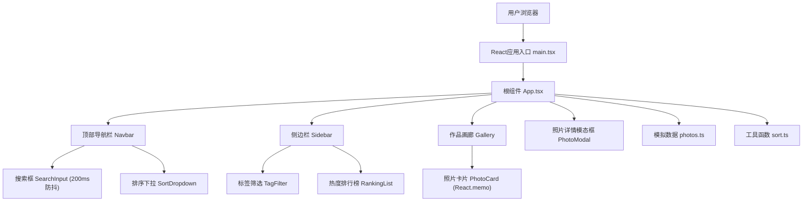

## 1. 架构设计



## 2. 技术描述

- **前端框架**：React 18 + TypeScript 5
- **构建工具**：Vite 5 + @vitejs/plugin-react
- **样式方案**：原生CSS（CSS Modules）+ CSS Variables主题
- **状态管理**：React Hooks（useState、useEffect、useMemo、useCallback）
- **数据层**：本地模拟数据模块（20张预置照片）
- **性能优化**：React.memo、useMemo、useCallback、防抖搜索

## 3. 目录结构与调用关系

```
src/
├── main.tsx              # 入口，渲染App
│   调用关系：import App → ReactDOM.createRoot
├── App.tsx               # 根组件，状态管理中枢
│   调用关系：import photos → import sort函数 → 传入props给子组件
├── components/
│   ├── Gallery.tsx       # 画廊，接收filterTags/sortBy
│   │   调用关系：接收App传入photos → 渲染PhotoCard列表
│   ├── PhotoCard.tsx     # 照片卡片，React.memo优化
│   │   调用关系：接收单张photo → 渲染UI → 调用onLike/onClick
│   ├── Sidebar.tsx       # 侧边栏，筛选+排行
│   │   调用关系：接收photos/allTags/selectedTags → 渲染筛选按钮和排行榜
│   ├── Navbar.tsx        # 导航栏，搜索+排序
│   │   调用关系：接收onSearch/onSortChange → 回调到App
│   └── PhotoModal.tsx    # 详情模态框
│       调用关系：接收selectedPhoto → 渲染大图详情
├── data/
│   └── photos.ts         # 模拟数据，20张照片
│       被调用：App.tsx直接import
└── utils/
    └── sort.ts           # 排序工具函数
        被调用：App.tsx调用处理照片列表
```

## 4. 数据模型

### 4.1 Photo类型定义

```typescript
interface Photo {
  id: number;
  title: string;
  url: string;
  tags: string[];
  likes: number;
  date: string; // ISO格式
}
```

### 4.2 数据流向

```
App状态(photos, selectedTags, sortBy, searchQuery)
    ↓
├─→ Sidebar (allTags, selectedTags, sortedPhotos)
│   ↓
│   └─→ 用户点击标签 → onTagToggle → 更新selectedTags
│
├─→ Gallery (filtered&sorted photos)
│   ↓
│   └─→ PhotoCard列表
│       ↓
│       ├─→ 点击卡片 → onPhotoClick → 打开PhotoModal
│       └─→ 点击点赞 → onLike → 更新photos.likes
│
└─→ Navbar (searchQuery, sortBy)
    ↓
    ├─→ 搜索输入 → onSearch → 更新searchQuery（防抖200ms）
    └─→ 排序选择 → onSortChange → 更新sortBy
```

## 5. 性能约束实现方案

| 约束 | 实现方案 |
|------|----------|
| 初始渲染 ≤ 300ms | React.memo包装PhotoCard，避免不必要重渲染 |
| 交互响应 ≤ 100ms | useCallback缓存事件处理函数，useMemo缓存计算结果 |
| 搜索无卡顿 | lodash-es防抖200ms，或自定义useDebounce hook |
| 动画流畅 | 全部使用CSS transition/transform，避免JS动效 |
| 列表重排动画 | CSS Grid + FLIP动画思想，transition: transform 0.3s |

## 6. 工具函数说明

### sort.ts 导出函数
- `sortByLikes(photos: Photo[]): Photo[]` - 按点赞数降序
- `sortByDate(photos: Photo[]): Photo[]` - 按日期降序
- `getTopPhotos(photos: Photo[], count: number): Photo[]` - 获取Top N

### 自定义Hooks
- `useDebounce<T>(value: T, delay: number): T` - 防抖hook
