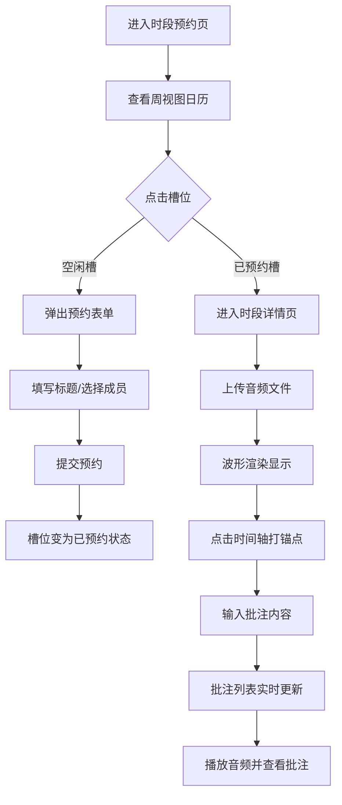

## 1. 产品概述
音乐社团录音棚预约与多轨音频协作平台，解决排练时间冲突和修改意见难以追踪的问题。
- 目标用户：音乐社团成员，需要预约录音棚时段并进行多轨音频协作批注
- 核心价值：可视化时段预约管理、多轨音频波形展示、秒级精确批注追踪

## 2. 核心功能

### 2.1 用户角色
| 角色 | 说明 | 核心权限 |
|------|------|----------|
| 社团成员 | 平台使用者 | 预约时段、上传音频、添加/编辑/删除批注 |

### 2.2 功能模块
1. **时段预约页**：周视图日历展示、预约表单模态框、已预约状态显示
2. **时段详情页**：多轨音频时间轴、波形渲染、音频播放控制、批注锚点与列表

### 2.3 页面详情
| 页面名称 | 模块名称 | 功能描述 |
|---------|---------|---------|
| 时段预约页 | 周视图日历 | 每天8:00-22:00，每30分钟一个槽位，显示预约状态 |
| 时段预约页 | 预约模态框 | 填写标题、选择邀请成员，毛玻璃背景效果 |
| 时段预约页 | 已预约槽位 | 显示预约人昵称首字母头像，从色板取背景色 |
| 时段详情页 | 多轨时间轴 | 垂直排列多轨道，canvas绘制波形，按上传者分色 |
| 时段详情页 | 音频播放器 | 播放/暂停控制，进度条平滑推进 |
| 时段详情页 | 批注锚点 | 点击时间轴打锚点，白色竖线+时间戳显示，缩放进场动画 |
| 时段详情页 | 批注面板 | 展示时间戳、批注人、内容，支持编辑删除，轮询更新 |
| 时段详情页 | 音频上传 | MP3/WAV格式，最大30MB，上传后显示波形 |

## 3. 核心流程

## 4. 用户界面设计

### 4.1 设计风格
- 主背景：暗色主题 #1E1E2E
- 卡片背景：#2B2B3D
- 文字颜色：#E0E0E0
- 强调色：霓虹蓝 #00D4FF（按钮、激活状态）
- 用户色板：#2C3E50、#E74C3C、#3498DB、#1ABC9C
- 按钮样式：圆角矩形，霓虹蓝边框/填充，hover过渡效果
- 字体：现代无衬线字体，清晰层级
- 布局：卡片式布局，响应式网格
- 动效：槽位0.3s缓入缓出，批注锚点scale 0.8→1.0缩放进场

### 4.2 页面设计概述
| 页面名称 | 模块名称 | UI元素 |
|---------|---------|--------|
| 时段预约页 | 周视图日历 | 网格布局、7列日期表头、时间列、槽位卡片、首字母头像 |
| 时段预约页 | 预约模态框 | 毛玻璃backdrop-blur:8px、表单输入、成员选择、提交按钮 |
| 时段详情页 | 多轨时间轴 | Canvas波形条、播放进度线、批注锚点、垂直轨道布局 |
| 时段详情页 | 批注面板 | 批注卡片列表、时间戳标签、编辑/删除操作按钮 |
| 时段详情页 | 上传区 | 拖拽区域、文件选择按钮、进度指示 |

### 4.3 响应式设计
- 桌面端：日历周视图网格 + 右侧批注面板并列布局
- 平板端（≤768px）：日历自动切换为列表视图，批注面板折叠为底部抽屉
- 触控优化：增大点击区域，支持滑动切换周视图
