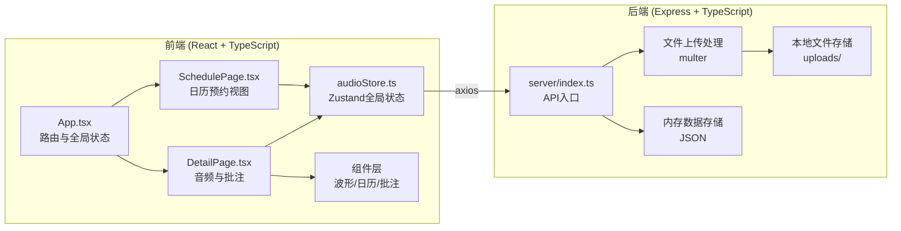
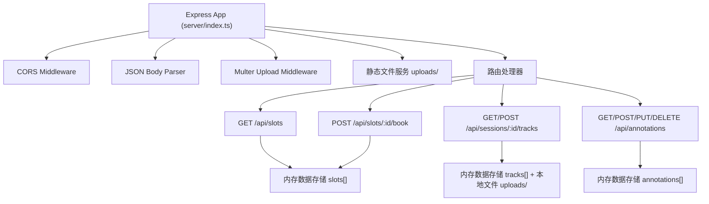
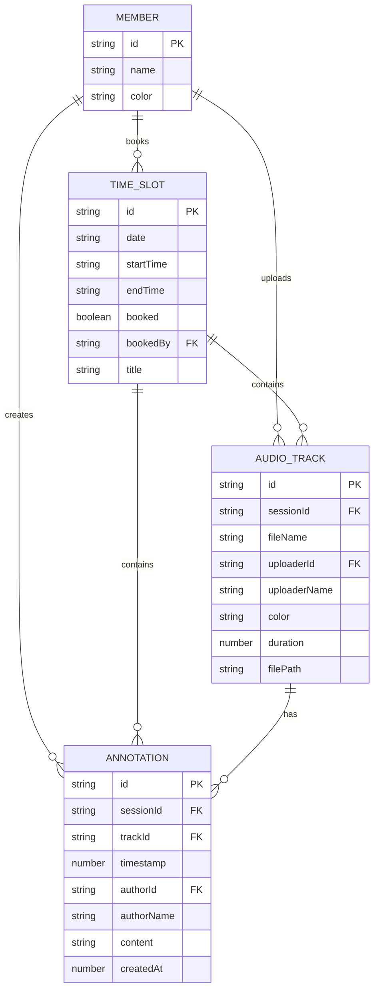

## 1. 架构设计



## 2. 技术栈说明
- 前端：React@18 + TypeScript + Vite
- 状态管理：Zustand
- 路由：react-router-dom
- HTTP请求：axios
- 后端：Express@4 + TypeScript
- 文件上传：multer
- 跨域：cors
- 构建工具：Vite

## 3. 路由定义
| 路由 | 用途 |
|-----|------|
| / | 时段预约首页（周视图日历） |
| /session/:id | 单个时段详情页（音频与批注） |

## 4. API 定义

### 4.1 类型定义

```typescript
interface Member {
  id: string;
  name: string;
  color: string;
}

interface TimeSlot {
  id: string;
  date: string;
  startTime: string;
  endTime: string;
  booked: boolean;
  bookedBy?: string;
  title?: string;
  invitedMembers?: string[];
}

interface AudioTrack {
  id: string;
  sessionId: string;
  fileName: string;
  uploaderId: string;
  uploaderName: string;
  color: string;
  duration: number;
  filePath: string;
}

interface Annotation {
  id: string;
  sessionId: string;
  trackId?: string;
  timestamp: number;
  authorId: string;
  authorName: string;
  content: string;
  createdAt: number;
}
```

### 4.2 接口定义

| 方法 | 路径 | 说明 | 请求体 | 响应 |
|-----|------|------|--------|------|
| GET | /api/slots | 获取所有时段槽位 | - | TimeSlot[] |
| POST | /api/slots/:id/book | 预约时段 | { title, bookedBy, invitedMembers } | TimeSlot |
| GET | /api/sessions/:id/tracks | 获取时段音频列表 | - | AudioTrack[] |
| POST | /api/sessions/:id/tracks | 上传音频文件 | multipart/form-data | AudioTrack |
| GET | /api/tracks/:id/file | 下载音频文件 | - | 文件流 |
| GET | /api/sessions/:id/annotations | 获取批注列表 | - | Annotation[] |
| POST | /api/sessions/:id/annotations | 创建批注 | { timestamp, authorId, authorName, content, trackId? } | Annotation |
| PUT | /api/annotations/:id | 更新批注 | { content } | Annotation |
| DELETE | /api/annotations/:id | 删除批注 | - | { success: boolean } |
| GET | /api/members | 获取成员列表 | - | Member[] |

## 5. 服务端架构



## 6. 数据模型

### 6.1 实体关系



### 6.2 初始化数据
- 生成一周内每天8:00-22:00的30分钟槽位数据
- 预置3-5个示例成员
- 服务端使用内存存储，重启后重置
