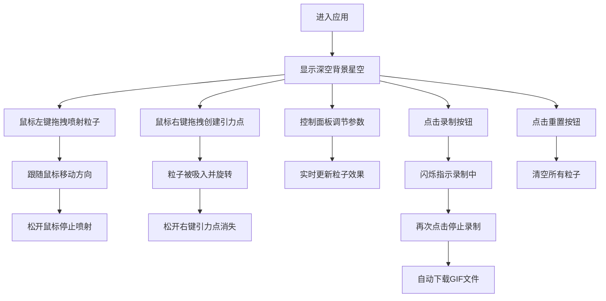

## 1. 产品概述

交互式粒子宇宙沙盒是一款基于Canvas的创意粒子物理模拟应用，用户通过鼠标交互和参数调节，实时生成并控制数千个粒子的运动轨迹，创造出绚丽的宇宙粒子效果。

- 面向创意设计师、数字艺术家和粒子物理爱好者，提供沉浸式的粒子创作体验
- 产品价值：将复杂的物理模拟转化为直观的交互体验，让用户轻松创造独特的粒子艺术作品

## 2. 核心功能

### 2.1 用户角色
| 角色 | 注册方式 | 核心权限 |
|------|----------|----------|
| 普通用户 | 无需注册 | 完整使用所有粒子交互、参数调节、录制功能 |

### 2.2 功能模块
1. **粒子画布**：核心渲染区域，实时绘制粒子运动轨迹和背景星空
2. **控制面板**：参数调节面板，控制粒子数量、速度、物理模式、颜色方案
3. **录制系统**：GIF动画录制功能，支持最长5秒的粒子动画录制
4. **交互系统**：鼠标拖拽喷射粒子、右键引力吸引、模式切换等交互

### 2.3 页面详情
| 页面名称 | 模块名称 | 功能描述 |
|----------|----------|----------|
| 主页面 | 粒子画布 | Canvas 2D渲染，支持3000粒子实时动画，渐变光晕拖尾效果 |
| 主页面 | 控制面板 | 参数滑杆（粒子数、速度、引力、拖尾长度）、物理模式切换、配色方案切换 |
| 主页面 | 录制按钮 | 圆形红色录制按钮，闪烁状态指示，自动下载GIF |
| 主页面 | 重置按钮 | 一键清除所有粒子 |
| 主页面 | 状态栏 | 显示粒子数、FPS帧率、当前模式名称 |

## 3. 核心流程

### 主交互流程
用户进入应用后，默认显示深空背景和少量粒子。按住鼠标左键拖拽可喷射粒子，松开停止。右键拖拽创建临时引力点吸引粒子。通过控制面板调节参数，切换物理模式（引力/涡旋/弹射）和配色方案。点击录制按钮开始捕获动画，再次点击停止并下载GIF。点击重置按钮清空画布。

## 4. 用户界面设计

### 4.1 设计风格
- **主色调**：深空主题，深蓝至深紫渐变背景（#0B0D1E → #1A0A2E）
- **强调色**：模式颜色 - 引力#3498DB，涡旋#E67E22，弹射#2ECC71；录制按钮#E74C3C
- **按钮风格**：圆形按钮，带悬停状态，模式按钮带发光边框
- **字体**：控制面板标题使用等宽字体，字号14px，颜色#ECF0F1
- **布局风格**：左侧280px控制面板，右侧Canvas区域，底部状态栏
- **视觉特效**：半透明深色玻璃质感面板，微光边框，粒子辉光效果，星星闪烁

### 4.2 页面设计概述
| 页面名称 | 模块名称 | UI元素 |
|----------|----------|--------|
| 主页面 | 粒子画布 | 深色径向渐变背景，Canvas渲染区域，十字准星鼠标，白色星星闪烁 |
| 主页面 | 控制面板 | 半透明玻璃质感（rgba(20,20,40,0.75)），10px圆角，2px微光边框 |
| 主页面 | 参数滑杆 | 轨道高4px，背景#2C3E50，滑块直径16px，#3498DB默认色，悬停#2980B9 |
| 主页面 | 模式按钮 | 发光边框，选中时显示对应模式颜色，0.3秒弹性缩放过渡 |
| 主页面 | 配色按钮 | 圆形色块（直径36px），边缘2px白色细分线 |
| 主页面 | 录制按钮 | 圆形红色按钮（直径40px），悬停变暗，录制时闪烁 |
| 主页面 | 重置按钮 | 灰色按钮，悬停变白 |
| 主页面 | 状态栏 | 粒子数（1856/3000）、FPS（59）、模式名称（中文） |

### 4.3 响应式设计
- **桌面端（≥768px）**：左侧固定控制面板280px，右侧自适应Canvas区域
- **移动端（<768px）**：控制面板折叠为顶部横向可展开面板（高度60px），点击箭头展开/收起，Canvas自动适应剩余高度
- **触摸优化**：支持触摸拖拽喷射粒子，调整按钮尺寸适配触摸操作

### 4.4 动效设计
- **UI过渡**：所有UI元素使用framer-motion的AnimatePresence实现0.2秒淡入淡出
- **滑杆动效**：数值变化时0.15秒微弹效果
- **按钮动效**：模式切换0.3秒弹性缩放过渡
- **粒子动效**：拖尾透明度渐变，粒子边缘辉光，星星缓慢闪烁
