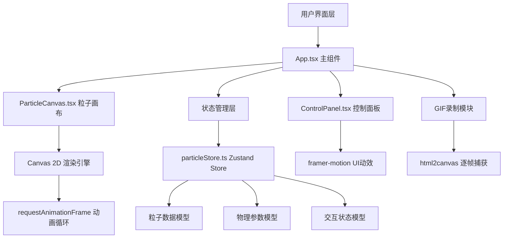

## 1. 架构设计



## 2. 技术描述

- **前端框架**：React@18 + TypeScript@5
- **构建工具**：Vite@5
- **状态管理**：Zustand@4 - 管理粒子数组、物理参数、交互模式
- **动画系统**：framer-motion@11 - 驱动UI过渡动画
- **Canvas渲染**：Canvas 2D API + requestAnimationFrame - 高性能粒子渲染
- **GIF录制**：html2canvas@1 + 自定义GIF编码器 - 逐帧捕获生成GIF
- **代码规范**：TypeScript严格模式

## 3. 核心文件结构

| 文件路径 | 用途 |
|----------|------|
| `package.json` | 项目依赖配置（react、react-dom、vite、typescript、zustand、framer-motion、html2canvas） |
| `vite.config.js` | Vite构建配置，React插件支持 |
| `tsconfig.json` | TypeScript配置，严格模式启用 |
| `index.html` | 应用入口页面 |
| `src/App.tsx` | 主组件，整合画布、控制面板、录制功能、状态栏 |
| `src/store/particleStore.ts` | Zustand状态管理，粒子数据、物理参数、交互状态 |
| `src/components/ParticleCanvas.tsx` | Canvas粒子渲染组件，动画循环、粒子更新与绘制 |
| `src/components/ControlPanel.tsx` | 参数控制面板，滑杆、模式切换、配色切换 |

## 4. 数据模型

### 4.1 粒子数据模型

```typescript
interface Particle {
  id: number;
  x: number;
  y: number;
  vx: number;
  vy: number;
  trail: { x: number; y: number }[];
  hue: number;
  life: number;
  maxLife: number;
}
```

### 4.2 状态数据模型

```typescript
interface ParticleState {
  particles: Particle[];
  maxParticles: number;
  particleCount: number;
  speed: number;
  gravityStrength: number;
  trailLength: number;
  physicsMode: 'gravity' | 'vortex' | 'ejection';
  colorScheme: 'aurora' | 'lava' | 'ocean' | 'night' | 'rainbow';
  isMouseDown: boolean;
  isRightMouseDown: boolean;
  mouseX: number;
  mouseY: number;
  lastMouseX: number;
  lastMouseY: number;
  gravityPointX: number | null;
  gravityPointY: number | null;
  stars: { x: number; y: number; size: number; opacity: number }[];
}
```

### 4.3 配色方案预设

| 方案名称 | HSL范围 |
|----------|---------|
| 极光 | 180° - 300°（青蓝紫） |
| 熔岩 | 0° - 60°（红橙黄） |
| 海洋 | 180° - 240°（蓝绿青） |
| 暗夜 | 270° - 330°（紫粉白） |
| 彩虹 | 0° - 360°（全色环） |

## 5. 核心算法与性能优化

### 5.1 粒子物理引擎

- **引力模式**：粒子间相互引力计算，距离平方反比定律
- **涡旋模式**：粒子围绕中心旋转，向心力计算，向心收缩
- **弹射模式**：爆炸式初速度，画布边缘反弹，阻尼衰减

### 5.2 性能优化策略

1. **粒子上限**：最多3000粒子，超出时FIFO淘汰最早粒子
2. **对象池化**：复用粒子对象，避免频繁GC
3. **Canvas优化**：
   - 使用离屏Canvas预处理？（暂不需要，直接主Canvas绘制）
   - 拖尾使用半透明矩形覆盖实现残影效果
   - 批量绘制同色粒子
4. **动画循环**：固定requestAnimationFrame，逻辑与渲染分离
5. **状态更新**：Zustand状态仅在UI参数变化时更新，粒子数据直接操作

### 5.3 GIF录制实现

- 使用html2canvas逐帧捕获Canvas
- 帧率15fps，最长5秒（75帧）
- 自定义简单GIF编码（LZW压缩）
- Blob URL触发下载

## 6. 交互事件处理

| 事件 | 处理逻辑 |
|------|----------|
| mousedown (左键) | 设置isMouseDown=true，记录鼠标位置 |
| mousemove | 更新鼠标位置，计算移动方向，喷射粒子 |
| mouseup (左键) | 设置isMouseDown=false，停止喷射 |
| mousedown (右键) | 设置isRightMouseDown=true，创建引力点 |
| mousemove (右键) | 更新引力点位置 |
| mouseup (右键) | 设置isRightMouseDown=false，清除引力点 |
| contextmenu | 阻止默认右键菜单 |
| resize | 调整Canvas尺寸 |

## 7. 物理模式详细规则

### 引力模式（Gravity）
- 粒子间存在相互吸引力，F = G * m1 * m2 / r²
- 距离过近时产生排斥力防止合并
- 粒子速度阻尼0.99

### 涡旋模式（Vortex）
- 所有粒子围绕画布中心旋转
- 切向速度与距离成正比
- 径向存在向心加速度
- 粒子缓慢向中心收缩

### 弹射模式（Ejection）
- 粒子从中心向外爆炸式散开
- 初速度随机方向，大小递增
- 碰撞画布边缘反弹，能量损失10%
- 速度阻尼0.995
