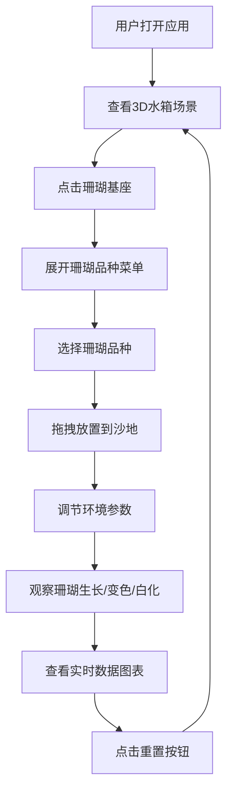

## 1. 产品概述

微型珊瑚礁生态群落动态演化模拟器，让用户以水族馆管理员视角，在3D水箱中放置不同种类的数字珊瑚，调节环境参数观察珊瑚生长、变色或白化，同时自动记录群落数据变化曲线。

- **目标用户**：海洋生物爱好者、教育工作者、模拟游戏玩家
- **核心价值**：沉浸式体验珊瑚礁生态系统，直观了解环境因素对珊瑚健康的影响

## 2. 核心功能

### 2.1 用户角色

| 角色 | 注册方式 | 核心权限 |
|------|----------|----------|
| 管理员用户 | 无需注册，直接使用 | 放置珊瑚、调节环境参数、查看数据图表 |

### 2.2 功能模块

1. **3D水箱场景**：水体渲染、沙底纹理、相机控制
2. **珊瑚放置系统**：珊瑚基座、品种选择、拖拽放置
3. **珊瑚生长模拟**：生长形态、颜色变化、白化过程
4. **环境参数控制**：水温、光照、水流、营养盐
5. **粒子效果系统**：气泡、浮游生物粒子
6. **数据记录与可视化**：实时折线图、历史数据、重置功能

### 2.3 页面详情

| 页面名称 | 模块名称 | 功能描述 |
|----------|----------|----------|
| 主页面 | 3D水箱场景 | 浅蓝色水体、淡金色细沙底、相机旋转缩放 |
| 主页面 | 珊瑚放置菜单 | 点击基座展开菜单，选择珊瑚品种，拖拽放置 |
| 主页面 | 右侧控制面板 | 四个滑块控制环境参数，实时响应 |
| 主页面 | 左下角数据图表 | 实时显示总面积和色彩饱和度曲线 |

## 3. 核心流程

用户打开应用 → 查看初始3D水箱场景 → 点击珊瑚基座选择珊瑚品种 → 拖拽放置珊瑚到沙地 → 调节环境参数 → 观察珊瑚生长/变色/白化 → 查看数据图表记录 → 点击重置按钮恢复初始状态

## 4. 用户界面设计

### 4.1 设计风格

- **主色调**：深海蓝灰色主题，背景#0F1923，控件基色#1A2A3A
- **强调色**：蓝色发光边框#3498DB，珊瑚健康色粉橙到亮黄渐变
- **按钮样式**：柔和光影卡片，微细发光边框，发光半径2px
- **字体**：现代无衬线字体，清晰的层级关系
- **布局风格**：右侧控制面板毛玻璃效果，左下角悬浮图表
- **交互过渡**：所有交互元素悬停时有0.2秒透明度渐变（0.75→1.0）

### 4.2 页面设计概述

| 页面名称 | 模块名称 | UI元素 |
|----------|----------|----------|
| 主页面 | 3D水箱场景 | 浅蓝色水体rgba(200,230,255,0.8，8x8网格细沙底，45度俯视相机 |
| 主页面 | 珊瑚放置 | 灰色圆柱基座#7F8C8D，鹿角珊瑚三分支、脑珊瑚半球褶皱、软珊瑚波浪触手 |
| 主页面 | 右侧控制面板 | 半透明毛玻璃背景rgba(255,255,255,0.12，边框1px rgba(255,255,255,0.2，内边距24px |
| 主页面 | 滑块控件 | 2px厚圆形旋钮直径14px，蓝到红渐变 |
| 主页面 | 数据图表 | 320x160px，深色半透明背景rgba(0,0,0,0.3，橙色#E67E22和青色#1ABC9C曲线 |
| 主页面 | 重置按钮 | 16x16px圆形#E74C3C，悬停变暗20% |

### 4.3 响应式设计

- 桌面端优先设计，最小宽度768px确保内容不重叠
- 平板适配：控制面板可收起为可折叠面板
- 触摸优化：拖拽放置支持触摸操作

### 4.4 3D场景指导

- **环境/HDRI**：清澈浅蓝色水体，柔和环境光
- **灯光设置**：主光+补光，模拟水下光照效果
- **相机设置**：正前方45度俯视，支持鼠标左键拖拽旋转、滚轮缩放
- **构图**：水箱为视觉焦点，珊瑚为主要交互元素
- **交互和动画**：珊瑚生长动画、触手摆动动画、气泡粒子动画
- **后处理效果**：柔和光影、发光边框效果
- **性能预算**：FPS保持45以上，珊瑚超过50时自动降低粒子密度至60%

## 5. 性能要求

- FPS保持在45以上
- 珊瑚总数超过50时自动降低粒子密度至60%
- 参数调整到结果稳定显示延迟不超过0.5秒
- 每5秒自动记录一次数据
