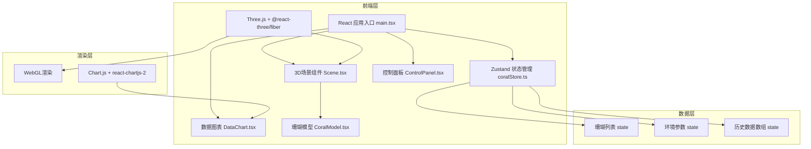

## 1. 架构设计



## 2. 技术描述

- **前端框架**：React 18 + TypeScript
- **构建工具**：Vite 5
- **3D引擎**：Three.js + @react-three/fiber + @react-three/drei
- **状态管理**：Zustand
- **图表库**：Chart.js + react-chartjs-2
- **后端**：无（纯前端应用）
- **数据库**：无（客户端内存状态）

### 核心依赖版本

```json
{
  "react": "^18.2.0",
  "react-dom": "^18.2.0",
  "three": "^0.160.0",
  "@react-three/fiber": "^8.15.0",
  "@react-three/drei": "^9.92.0",
  "zustand": "^4.4.0",
  "chart.js": "^4.4.0",
  "react-chartjs-2": "^5.2.0"
}
```

## 3. 项目结构

```
d:\Pro\tasks\auto283\
├── .trae/documents/
│   ├── PRD.md
│   └── TechnicalArchitecture.md
├── src/
│   ├── components/
│   │   ├── Scene.tsx          # 3D场景主组件
│   │   ├── CoralModel.tsx     # 单个珊瑚3D模型
│   │   ├── ControlPanel.tsx   # 右侧控制面板
│   │   └── DataChart.tsx      # 数据折线图
│   ├── store/
│   │   └── coralStore.ts      # Zustand状态管理
│   └── main.tsx               # React应用入口
├── index.html                 # HTML入口
├── vite.config.js             # Vite配置
├── tsconfig.json              # TypeScript配置
└── package.json               # 项目依赖
```

## 4. 状态管理设计

### 4.1 状态类型定义

```typescript
// 珊瑚品种
type CoralType = 'staghorn' | 'brain' | 'soft'

// 单个珊瑚数据
interface Coral {
  id: string
  type: CoralType
  position: [number, number, number]
  growth: number      // 0-1 生长阶段
  health: number      // 0-1 健康度
  colorProgress: number // 颜色过渡进度
  bleachingProgress: number // 白化进度 0-1
}

// 环境参数
interface EnvironmentParams {
  temperature: number   // 18-35度
  light: number         // 500-3000流明
  waterFlow: number     // 0-5单位/秒
  nutrients: number     // 0.05-1.0mg/L
}

// 历史数据点
interface HistoryDataPoint {
  timestamp: number
  totalArea: number
  colorSaturation: number
}

// Store状态
interface CoralStore {
  corals: Coral[]
  environmentParams: EnvironmentParams
  historyData: HistoryDataPoint[]
  selectedCoralType: CoralType | null
  isPlacing: boolean
  hoverPosition: [number, number, number] | null
  
  // Actions
  addCoral: (type: CoralType, position: [number, number, number]) => void
  updateParams: (params: Partial<EnvironmentParams>) => void
  tick: (deltaTime: number) => void
  reset: () => void
  startPlacing: (type: CoralType) => void
  cancelPlacing: () => void
  setHoverPosition: (pos: [number, number, number] | null) => void
}
```

## 5. 核心算法

### 5.1 珊瑚生长算法

```typescript
// 每帧更新生长值
const growthRate = 0.001 * (environmentParams.light / 1500) * (environmentParams.nutrients / 0.3)
coral.growth = Math.min(1, coral.growth + growthRate * deltaTime)
```

### 5.2 珊瑚健康度计算

```typescript
// 温度影响
const tempStress = Math.max(0, environmentParams.temperature - 30) * 0.1
// 营养盐影响
const nutrientStress = Math.max(0, 0.1 - environmentParams.nutrients) * 2
// 综合健康度
coral.health = Math.max(0, 1 - tempStress - nutrientStress)
```

### 5.3 白化过程

```typescript
if (coral.health < 0.3) {
  coral.bleachingProgress = Math.min(1, coral.bleachingProgress + deltaTime / 15)
} else if (coral.health > 0.7) {
  coral.bleachingProgress = Math.max(0, coral.bleachingProgress - deltaTime / 30)
}
```

### 5.4 颜色混合

```typescript
// 健康颜色渐变：#FF6B6B → #FFD93D
const healthyColor = lerpColor('#FF6B6B', '#FFD93D', coral.colorProgress)
// 白化颜色渐变：#E0E0E0 → #B0B0B0 → #808080
const bleachedColor = lerpColor('#E0E0E0', '#808080', coral.bleachingProgress)
// 最终颜色
const finalColor = lerpColor(healthyColor, bleachedColor, coral.bleachingProgress)
```

### 5.5 总面积计算

```typescript
const baseAreas = { staghorn: 0.15, brain: 0.5, soft: 0.3 }
const totalArea = corals.reduce((sum, coral) => {
  return sum + baseAreas[coral.type] * coral.growth * coral.health
}, 0)
```

## 6. 性能优化策略

1. **实例化渲染**：对于大量粒子使用 InstancedMesh
2. **LOD控制**：远处珊瑚降低多边形数量
3. **帧节流**：数据记录每5秒一次，而非每帧
4. **粒子密度动态调整**：珊瑚>50时粒子密度降为60%
5. **材质复用**：相同类型珊瑚共享材质
6. **requestAnimationFrame优化**：使用 @react-three/fiber 的 useFrame

## 7. 路由定义

| 路由 | 用途 |
|------|------|
| / | 主页面，包含3D场景、控制面板和数据图表 |

（单页应用，无多路由）
