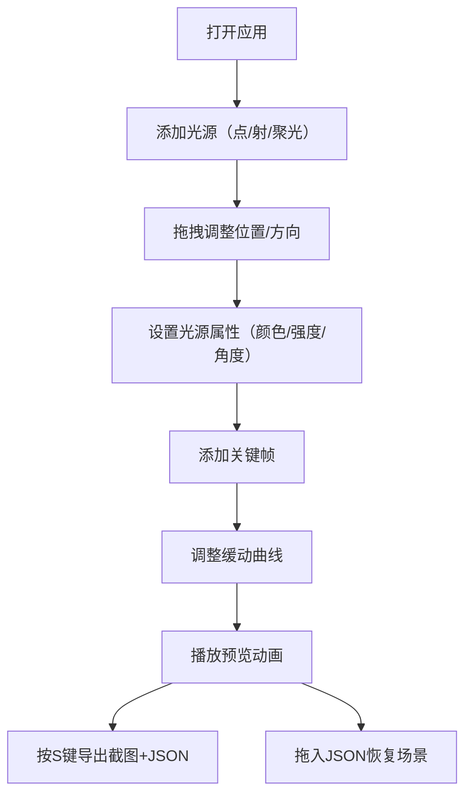

## 1. 产品概述

LightCanvas 是一款面向光影设计师和展览策划者的三维光影装置艺术编排工具，解决传统设计过程中实体模型调试成本高、光线效果不可控的痛点。用户可在虚拟展厅中自由编排多种光源，设置动态动画，并实时预览不同材质表面的光影反应。

## 2. 核心功能

### 2.2 功能模块

1. **三维场景编辑器**：虚拟展厅（16x10x6单位）、网格地板、三种测试几何体（金色球体、磨砂立方体、粗糙圆柱）
2. **光源编排系统**：点光源、射灯、聚光灯的添加/移动/旋转/删除，拖拽交互与照射范围预览
3. **动画时间线**：关键帧动画编辑、多种缓动曲线、播放控制、昼夜背景渐变
4. **导出导入系统**：截图导出（PNG）、参数导出（JSON）、场景恢复（JSON导入）

### 2.3 页面详情

| 页面名称 | 模块名称 | 功能描述 |
|-----------|-------------|---------------------|
| 主界面 | 三维场景区域 | 16x10x6虚拟展厅，深灰色网格地板，支持鼠标拖拽旋转视角、滚轮缩放，相机轨道指示线 |
| 主界面 | 左侧工具栏 | 光源添加按钮（点/射/聚光）、材质测试几何体开关、光源列表与强度滑块 |
| 主界面 | 底部时间线面板 | 关键帧轨道、播放头、缓动曲线选择、循环时长设置、实时属性显示 |

## 3. 核心流程

用户添加光源 → 调整光源位置/方向/颜色 → 为属性设置关键帧 → 调整缓动曲线 → 播放预览动画 → 导出截图与配置文件

## 4. 用户界面设计

### 4.1 设计风格

- **主色调**：深色主题，背景 #1A1A24，面板 #2C2C3A，高亮文字 #E0E0FF
- **辅助色**：相机轨道指示线 #4488CC，控制轴 X红/Y绿/Z蓝，选中关键帧 #FF4444
- **字体**：Google Fonts - Inter，等宽字体用于数值显示
- **交互反馈**：按钮点击缩放反弹动画（0.2s easeOut），光源悬浮属性提示框
- **视觉风格**：低饱和度蓝灰/白灰UI配色，高饱和度仅用于光源本身，科技感与专业感平衡

### 4.2 页面设计概述

| 页面名称 | 模块名称 | UI元素 |
|-----------|-------------|-------------|
| 主界面 | 三维场景区域 | 网格地板、测试几何体、光源可视化、控制轴、照射范围轮廓 |
| 主界面 | 左侧工具栏（260px） | 折叠按钮、光源添加按钮（带颜色圆点）、光源列表项、强度滑块 |
| 主界面 | 底部时间线面板（200px） | 轨道行（30px）、菱形关键帧（8px）、播放头、时间刻度、属性数值面板 |

### 4.3 响应式

- 桌面端（≥1024px）：左侧工具栏260px + 中央场景 + 底部时间线200px
- 移动端（<1024px）：左侧工具栏转为底部固定条（80px，图标横排），时间线转为场景底部半透明叠加层（160px），元素按比例缩小

### 4.4 3D场景指导

- **环境**：背景色从 #1E1E24 到 #4A3B32 昼夜渐变，深灰色网格地板（#2C2C2C，网格线 #555 半透明）
- **光照**：环境光 + 最多8个动态光源，PBR材质模拟金属/玻璃/混凝土的光影反应
- **相机**：默认俯视45度，距离原点10单位，OrbitControls控制
- **后处理**：光晕效果增强光源视觉，抗锯齿处理

### 4.5 性能要求

- 最多8个动态光源，30FPS以上动画更新
- 6个光源+3个几何体时，60FPS以上
- 参数调整到场景更新响应≤100ms
