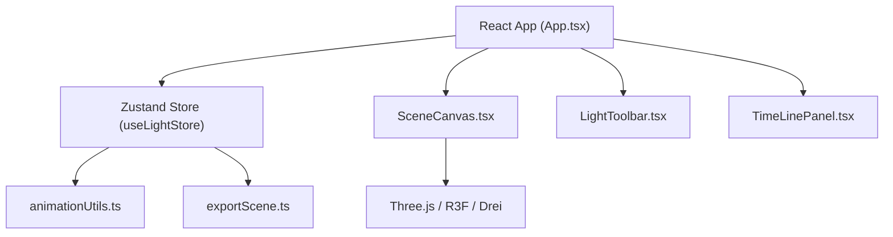

## 1. 架构设计



## 2. 技术描述

- **前端**：React 18 + TypeScript + Vite
- **三维渲染**：Three.js + @react-three/fiber + @react-three/drei
- **状态管理**：Zustand
- **文件导出**：file-saver
- **字体**：Google Fonts - Inter
- **无后端**，纯前端应用

## 3. 目录结构

```
src/
├── main.tsx              # React入口
├── App.tsx               # 根组件
├── store/
│   └── useLightStore.ts  # Zustand全局状态
├── components/
│   ├── SceneCanvas.tsx   # 3D场景组件
│   ├── LightToolbar.tsx  # 左侧工具栏
│   └── TimeLinePanel.tsx # 时间线面板
├── utils/
│   ├── exportScene.ts    # 导出导入功能
│   └── animationUtils.ts # 缓动函数与插值
└── types/                # 类型定义（按需）
```

## 4. 核心数据模型

### 光源类型定义

```typescript
type LightType = 'point' | 'spot' | 'directional';

interface Keyframe {
  id: string;
  time: number;          // 秒
  property: 'color' | 'intensity' | 'position' | 'rotation' | 'beamAngle';
  value: number[];       // [r,g,b] 或 [x,y,z] 或 [angle]
  easing: 'linear' | 'easeIn' | 'easeOut' | 'elastic' | 'bounce';
}

interface LightSource {
  id: string;
  type: LightType;
  position: [number, number, number];
  rotation: [number, number, number];
  color: [number, number, number];
  intensity: number;
  beamAngle?: number;    // 射灯专用
  radius?: number;       // 聚光灯专用
  decay?: number;        // 聚光灯专用
  keyframes: Keyframe[];
}

interface TimelineState {
  currentTime: number;
  duration: number;      // 1-60秒
  isPlaying: boolean;
  selectedKeyframeId?: string;
}

interface LightStore {
  lights: LightSource[];
  selectedLightId?: string;
  timeline: TimelineState;
  showTestObjects: boolean;
  // actions
  addLight: (type: LightType) => void;
  updateLight: (id: string, updates: Partial<LightSource>) => void;
  removeLight: (id: string) => void;
  selectLight: (id?: string) => void;
  addKeyframe: (lightId: string, keyframe: Omit<Keyframe, 'id'>) => void;
  updateKeyframe: (lightId: string, keyframeId: string, updates: Partial<Keyframe>) => void;
  removeKeyframe: (lightId: string, keyframeId: string) => void;
  togglePlay: () => void;
  setCurrentTime: (time: number) => void;
  setDuration: (duration: number) => void;
  toggleTestObjects: () => void;
}
```

## 5. 缓动函数库

```typescript
type EasingFn = (t: number) => number;

const easings: Record<string, EasingFn> = {
  linear: (t) => t,
  easeIn: (t) => t * t,
  easeOut: (t) => t * (2 - t),
  elastic: (t) => t === 0 || t === 1 ? t : Math.pow(2, -10 * t) * Math.sin((t - 0.1) * 5 * Math.PI) + 1,
  bounce: (t) => { /* bounce implementation */ }
};
```

## 6. 性能优化策略

- 使用 `useFrame` 进行动画帧更新，节流到30-60FPS
- 光源属性变化使用订阅模式，避免不必要的重渲染
- 测试几何体使用 `useMemo` 缓存
- 关键帧插值计算结果缓存
- Three.js 场景使用 InstancedMesh 优化（如适用）
- 使用 `drei` 提供的优化组件（如 `<OrbitControls>`、`<Grid>`）
