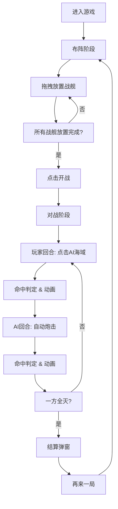

## 1. 产品概述

微型海战棋舰队布阵与自动炮击模拟器，一款基于10x10海域网格的双人回合制策略游戏。玩家可手动布置舰队后与AI进行自动炮击对战，包含精美的动画效果和实时舰队状态展示。

- 核心玩法：布阵→对战→结算，完整的游戏循环
- 目标用户：休闲游戏爱好者、策略游戏玩家
- 产品价值：提供沉浸式海战棋游戏体验，精美动画与流畅交互

## 2. 核心功能

### 2.1 功能模块

1. **布阵阶段：拖拽放置5艘不同类型战舰到10x10玩家海域网格
2. **对战阶段：玩家点击AI海域反击，AI自动炮击玩家海域
3. **状态面板：实时显示双方舰队耐久度和击沉数
4. **结算界面：游戏结束展示战斗统计，支持再来一局

### 2.2 页面详情

| 页面名称 | 模块名称 | 功能描述 |
|---------|---------|---------|
| 主游戏界面 | 布阵模块 | 5艘战舰拖拽放置、预览高亮、开战按钮 |
| 主游戏界面 | 对战模块 | 双方10x10网格、炮击动画、命中判定 |
| 主游戏界面 | 舰队状态面板 | 船只图标、名称、耐久横条、击沉计数 |
| 结算弹窗 | 统计模块 | 命中率、击沉数、总回合数、再来一局 |

## 3. 核心流程

玩家进入游戏 → 拖拽放置5艘战舰 → 点击开战 → 回合制对战（玩家点击AI海域 → 命中/未命中动画 → AI自动炮击 → 循环）→ 一方全灭 → 结算弹窗 → 再来一局回到布阵阶段

## 4. 用户界面设计

### 4.1 设计风格

- 主色调：海军蓝 #1A237E，深灰 #2C3E50
- 按钮风格：圆角按钮，hover放大1.05倍，阴影加深
- 字体：monospace等宽字体，数字24px标题
- 布局：左右双网格并排，中间分隔线，右侧状态面板
- 图标：emoji表情符号表示各类型战舰

### 4.2 页面设计概览

| 页面名称 | 模块名称 | UI元素 |
|---------|---------|--------|
| 主游戏界面 | 标题区 | 游戏标题、回合计数器（居中，24px monospace |
| 主游戏界面 | 战场区 | 玩家海域网格（浅蓝背景）、AI海域网格、中间分隔竖线 |
| 主游戏界面 | 状态面板 | 半透明深色背景、圆角12px、耐久横条渐变 |
| 主游戏界面 | 底部区 | 操作按钮、AI炮击进度条 |
| 结算弹窗 | 弹窗 | 背景模糊10px、居中显示、战斗统计数据 |

### 4.3 动画效果

- 命中爆炸：scale 0→1.2→弹回，闪白0.3秒
- 未命中涟漪：圆形渐变扩散0.5秒
- 屏幕抖动：x偏移±3px，持续0.2秒
- 耐久横条：动态流动纹理，width微幅抖动
- 交互元素：hover放大1.05倍，阴影加深
- 过渡时间：0.3-0.6秒

### 4.4 响应式

- 桌面端优先，居中布局
- 网格固定尺寸40px每格
- 整体采用固定宽度，确保最佳游戏体验

## 5. 战舰规格

### 5.1 战舰类型

| 战舰类型 | 占格数 | 形状 | 颜色 | 耐久 |
|-------|-------|------|------|------|
| 航母 | 5 | 一字型 | #3498DB | 5 |
| 战列舰 | 4 | 一字型 | #E74C3C | 4 |
| 巡洋舰 | 3 | 一字型 | #2ECC71 | 3 |
| 驱逐舰 | 2 | 一字型 | #F39C12 | 2 |
| 潜艇 | 1 | 单格 | #9B59B6 | 1 |

### 5.2 网格规格

- 尺寸：10x10 格
- 每格大小：40px
- 格子边线：#34495E 1px实线
- 背景色：浅蓝 #E0F7FA
