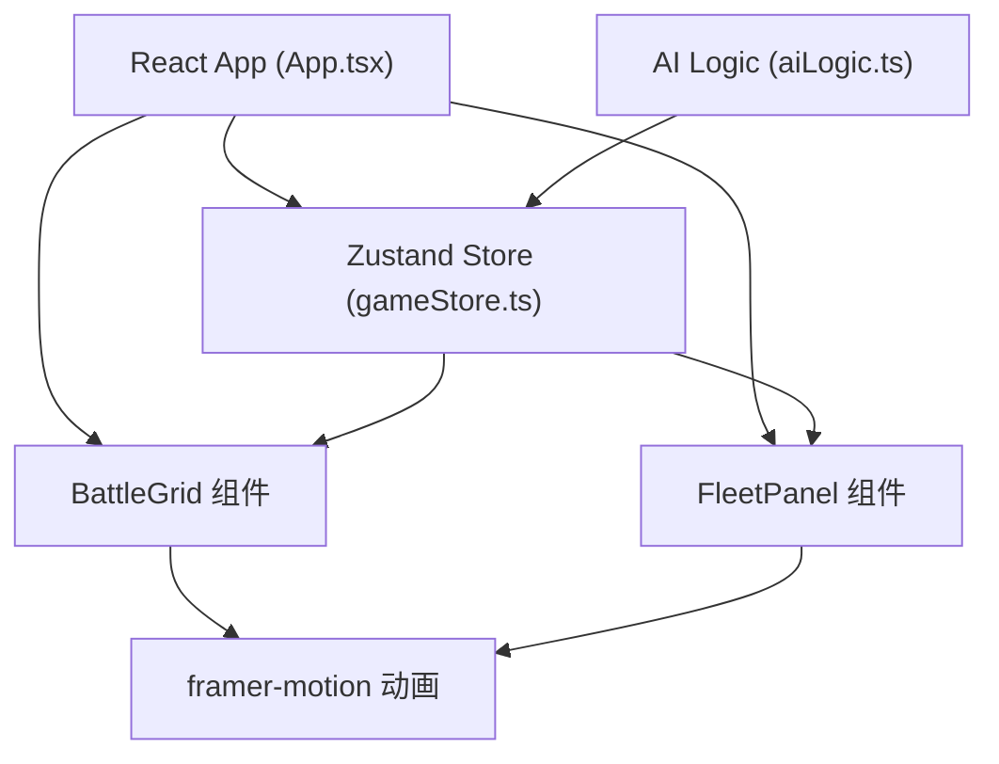

## 1. 架构设计



## 2. 技术描述

- 前端：React 18 + TypeScript + Vite
- 状态管理：Zustand
- 动画库：framer-motion
- 构建工具：Vite
- 样式：CSS + CSS变量

## 3. 文件结构

| 文件路径 | 作用 |
|---------|------|
| package.json | 项目依赖与脚本配置 |
| vite.config.js | Vite 构建配置 |
| tsconfig.json | TypeScript 严格模式配置 |
| index.html | 入口页面 |
| src/App.tsx | 根组件，组合游戏主界面 |
| src/store/gameStore.ts | Zustand store，管理游戏状态 |
| src/components/BattleGrid.tsx | 海域网格组件 |
| src/components/FleetPanel.tsx | 舰队状态面板组件 |
| src/utils/aiLogic.ts | AI炮击逻辑模块 |

## 4. 数据模型

### 4.1 战舰数据类型定义

```typescript
// 战舰类型
type ShipType = 'carrier' | 'battleship' | 'cruiser' | 'destroyer' | 'submarine';

// 坐标
interface Position { x: number; y: number; }

// 战舰
interface Ship {
  id: string;
  type: ShipType;
  name: string;
  length: number;
  color: string;
  positions: Position[];
  hits: boolean[];
  isPlaced: boolean;
  isSunk: boolean;
}

// 网格单元格
interface Cell {
  x: number;
  y: number;
  hasShip: boolean;
  shipId?: string;
  isHit: boolean;
  isMiss: boolean;
}

// 游戏阶段
type GamePhase = 'placement' | 'battle' | 'gameOver';

// 回合
type Turn = 'player' | 'ai';
```

### 4.2 Store 状态

```typescript
interface GameState {
  phase: GamePhase;
  turn: Turn;
  round: number;
  playerShips: Ship[];
  aiShips: Ship[];
  playerGrid: Cell[][];
  aiGrid: Cell[][];
  playerHits: number;
  playerMisses: number;
  aiHits: number;
  aiMisses: number;
  selectedShip: ShipType | null;
  winner: 'player' | 'ai' | null;
}
```

## 5. AI 策略

### 5.1 AI 炮击策略

- Hunt 阶段（搜索模式：随机选择未攻击格子
- Target 阶段（目标模式：命中后攻击相邻格子
- 优先攻击与已命中格子相邻的格子
- 记录命中记录用于计算最大概率

## 6. 性能优化

- React.memo 优化网格和面板组件
- 动画帧率不低于50fps
- 状态局部更新避免不必要重渲染
