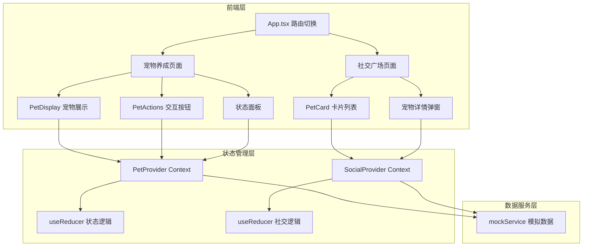

## 1. 架构设计



## 2. 技术说明

- 前端：React 18 + TypeScript + Vite
- 初始化工具：vite-init（react-ts 模板）
- 状态管理：React Context + useReducer（非 zustand，用户明确指定）
- 样式：CSS-in-JS（内联样式 + CSS模块），无 Tailwind（用户未指定）
- 后端：无（纯前端项目）
- 数据库：无（使用 mockService 模拟数据）

## 3. 路由定义

| 路由 | 用途 |
|------|------|
| / | 宠物养成页面（默认首页） |
| /plaza | 社交广场页面 |

路由通过 React 状态切换实现（用户未指定 react-router-dom 依赖）

## 4. 数据模型

### 4.1 核心类型定义

```typescript
type PetType = 'cat' | 'dog' | 'dragon';

interface PetStatus {
  hunger: number;     // 饱食度 0-100
  happiness: number;  // 快乐度 0-100
  cleanliness: number;// 清洁度 0-100
  energy: number;     // 精力值 0-100
}

interface PetProfile {
  id: string;
  name: string;
  type: PetType;
  status: PetStatus;
  ownerId: string;
  ownerName: string;
  likes: number;
  isCollapsed: boolean;     // 是否躺倒
  collapseAt: number | null;// 躺倒开始时间
  createdAt: number;
}

interface PetCard {
  id: string;
  name: string;
  type: PetType;
  ownerName: string;
  healthScore: number; // 1-5 星级
  likes: number;
}
```

### 4.2 状态衰减模型

```typescript
// 非线性衰减：初始1小时慢，后逐渐加速
// decay(t) = baseRate * (1 + acceleration * floor(t / 3600))
// baseRate = 2 (每5分钟基础衰减2点)
// acceleration = 0.5 (每小时增加50%衰减速率)
```

### 4.3 数据流

```mermaid
flowchart LR
    "UI组件 dispatch" --> "PetProvider reducer" --> "状态更新" --> "Context广播" --> "所有订阅者重渲染"
    "mockService" --> "衰减定时器" --> "PetProvider dispatch"
    "SocialProvider" --> "mockService" --> "宠物列表数据"
```

## 5. 文件结构

```
project/
├── package.json
├── vite.config.ts
├── tsconfig.json
├── index.html
└── src/
    ├── main.tsx
    ├── App.tsx
    ├── mockService.ts
    └── modules/
        ├── pet/
        │   ├── types.ts
        │   ├── PetProvider.tsx
        │   ├── PetDisplay.tsx
        │   └── PetActions.tsx
        └── social/
            ├── types.ts
            ├── SocialProvider.tsx
            └── PetCard.tsx
```

## 6. 性能指标

| 指标 | 目标值 |
|------|--------|
| 状态更新→UI刷新 | < 100ms |
| 渲染帧率 | ≥ 30fps |
| 动画缓动 | ease-out |
| 状态衰减间隔 | 5分钟（模拟） |
