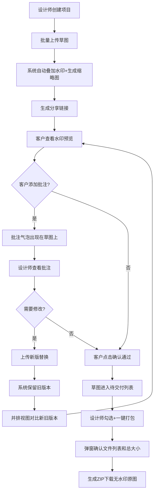

## 1. 产品概述

插画批注交付系统是一款面向自由插画师和平面设计师的在线协作工具，旨在解决传统通过邮件或微信发送草图后客户反馈分散、版本管理混乱、手动打水印与切图耗时等痛点。目标用户为独立创意工作者及其客户，产品核心价值在于将「草图预览→客户批注→版本对比→确认交付」全流程线上化、自动化，显著减少重复劳动与沟通成本。

## 2. 核心功能

### 2.1 用户角色

| 角色 | 注册方式 | 核心权限 |
|------|----------|----------|
| 设计师 | 邮箱注册 | 创建项目、上传草图、查看批注、上传新版、打包交付 |
| 客户 | 无需注册（通过分享链接访问） | 查看带水印预览、添加批注、确认通过草图 |

### 2.2 功能模块

1. **项目列表页**：项目卡片网格、新建项目入口
2. **工作台页面**：草图浏览、批注面板、版本对比、交付清单四大标签页
3. **客户分享页**：带水印预览、批注添加、确认通过

### 2.3 页面详情

| 页面名称 | 模块名称 | 功能描述 |
|----------|----------|----------|
| 项目列表页 | 项目卡片网格 | 展示所有项目（名称、客户、截止日期、缩略图），点击进入工作台 |
| 项目列表页 | 新建项目弹窗 | 填写项目名称、客户名称、截止日期后创建项目 |
| 工作台-草图浏览 | 草图网格 | 缩略图按上传时间排列，每行4张，悬停浮动+阴影加深，点击查看大图 |
| 工作台-草图浏览 | 批量上传 | 批量选择JPG/PNG（≤15MB），自动叠加半透明水印并生成缩略图 |
| 工作台-草图浏览 | 右键菜单 | 复制批注链接、标记为终稿、删除 |
| 工作台-批注面板 | 批注气泡 | 客户在草图任意位置点击添加白色圆角矩形气泡（红色小三角指向点击位置），支持文字+Emoji |
| 工作台-批注面板 | 未读标记 | 草图右上角红点显示未读批注数 |
| 工作台-批注面板 | 批注管理 | 设计师可查看、回复、删除批注 |
| 工作台-版本对比 | 并排视图 | 左右并排显示新旧两版草图 |
| 工作台-版本对比 | 透明度滑块 | 0-100滑块控制上层图片透明度，拖拽观察底层细节变化 |
| 工作台-交付清单 | 已确认列表 | 客户点击"确认通过"后的草图进入待交付列表，按钮变为绿色对勾 |
| 工作台-交付清单 | 一键打包 | 勾选已确认草图，点击打包生成ZIP（含无水印原图），弹窗确认后触发下载 |
| 客户分享页 | 水印预览 | 查看带水印的草图，添加批注，点击确认通过 |

## 3. 核心流程

设计师创建项目并批量上传草图 → 系统自动叠加水印并生成缩略图 → 设计师生成分享链接发给客户 → 客户在草图上添加批注气泡 → 设计师查看批注并上传新版替换 → 系统自动保留旧版本 → 设计师与客户在并排视图对比新旧版本 → 客户对所有草图点击"确认通过" → 草图进入待交付列表 → 设计师勾选并一键打包无水印原图ZIP → 弹窗确认后触发下载

## 4. 用户界面设计

### 4.1 设计风格

- 主色调：深色侧边栏（#2C3E50）+ 浅色内容区（#ECF0F1）
- 强调色：#3498DB（交互蓝）、#E74C3C（水印红/警示红）、#27AE60（确认绿）
- 按钮样式：圆角6px，hover时0.2s ease背景色过渡
- 字体：Inter（正文），清晰专业
- 布局：左侧固定侧边栏 + 右侧主内容区，顶部导航标签
- 图标：lucide-react图标库
- 动画：framer-motion页面切换淡入淡出300ms，卡片悬停浮动4px

### 4.2 页面设计概览

| 页面名称 | 模块名称 | UI元素 |
|----------|----------|--------|
| 项目列表页 | 项目卡片网格 | 圆角卡片、项目名称+客户+截止日期、缩略图预览、悬停浮动阴影 |
| 项目列表页 | 新建项目弹窗 | 居中弹窗、表单输入、日期选择器、创建/取消按钮 |
| 工作台 | 侧边栏 | 深色#2C3E50、项目列表、新建项目按钮、回到首页按钮 |
| 工作台 | 标签导航 | 草图浏览/批注面板/版本对比/交付清单、切换300ms淡入淡出 |
| 工作台-草图浏览 | 草图网格 | 4列网格、缩略图卡片、未读红点、悬停浮动4px+阴影加深、右键菜单 |
| 工作台-批注面板 | 批注气泡 | 白色圆角矩形、红色小三角指向、文字+Emoji输入、8px圆角编辑框 |
| 工作台-版本对比 | 并排视图 | 左右各一张、自定义滑块（圆形#3498DB滑块头、渐变轨道） |
| 工作台-交付清单 | 打包确认弹窗 | 文件列表+总大小、确认/取消按钮 |
| 客户分享页 | 水印预览 | 半透明斜纹水印、批注气泡、确认通过按钮（变绿色对勾） |

### 4.3 响应式设计

- 桌面优先设计，平板（768px）以下侧边栏收窄为图标条
- 内容区标签在768px以下变为下拉选择器
- 草图网格在小屏幕上从4列自适应为2列
- 所有交互元素保持触摸友好（最小44px点击区域）

### 4.4 水印设计

- 半透明斜纹重复"草稿 - 仅供预览"字样
- 颜色：#E74C3C，透明度：35%
- 通过Canvas API绘制叠加
- 客户分享页仅展示带水印版本，设计师工作台可预览原图

## 5. 性能要求

- 首屏加载（含20张缩略图）≤ 1.5秒（缓存+懒加载）
- 透明度滑块帧率 ≥ 55FPS
- ZIP打包（最多50张图）≤ 3秒触发下载
