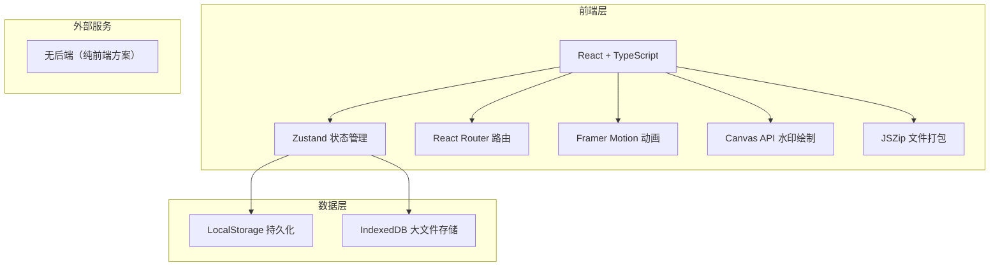
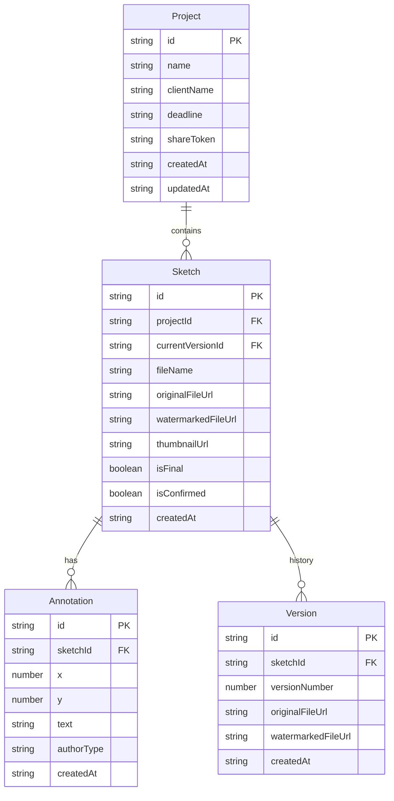

## 1. 架构设计



本项目为纯前端应用，无后端服务。所有数据通过LocalStorage和IndexedDB在浏览器本地持久化，文件操作（水印叠加、ZIP打包）均在客户端完成。

## 2. 技术说明

- 前端：React 18 + TypeScript + Vite
- 样式：Tailwind CSS 3
- 状态管理：Zustand（管理项目列表、当前项目、草图列表、批注数据、版本历史、交付清单）
- 路由：react-router-dom v6
- 动画：framer-motion（页面切换淡入淡出300ms、卡片悬停浮动、微交互）
- 文件处理：JSZip（ZIP打包）、FileSaver（下载触发）、Canvas API（水印叠加）
- HTTP请求：axios（预留API对接能力，当前使用本地存储）
- 初始化工具：vite-init（react-ts模板）
- 图标：lucide-react

## 3. 路由定义

| 路由 | 用途 |
|------|------|
| / | 首页，重定向到 /projects |
| /projects | 项目列表页，展示所有项目卡片 |
| /projects/:id/workspace | 工作台页面，含草图浏览/批注面板/版本对比/交付清单标签 |
| /projects/:id/share/:token | 客户分享页，无需登录，查看水印预览并添加批注 |

## 4. API定义

本项目为纯前端应用，无后端API。所有数据操作通过Zustand store管理，持久化到LocalStorage和IndexedDB。axios实例预留baseURL配置，便于未来对接后端。

## 5. 数据模型

### 5.1 数据模型定义



### 5.2 数据存储方案

- **LocalStorage**：存储项目元数据、批注数据、版本引用信息
- **IndexedDB**：存储原始图片文件和水印图片的Blob数据（支持大文件）
- **内存缓存**：Zustand store运行时缓存，避免频繁读取存储

## 6. 文件组织结构

```
├── index.html
├── package.json
├── vite.config.js
├── tsconfig.json
├── src/
│   ├── types/
│   │   └── index.ts
│   ├── store/
│   │   └── useProjectStore.ts
│   ├── pages/
│   │   ├── ProjectList.tsx
│   │   └── Workspace.tsx
│   ├── components/
│   │   ├── Layout.tsx
│   │   ├── SketchCard.tsx
│   │   ├── AnnotationBubble.tsx
│   │   └── VersionSlider.tsx
│   ├── utils/
│   │   ├── fileHelpers.ts
│   │   └── api.ts
│   ├── App.tsx
│   └── main.tsx
```
