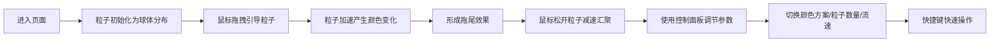

## 1. 产品概述
微型流体力学交互式艺术装置，用户通过鼠标在3D空间中引导彩色粒子流，粒子根据速度与碰撞产生动态颜色渐变和拖尾效果，形成不断演变的抽象画作。

- 核心目的：提供沉浸式的粒子流体艺术交互体验
- 目标用户：艺术爱好者、创意设计师、普通用户
- 产品价值：通过简单的鼠标交互生成独特的视觉艺术效果

## 2. 核心功能

### 2.1 用户角色
| 角色 | 注册方式 | 核心权限 |
|------|----------|----------|
| 普通用户 | 无需注册 | 使用全部交互功能 |

### 2.2 功能模块
1. **3D粒子场**：实时渲染数千个粒子，支持速度驱动的颜色渐变和拖尾效果
2. **交互控制系统**：鼠标拖拽引导粒子流动，支持视角旋转和缩放
3. **控制面板**：调节粒子参数，切换颜色方案，重置粒子状态
4. **快捷键系统**：键盘快捷操作提升交互效率

### 2.3 页面详情
| 页面名称 | 模块名称 | 功能描述 |
|----------|----------|----------|
| 主界面 | 3D粒子场 | 5000个粒子分布在半径6的球体内，随鼠标引导流动 |
| 主界面 | 帧率显示 | 左上角实时显示当前FPS |
| 主界面 | 控制面板 | 右下角可展开/收起的参数调节面板 |
| 主界面 | 快捷键提示 | 面板底部显示键盘快捷键说明 |

## 3. 核心流程

用户进入页面 → 看到随机分布的粒子团簇 → 鼠标拖拽引导粒子流动 → 粒子产生颜色渐变和拖尾 → 通过控制面板调节参数 → 使用快捷键切换状态

## 4. 用户界面设计

### 4.1 设计风格
- 主色调：深空黑色 #0B0D17 背景
- 强调色：粒子颜色根据速度从冷色调（深蓝 #1A237E）渐变到暖色调（橙黄 #FF6F00）
- 四种预设颜色方案：极光青蓝橙、火焰红黄紫、海洋蓝绿白、霓虹粉紫青
- 面板风格：半透明磨砂玻璃效果，背景 rgba(255,255,255,0.08)，边框 #888，圆角 16px
- 字体：monospace，14px
- 交互：柔和光晕效果，size attenuation，transparent: true

### 4.2 页面设计概览
| 页面名称 | 模块名称 | UI元素 |
|----------|----------|--------|
| 主界面 | 3D场景 | 全屏Canvas，深空黑背景，俯视相机 |
| 主界面 | 帧率显示 | 左上角白色半透文字，monospace字体 |
| 主界面 | 控制面板 | 右下角半透明浮动面板，弹簧动画展开/收起 |
| 主界面 | 控制滑块 | 粒子数量滑块（2000-15000）、流速滑块（0.1-3.0） |
| 主界面 | 颜色选择器 | 四种颜色方案切换 |
| 主界面 | 重置按钮 | 重置粒子位置 |
| 主界面 | 快捷键提示 | 面板底部显示R/C/空格键功能 |

### 4.3 响应式
- 桌面端优先，全屏布局无滚动条
- 控制面板固定在右下角，不随窗口大小改变位置
- 3D场景自适应窗口大小

### 4.4 3D场景指引
- 环境：深空黑色背景，营造宇宙空间感
- 光照：粒子自发光，无需额外光源
- 相机：正上方俯视，position: [0, 10, 12]
- 交互：鼠标右键拖拽旋转视角，滚轮缩放
- 粒子效果：PointsMaterial，size attenuation，柔和光晕
- 性能目标：5000粒子保持45FPS以上，15000粒子不低于25FPS
