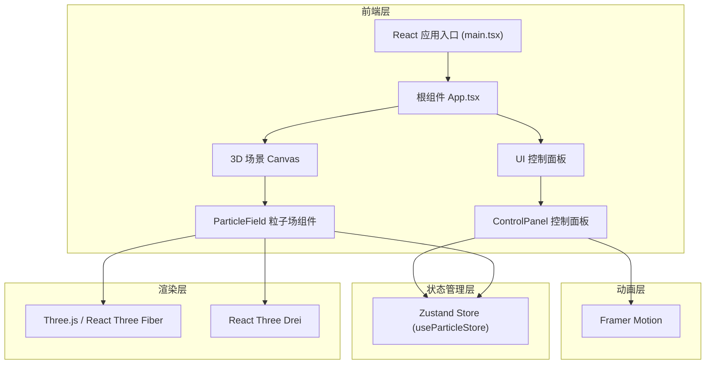

## 1. 架构设计



## 2. 技术描述

- 前端框架：React 18 + TypeScript
- 构建工具：Vite + @vitejs/plugin-react
- 3D 渲染：Three.js + @react-three/fiber + @react-three/drei
- 状态管理：Zustand
- UI 动画：framer-motion
- 后端：无（纯前端应用）
- 数据库：无

## 3. 目录结构

```
src/
├── main.tsx                 # React 入口文件
├── App.tsx                  # 根组件
├── store/
│   └── useParticleStore.ts  # Zustand 状态管理
└── components/
    ├── ParticleField.tsx    # 3D粒子场组件
    └── ControlPanel.tsx     # 控制面板组件
```

## 4. 核心数据模型

### 4.1 粒子数据结构
```typescript
interface Particle {
  position: [number, number, number];  // 当前位置
  velocity: [number, number, number];  // 速度向量
  trail: [number, number, number][];   // 拖尾位置历史（15帧）
}
```

### 4.2 Store 状态
```typescript
interface ParticleState {
  particleCount: number;           // 粒子数量 (2000-15000)
  flowSpeed: number;               // 流速 (0.1-3.0)
  colorScheme: string;             // 颜色方案
  isPaused: boolean;               // 是否暂停
  mousePosition: [number, number]; // 鼠标位置
  mouseDirection: [number, number, number]; // 鼠标方向向量
  isMouseDown: boolean;            // 鼠标是否按下
  resetTrigger: number;            // 重置触发器
  colorSchemes: ColorScheme[];     // 颜色方案列表
}
```

### 4.3 颜色方案
```typescript
interface ColorScheme {
  name: string;
  coldColor: string;  // 低速颜色
  warmColor: string;  // 高速颜色
  midColor: string;   // 中速颜色
}
```

## 5. 核心技术实现

### 5.1 粒子系统
- 使用 Three.js Points + BufferGeometry 进行高性能渲染
- 粒子位置存储在 Float32Array 中直接操作 GPU 缓冲区
- 每帧更新粒子位置和颜色属性
- 拖尾效果通过保留历史位置实现

### 5.2 物理模拟
- 鼠标拖拽产生方向向量，粒子沿该方向加速
- 随机扰动用 Math.random() 生成
- 鼠标停止后粒子减速（阻尼系数）
- 边界环绕：离开视野后从对侧重新进入

### 5.3 颜色渐变
- 根据粒子速度大小在冷色和暖色之间插值
- 使用 lerp 算法进行 RGB 颜色插值
- 支持四种预设颜色方案切换

### 5.4 相机控制
- 使用 @react-three/drei 的 OrbitControls
- 右键拖拽旋转，滚轮缩放
- 相机初始位置 [0, 10, 12]

## 6. 性能优化

- 使用 BufferGeometry 而非逐个粒子对象
- 位置和颜色数据直接写入类型化数组
- requestAnimationFrame 驱动动画循环
- 粒子数量可配置以平衡性能与视觉效果
- 目标帧率：5000粒子 ≥ 45FPS，15000粒子 ≥ 25FPS
