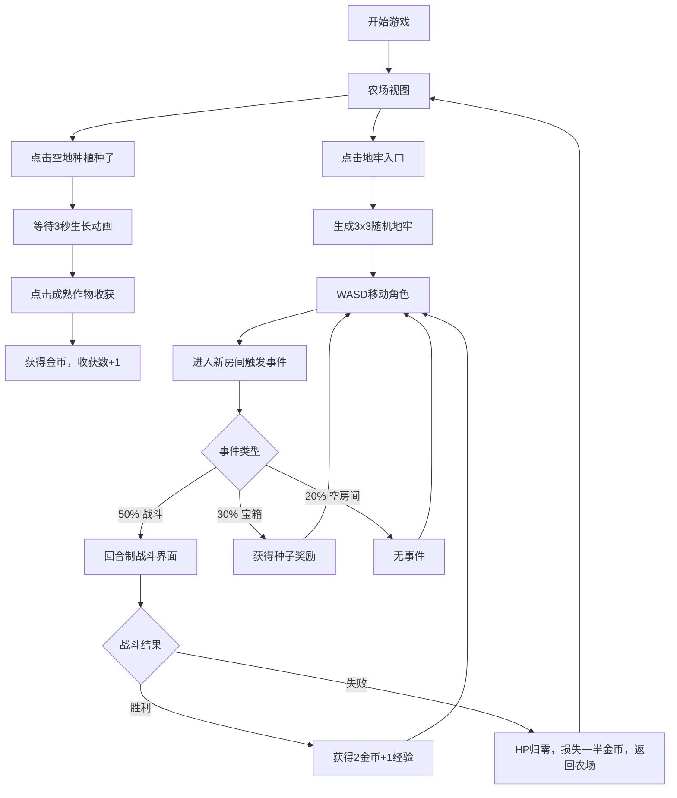

## 1. 产品概述

像素风农场经营与地牢探险RPG，玩家在像素村庄中经营农场，同时探索随机生成的地牢获取稀有种子。集种植、战斗和探索于一体的迷你RPG游戏。

- 目标用户：热爱复古像素游戏的玩家，喜欢休闲经营与轻度战斗结合的游戏体验
- 产品价值：提供轻松有趣的像素风游戏体验，融合农场经营的成就感和地牢探索的刺激感

## 2. 核心功能

### 2.1 用户角色

| 角色 | 注册方式 | 核心权限 |
|------|----------|----------|
| 玩家 | 无需注册，本地存储 | 完整游戏体验，农场经营、地牢探险、背包管理 |

### 2.2 功能模块

1. **玩家状态面板**：顶部固定显示金币、生命值、地牢层数、收获总数
2. **农场经营模块**：9x9网格田地、种植/收获作物、生长动画、粒子效果
3. **工具栏模块**：种子背包展示、种子选择切换、数量显示
4. **地牢探险模块**：3x3随机房间布局、WASD移动、房间事件触发
5. **战斗系统模块**：回合制战斗、敌人AI、奖励结算
6. **背包管理模块**：三种种子类型、最多10个槽位、数量追踪

### 2.3 页面详情

| 页面名称 | 模块名称 | 功能描述 |
|----------|----------|----------|
| 主游戏界面 | 状态面板 | 实时显示玩家金币、生命值（心形图标+数值条）、地牢层数（罗马数字）、收获总数，数值变化时播放动画 |
| 主游戏界面 | 农场视图 | 9x9网格田地，点击空地种植，3秒生长三帧动画（发芽→生长→成熟），点击成熟作物收获获得1-3金币，收获时10个彩色粒子爆炸效果 |
| 主游戏界面 | 工具栏 | 展示背包中16x16像素种子图标，点击切换选中种子，未选中显示锄头，图标下方显示数量 |
| 主游戏界面 | 地牢入口按钮 | 点击进入地牢视图，播放过渡动画 |
| 地牢界面 | 地牢地图 | 3x3随机房间布局，走廊连接，玩家从左上角进入，WASD键控制移动 |
| 地牢界面 | 房间事件 | 50%战斗、30%宝箱、20%空房间，房间切换时淡入淡出动画 |
| 战斗界面 | 回合制战斗 | 暗红背景，玩家与敌人分列两侧，点击攻击按钮互造成1点伤害，击败敌人获得2金币1经验，HP归零返回农场损失一半金币 |
| 战斗界面 | 敌人渲染 | 根据地牢层数生成不同颜色史莱姆，16x16帧动画，攻击/受伤动画 |

## 3. 核心流程

## 4. 用户界面设计

### 4.1 设计风格

- **主色调**：深蓝色 #1a1a2e（背景），#16213e（状态栏），#0f3460（分割线）
- **辅助色**：金色 #FFD700（金币），红色 #8B0000（战斗背景），深棕色 #3d2c1b（田地）
- **按钮风格**：像素风格，默认深灰 #2c3e50，悬停变亮 #34495e + 2px白色边框，点击下沉2px + 缩放0.95
- **字体**：像素字体 'Press Start 2P', monospace
- **布局风格**：顶部固定状态栏 + 下方主视口（农场/地牢切换）
- **图标风格**：16x16像素艺术风格，种子/锄头/心形等图标

### 4.2 页面设计概述

| 页面名称 | 模块名称 | UI元素 |
|----------|----------|--------|
| 主界面 | 状态面板 | 固定高度60px，底部2px亮蓝分割线，金币（金色数字）、生命值（红色心形+数值条）、层数（罗马数字）、收获数，数值变化时跳动缩放动画 |
| 主界面 | 农场网格 | 9x9网格，每格64x64px，半透灰色网格线 rgba(255,255,255,0.1)，深棕田地背景，作物三帧生长动画 |
| 主界面 | 工具栏 | 种子图标16x16px，下方数量显示，选中高亮效果 |
| 地牢界面 | 地牢地图 | 3x3房间，深灰走廊 #333，黑色背景 #111，玩家像素角色WASD移动 |
| 战斗界面 | 战斗场景 | 暗红背景 #8B0000，玩家与敌人16x16像素角色分列两侧，攻击按钮，HP条，帧动画每秒切换 |

### 4.3 响应式

- **桌面端**：网格64x64px，图标16x16px，状态栏60px
- **移动端**（<768px）：网格48x48px，图标12x12px，状态栏50px，字体相应缩小
- **触摸优化**：按钮最小触摸区域48x48px，适合移动端操作

### 4.4 性能约束

- 农场网格渲染 ≥ 30FPS
- 地牢房间过渡动画 ≤ 0.5秒
- 玩家移动和战斗动画关键帧间隔 ≤ 100ms
- 粒子效果使用CSS transform提升性能
