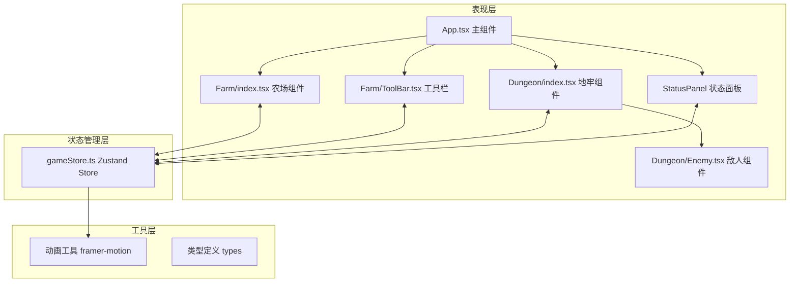

## 1. 架构设计



## 2. 技术描述

- **前端框架**：React 18 + TypeScript
- **构建工具**：Vite 5 + @vitejs/plugin-react
- **状态管理**：Zustand 4（全局游戏状态：金币、背包、生命值、地牢层数）
- **动画库**：framer-motion 11（像素动画、UI过渡、粒子效果）
- **样式方案**：CSS Modules + CSS Variables（像素风格主题）
- **字体**：Press Start 2P（Google Fonts 像素字体）

## 3. 文件结构与调用关系

```
src/
├── App.tsx                    # 主组件，连接Store，渲染状态面板+农场/地牢
│   ├── 调用 gameStore 获取: gold, hp, dungeonFloor, harvestedCount, currentView
│   ├── 调用 gameStore 方法: setView, enterDungeon, exitDungeon
│   └── 渲染子组件: StatusPanel, Farm, ToolBar, Dungeon
│
├── stores/
│   └── gameStore.ts          # Zustand全局状态管理
│       ├── State: gold, seeds[], hp, maxHp, dungeonFloor, harvestedCount
│       ├── State: currentView ('farm'|'dungeon'|'battle'), selectedSeed
│       ├── State: farmGrid[9][9], dungeonGrid[3][3], playerPos
│       ├── Actions: plantSeed(), harvestCrop(), takeDamage(), addGold()
│       ├── Actions: selectSeed(), enterDungeon(), exitDungeon()
│       └── Actions: generateDungeon(), movePlayer(), startBattle(), endBattle()
│
├── components/
│   ├── Farm/
│   │   ├── index.tsx         # 9x9农场网格组件
│   │   │   ├── 依赖 gameStore: selectedSeed, plantSeed(), harvestCrop()
│   │   │   ├── 内部状态: growingCrops[] 管理生长动画
│   │   │   └── 使用 framer-motion: 生长动画、收获粒子效果
│   │   └── ToolBar.tsx       # 种子工具栏组件
│   │       ├── 依赖 gameStore: seeds[], selectedSeed, selectSeed()
│   │       └── 渲染: 16x16种子图标、数量、锄头默认图标
│   │
│   ├── Dungeon/
│   │   ├── index.tsx         # 3x3地牢组件
│   │   │   ├── 依赖 gameStore: dungeonGrid, playerPos, movePlayer()
│   │   │   ├── 键盘事件: WASD监听
│   │   │   └── framer-motion: 房间淡入淡出过渡
│   │   └── Enemy.tsx         # 敌人渲染组件
│   │       ├── Props: enemyType, hp, isAttacking, isHurt
│   │       └── framer-motion: 帧动画、攻击冲刺、受伤闪烁
│   │
│   └── StatusPanel.tsx       # 顶部状态面板
│       ├── 依赖 gameStore: gold, hp, maxHp, dungeonFloor, harvestedCount
│       └── framer-motion: 数值跳动、缩放动画
│
├── types/
│   └── index.ts              # TypeScript类型定义
│       ├── SeedType: 'normal'|'rare'|'magic'
│       ├── Seed: { type, count, value, color }
│       ├── CropState: 'empty'|'sprout'|'growing'|'mature'
│       ├── FarmCell: { state, seedType, plantedAt }
│       ├── RoomType: 'empty'|'enemy'|'chest'|'start'|'exit'
│       ├── DungeonRoom: { type, visited, cleared }
│       └── Enemy: { type, hp, maxHp, attack, color }
│
└── utils/
    ├── pixel.ts              # 像素风格工具函数
    │   ├── generateParticles(): 生成粒子配置
    │   └── romanNumeral(): 数字转罗马数字
    └── random.ts             # 随机数工具
        ├── randomInt(min, max): 整数随机
        └── randomChoice(array): 数组随机选择
```

**数据流向说明：**

1. **农场 → Store**：种植时调用 `plantSeed()` 更新 `farmGrid`，收获时调用 `harvestCrop()` 更新 `gold` 和 `harvestedCount`
2. **工具栏 → Store**：点击种子调用 `selectSeed()` 更新 `selectedSeed`
3. **地牢 → Store**：移动调用 `movePlayer()` 更新 `playerPos`，战斗调用 `takeDamage()` / `addGold()`
4. **Store → 所有组件**：通过 Zustand selector 订阅状态变化，自动重渲染

## 4. 关键技术实现

### 4.1 农场生长动画
```typescript
// 3帧生长动画，每帧1秒
// 使用 framer-motion 的 keyframes
const growAnimation = {
  sprout: { scale: 0.5, opacity: 0.8 },
  growing: { scale: 0.8, opacity: 0.9 },
  mature: { scale: 1, opacity: 1 }
};
```

### 4.2 粒子爆炸效果
```typescript
// 收获时10个彩色粒子向四周飞散
// 使用 framer-motion AnimatePresence
const particleVariants = {
  initial: { x: 0, y: 0, scale: 1, opacity: 1 },
  animate: (i: number) => ({
    x: Math.cos(i * 36 * Math.PI / 180) * 50,
    y: Math.sin(i * 36 * Math.PI / 180) * 50,
    scale: 0,
    opacity: 0,
    transition: { duration: 0.5 }
  })
};
```

### 4.3 地牢随机生成
```typescript
// 3x3网格，起点固定左上角，事件随机分布
// 50%敌人, 30%宝箱, 20%空房间
const generateDungeon = () => {
  const roomTypes = ['enemy', 'enemy', 'enemy', 'chest', 'chest', 'empty', 'empty', 'empty', 'empty'];
  // Fisher-Yates 洗牌
};
```

### 4.4 战斗系统
```typescript
// 回合制战斗状态机
// idle → playerAttack → enemyAttack → checkResult
// 使用 framer-motion 动画同步
```

## 5. 性能优化方案

1. **农场网格**：使用 CSS `contain: strict` 隔离每个格子的重绘
2. **状态订阅**：Zustand selector 精确订阅，避免不必要重渲染
3. **动画性能**：使用 `transform` 和 `opacity` 属性，启用 GPU 加速
4. **粒子效果**：限制粒子数量≤10，使用 `will-change` 提示
5. **重绘优化**：`React.memo` 包装纯展示组件，如 `Enemy.tsx`
