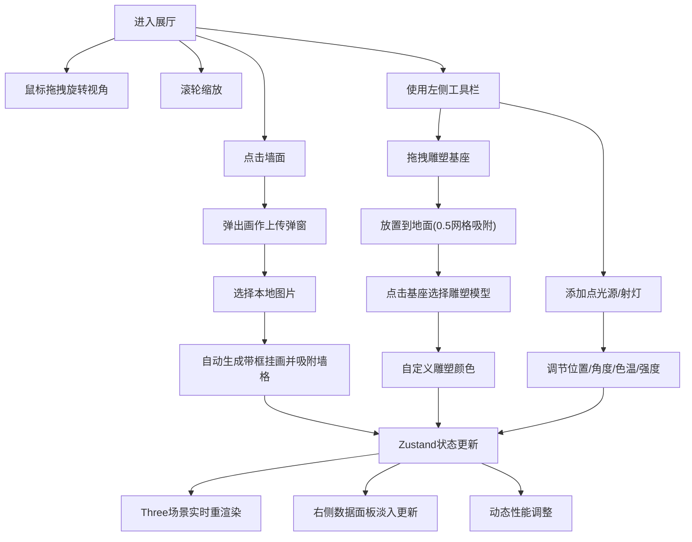

## 1. 产品概述

虚拟画廊策展系统是一个基于Web的3D交互式应用，让用户能够在虚拟展厅中自由布置画作、雕塑，并实时调整灯光参数，观察光影对艺术品展示效果的影响。

- 主要目的：为艺术爱好者、策展人、设计师提供一个沉浸式的虚拟展览策划工具
- 目标用户：艺术家、策展人、室内设计师、艺术学生及爱好者
- 市场价值：降低实体展览策划成本，提供可视化预览，支持创意实验与教学演示

## 2. 核心功能

### 2.1 用户角色

| 角色 | 注册方式 | 核心权限 |
|------|----------|----------|
| 访客用户 | 无需注册，直接进入 | 完整使用所有策展功能，本地保存作品 |

### 2.2 功能模块

1. **3D展厅场景**：空白展厅空间、相机控制、墙面与地面网格
2. **画作管理**：墙面点击上传、自动居中吸附、木质画框渲染
3. **雕塑管理**：基座拖拽放置、雕塑模型选择、颜色自定义
4. **光源管理**：点光源/射灯添加、角度/色温/强度调节、光锥角度控制
5. **工具栏**：可折叠面板、垂直拖拽、参数子面板展开
6. **数据面板**：实时统计、淡入动画更新、最后操作时间显示
7. **性能优化**：动态多边形细节、阴影贴图自适应、帧率保证

### 2.3 页面详情

| 页面名称 | 模块名称 | 功能描述 |
|----------|----------|----------|
| 主策展页面 | 3D展厅 | 12x8x5单位展厅，浅灰地面带网格，暖白墙面，OrbitControls相机控制 |
| 主策展页面 | 画作系统 | 点击墙面弹窗上传JPEG/PNG，自动生成2x1.5木质画框挂画，1x1墙格吸附 |
| 主策展页面 | 雕塑系统 | 拖拽白色大理石圆柱基座(0.4x0.6)，0.5单位地面网格吸附，4种预设模型，磨砂材质 |
| 主策展页面 | 光源系统 | 点光源(发光小球)、射灯(可旋转灯头)，5°-45°光锥角度，SoftShadowMap柔和阴影 |
| 主策展页面 | 左侧工具栏 | 深色半透明#2C3E50模糊背景，三大按钮(画作/雕塑/光源)，参数子面板，垂直拖拽 |
| 主策展页面 | 右侧数据面板 | 白色半透明#FFFFFF浅灰边框，艺术品/光源数量，最后操作时间，0.3s淡入动画 |
| 主策展页面 | 性能优化 | >20对象时降多边形(128→64面)和阴影贴图(2048→1024)，保证45FPS+ |

## 3. 核心流程

用户进入展厅后，可通过三种主要方式互动：点击墙面上传画作、从工具栏拖拽雕塑基座到地面、点击添加光源按钮。每个操作都会触发状态更新，3D场景实时响应渲染。光源增删会动态调整阴影质量，对象数量超过阈值自动降级性能参数。

## 4. 用户界面设计

### 4.1 设计风格

- 主色调：暖灰色系(#D5D8DC, #F2F3F4) + 木质深棕(#5D4037) + 深蓝面板(#2C3E50)
- 按钮风格：圆角矩形，悬停微放大，半透明背景配模糊效果
- 字体：标题使用衬线体(艺术感)，正文使用无衬线体(可读性)
- 布局风格：沉浸式全屏3D画布，左右浮动面板，非对称布局
- 图标风格：线性简约图标，与画廊艺术氛围契合

### 4.2 页面设计概览

| 页面名称 | 模块名称 | UI元素 |
|----------|----------|--------|
| 主策展页面 | 3D场景 | 全屏Canvas，浅灰地面网格，暖白墙面，柔和环境光 |
| 主策展页面 | 左侧工具栏 | 垂直可拖拽面板，三大主按钮带图标，展开式参数子面板，毛玻璃背景 |
| 主策展页面 | 右侧数据面板 | 白色半透明卡片，统计数字大号显示，时间戳小号，边框浅灰 |
| 主策展页面 | 弹窗 | 画作上传：文件选择器+预览；雕塑选择：4个缩略图+色环；光源：滑块组 |
| 主策展页面 | 动画 | 面板展开/收起，数据更新淡入，光源阴影质量过渡(0.2s) |

### 4.3 响应式

- 桌面端优先设计，3D画布自适应全屏
- 工具栏最小宽度240px，数据面板固定宽度200px
- 移动端触摸手势支持：单指旋转、双指缩放

### 4.4 3D场景指导

- 环境：展厅内部12x8x5单位，地面#D5D8DC带半透明网格线，墙面#F2F3F4
- 光照：默认环境光+方向光基础照明，用户添加的光源为主角，SoftShadowMap柔和阴影
- 相机：初始位置展厅中央高度1.6单位，OrbitControls拖拽旋转、滚轮缩放
- 构图：用户自由布置，相机可环绕整个展厅
- 交互：墙面点击检测、地面拖拽吸附、对象选中高亮
- 后处理：无，保持原生Three.js渲染，确保性能
- 性能：多边形和阴影贴图动态降级，目标45FPS+
