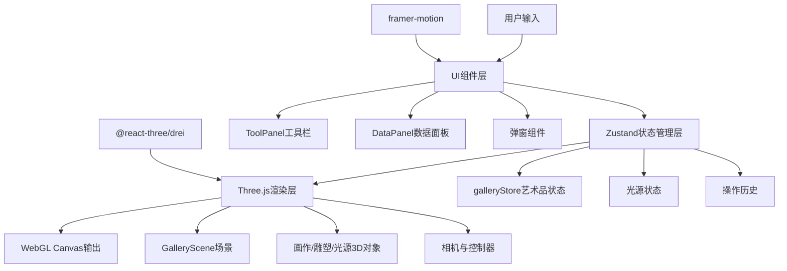
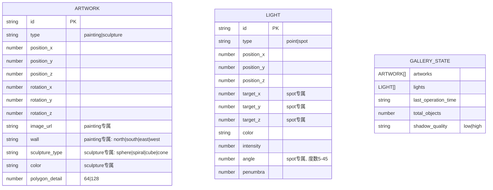

## 1. 架构设计



## 2. 技术说明

- 前端：React@18 + TypeScript + Vite
- 3D渲染：Three.js + @react-three/fiber + @react-three/drei
- 状态管理：Zustand
- UI动画：framer-motion
- 构建工具：Vite

## 3. 路由定义

| 路由 | 用途 |
|------|------|
| / | 主策展页面，包含完整3D画廊场景与交互UI |

## 4. 数据模型

### 4.1 数据模型定义



### 4.2 TypeScript类型定义

```typescript
type ArtworkType = 'painting' | 'sculpture';
type SculptureType = 'sphere' | 'spiral' | 'cube' | 'cone';
type WallType = 'north' | 'south' | 'east' | 'west';
type LightType = 'point' | 'spot';

interface Position {
  x: number;
  y: number;
  z: number;
}

interface Rotation {
  x: number;
  y: number;
  z: number;
}

interface Artwork {
  id: string;
  type: ArtworkType;
  position: Position;
  rotation: Rotation;
  imageUrl?: string;
  wall?: WallType;
  sculptureType?: SculptureType;
  color?: string;
  polygonDetail: 64 | 128;
}

interface Light {
  id: string;
  type: LightType;
  position: Position;
  target?: Position;
  color: string;
  intensity: number;
  angle?: number;
  penumbra: number;
}

interface GalleryStore {
  artworks: Artwork[];
  lights: Light[];
  lastOperationTime: string;
  shadowQuality: 'low' | 'high';
  addArtwork: (artwork: Omit<Artwork, 'id' | 'polygonDetail'>) => void;
  removeArtwork: (id: string) => void;
  updateArtwork: (id: string, updates: Partial<Artwork>) => void;
  addLight: (light: Omit<Light, 'id'>) => void;
  removeLight: (id: string) => void;
  updateLight: (id: string, updates: Partial<Light>) => void;
  getTotalObjects: () => number;
}
```

## 5. 项目结构

```
src/
├── main.tsx              # React根组件入口
├── App.tsx               # 应用主组件
├── store/
│   └── galleryStore.ts   # Zustand状态管理
├── components/
│   ├── GalleryScene.tsx  # Three.js 3D场景主组件
│   ├── ToolPanel.tsx     # 左侧工具栏UI
│   ├── DataPanel.tsx     # 右侧数据统计面板
│   ├── Painting.tsx      # 画作3D组件
│   ├── Sculpture.tsx     # 雕塑3D组件
│   ├── LightSource.tsx   # 光源3D组件
│   └── modals/           # 弹窗组件目录
│       ├── UploadModal.tsx
│       ├── SculptureModal.tsx
│       └── LightModal.tsx
├── types/
│   └── index.ts          # TypeScript类型定义
└── utils/
    └── helpers.ts        # 工具函数(网格吸附、ID生成等)
```
