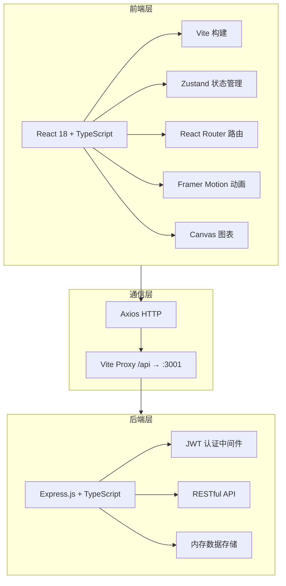
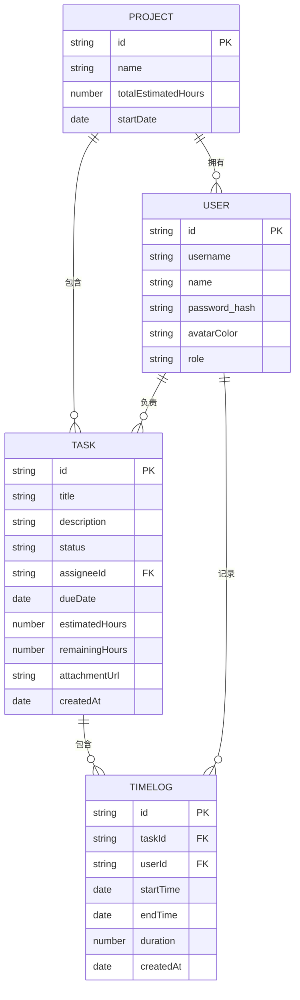

## 1. 架构设计



## 2. 技术描述

- 前端：React 18 + TypeScript + Vite 5
- 状态管理：Zustand
- 路由：React Router DOM 6
- 动画：Framer Motion
- HTTP客户端：Axios
- 后端：Express 4 + TypeScript
- 认证：JSON Web Token
- 跨域：CORS中间件
- 开发模式：Vite开发服务器 + Express API服务器（双端口）

## 3. 路由定义

| 路由 | 用途 |
|-------|---------|
| /login | 登录页面 |
| /dashboard | 项目看板主页 |
| /weekly-report | 个人周报页面 |

## 4. API 定义

### 4.1 认证接口

```typescript
// 登录
POST /api/auth/login
Request: { username: string; password: string }
Response: { token: string; user: User }

// 获取当前用户
GET /api/auth/me
Headers: Authorization: Bearer <token>
Response: User
```

### 4.2 任务接口

```typescript
// 获取所有任务
GET /api/tasks
Response: Task[]

// 创建任务
POST /api/tasks
Request: Partial<Task>
Response: Task

// 更新任务
PUT /api/tasks/:id
Request: Partial<Task>
Response: Task

// 删除任务
DELETE /api/tasks/:id
Response: { success: boolean }
```

### 4.3 工时记录接口

```typescript
// 获取任务的工时记录
GET /api/timelogs/task/:taskId?page=1&limit=20
Response: { data: TimeLog[]; hasMore: boolean }

// 创建工时记录
POST /api/timelogs
Request: { taskId: string; startTime: Date; endTime?: Date; duration: number }
Response: TimeLog

// 获取用户本周工时
GET /api/timelogs/user/:userId/weekly
Response: WeeklyReportData
```

### 4.4 成员接口

```typescript
// 获取项目成员
GET /api/members
Response: Member[]

// 添加成员
POST /api/members
Request: { name: string; email: string }
Response: Member
```

### 4.5 燃尽图接口

```typescript
// 获取燃尽图数据
GET /api/burndown
Response: BurndownData
```

## 5. 服务器架构图

```mermaid
graph TD
    A["API路由层 (Routes) --> B["认证中间件 (JWT)"]
    B --> C["控制器 (Controllers)"]
    C --> D["服务层 (Services)"]
    D --> E["数据存储 (Memory Store)"]
```

## 6. 数据模型

### 6.1 数据模型定义



### 6.2 核心类型定义

```typescript
interface User {
  id: string;
  username: string;
  name: string;
  avatarColor: string;
  role: 'admin' | 'member';
}

interface Task {
  id: string;
  title: string;
  description: string;
  status: 'todo' | 'in-progress' | 'done';
  assigneeId: string;
  dueDate: string;
  estimatedHours: number;
  remainingHours: number;
  attachmentUrl?: string;
  createdAt: string;
}

interface TimeLog {
  id: string;
  taskId: string;
  userId: string;
  startTime: string;
  endTime?: string;
  duration: number;
  createdAt: string;
}

interface Member {
  id: string;
  name: string;
  avatarColor: string;
  weeklyHours: number;
}

interface BurndownPoint {
  date: string;
  idealHours: number;
  actualHours: number;
}
```
