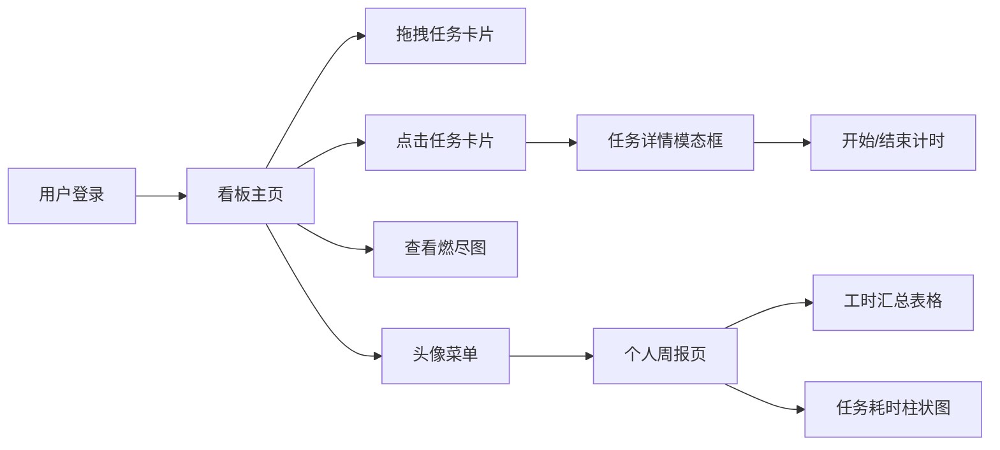

## 1. 产品概述

面向10人以内小团队的项目协作看板与工时统计系统，帮助团队高效跟踪任务进度、精确记录工时消耗、自动化生成工作汇报。

- 核心价值：通过可视化看板+工时管理解决小团队任务协作混乱、工时统计困难、周报撰写繁琐等痛点
- 目标用户：初创团队、敏捷开发小组、自由职业者小团队

## 2. 核心功能

### 2.1 用户角色

| 角色 | 注册方式 | 核心权限 |
|------|----------|----------|
| 团队成员 | 账号密码登录 | 查看看板、拖拽任务、记录工时、查看个人周报 |
| 团队管理员 | 账号密码登录 | 成员管理、项目配置、所有数据查看 |

### 2.2 功能模块

1. **登录页面**：用户认证入口，JWT Token鉴权
2. **项目看板页**：三列看板（待开始/进行中/已完成）、燃尽图、成员侧边栏、任务详情模态框
3. **个人周报页**：工时汇总表格、任务耗时柱状图、计时片段展开

### 2.3 页面详情

| 页面名称 | 模块名称 | 功能描述 |
|-----------|-----------|----------|
| 登录页面 | 登录表单 | 账号密码输入、登录验证、Token存储 |
| 项目看板页 | 燃尽图区域 | Canvas绘制7天燃尽曲线、理想线对比、颜色预警 |
| 项目看板页 | 三列看板 | 拖拽任务卡片、弹性动画、状态切换 |
| 项目看板页 | 任务卡片 | 任务名称、负责人头像、剩余工时展示 |
| 项目看板页 | 成员侧边栏 | 成员列表（头像+本周工时）、折叠动画、添加成员 |
| 项目看板页 | 任务详情模态框 | 任务描述、截止日期、附件、工时记录、开始/结束计时 |
| 个人周报页 | 工时汇总表 | 行：日期 列：任务名 交叉单元格：工时数 |
| 个人周报页 | 任务耗时柱状图 | 按任务汇总、点击展开计时片段 |

## 3. 核心流程

用户登录 → 进入看板页 → 拖拽任务或点击任务 → 查看详情/记录工时 → 查看燃尽图进度 → 查看个人周报

## 4. 用户界面设计

### 4.1 设计风格

- 主背景色：#1E1E2E（深紫蓝黑）
- 卡片背景色：#2D2D44
- 文字主色：#E0E0E0
- 强调色：#7C3AED（紫色）
- Hover强调色：#9B5DE5
- 侧边栏背景：#2C3E50
- 按钮圆角设计，12px模态框圆角
- 字体：系统默认无衬线字体
- 拖拽卡片：柔和阴影 box-shadow: 0 4px 12px rgba(124, 58, 237, 0.3)

### 4.2 页面设计概览

| 页面名称 | 模块名称 | UI元素 |
|-----------|-----------|----------|
| 登录页面 | 登录表单 | 居中卡片、紫色主按钮、输入框聚焦发光 |
| 看板页面 | 燃尽图 | Canvas折线图、右上角图例 |
| 看板页面 | 三列看板 | 列标题16px、列间距24px、响应式垂直排列（<768px） |
| 看板页面 | 任务卡片 | 弹性缩放动画、0.2s过渡、跟随鼠标 |
| 看板页面 | 侧边栏 | 240px宽度、framer-motion折叠动画、成员圆形头像 |
| 任务详情 | 模态框 | scale(0.9→1弹出、半透明遮罩 |
| 周报页面 | 表格+柱状图 | 深色表格行hover高亮、柱子点击展开 |

### 4.3 响应式

桌面端优先，移动端适配：
- 宽度<768px时看板列垂直排列
- 侧边栏改为底部标签栏

### 4.4 动效设计

- 拖拽卡片：弹性缩放动画、0.2s transform过渡
- 模态框：从中心缩放弹出（framer-motion）
- 侧边栏：framer-motion宽度动画（240px↔0）
- 按钮：hover变色、点击scale(0.95)
- 柱状图柱子点击展开动画
