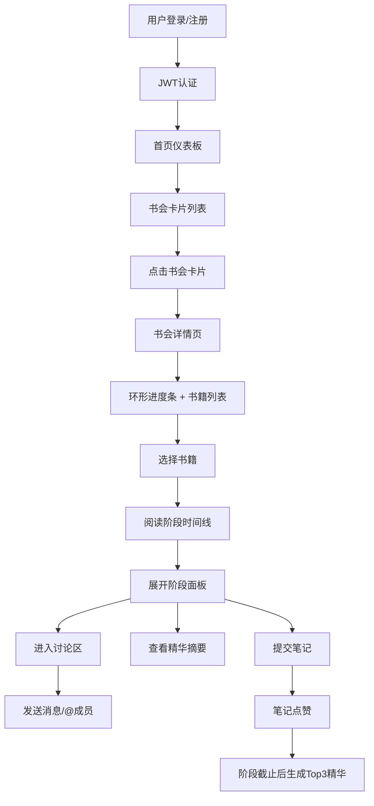

## 1. 产品概述

社区读书会共读进度追踪与在线讨论应用，解决读书会成员时间协调困难、阅读进度和讨论记录分散等问题，提供一站式共读管理平台。

- 核心目标：帮助读书会高效管理阅读计划、沉淀成员笔记、促进在线讨论交流
- 目标用户：社区读书会组织者及成员
- 市场价值：提升读书会运营效率，增强成员参与感，沉淀高质量阅读内容

## 2. 核心功能

### 2.1 用户角色

| 角色 | 注册方式 | 核心权限 |
|------|----------|----------|
| 普通用户 | 邮箱注册登录 | 浏览公开书会、加入书会、提交笔记、参与讨论 |
| 书会创建者 | 邮箱注册登录后创建书会 | 管理书会信息、添加书籍、设置阅读阶段、管理成员 |

### 2.2 功能模块

1. **首页仪表板**：书会卡片列表、阅读进度概览、截止日期提醒
2. **书会详情页**：环形进度条、书籍列表、阅读阶段时间线
3. **书籍详情页**：阅读阶段折叠面板、精华摘要展示、笔记提交区
4. **讨论区页面**：分阶段讨论、@成员提醒、未读消息提示
5. **登录/注册页**：用户认证、JWT令牌管理

### 2.3 页面详情

| 页面名称 | 模块名称 | 功能描述 |
|----------|----------|----------|
| 首页仪表板 | 书会卡片列表 | 展示用户所有书会，包含封面、书名、剩余天数，hover上浮效果 |
| 首页仪表板 | 导航栏 | 顶部导航，移动端收起为汉堡菜单 |
| 书会详情页 | 环形进度条 | SVG绘制，显示整体笔记提交率，颜色渐变#3498DB到#2ECC71 |
| 书会详情页 | 时间线阶段列表 | 垂直时间轴，阶段卡片左侧#3498DB实线，圆点标记#B0BEC5 |
| 书籍详情页 | 折叠面板 | 每个阶段可展开，显示笔记区和讨论区入口 |
| 书籍详情页 | 精华摘要 | 浅金色#FFF8E1背景，深金色#F39C12左边框，展示点赞前3笔记 |
| 讨论区页面 | 消息列表 | 按时间排序，用户头像为首字母圆形，背景色依用户名哈希 |
| 讨论区页面 | @提及功能 | 输入@弹出用户列表，选中后插入高亮文本 |
| 讨论区页面 | 未读提示 | 新消息不在可视区时显示浮动按钮 |
| 笔记提交 | 表单组件 | 文字≤2000字，最多3张图片上传，支持预览 |
| 登录/注册 | 认证表单 | 邮箱密码登录注册，JWT有效期24小时 |

## 3. 核心流程

用户登录后进入首页仪表板，查看已加入的书会列表。点击书会卡片进入详情页，查看整体阅读进度和书籍列表。选择书籍后展开阅读阶段时间线，每个阶段可以提交笔记、查看精华摘要、进入讨论区。在讨论区可以发送消息、@成员、查看历史讨论。

## 4. 用户界面设计

### 4.1 设计风格

- **主色调**：暖白#FDFCF0背景，深蓝#2C3E50标题字体
- **辅助色**：#3498DB（蓝色）、#2ECC71（绿色）、#F39C12（金色）
- **卡片样式**：白色背景，细微阴影，边框#E8E6D9，圆角8px
- **按钮样式**：圆角6px，hover有颜色加深效果，transition 0.2s
- **字体**：系统字体栈，标题font-weight 600，正文font-weight 400
- **布局**：卡片式布局，最大宽度1200px居中，间距以8px为基准
- **图标**：使用lucide-react图标库，统一大小20px

### 4.2 页面设计概述

| 页面名称 | 模块名称 | UI元素 |
|----------|----------|--------|
| 首页仪表板 | 书会卡片 | 网格布局，4列（桌面）/ 2列（移动端），封面300x200裁剪，hover上浮+阴影加深 |
| 书会详情页 | 环形进度条 | SVG绘制，stroke渐变，中心显示百分比 |
| 书籍详情页 | 时间线 | 左侧垂直#3498DB实线，阶段圆点#B0BEC5，卡片展开动画 |
| 讨论区 | 消息气泡 | 圆角矩形，左侧头像，@提及高亮显示为蓝色背景 |
| 精华摘要 | 摘要卡片 | 浅金色背景，左边框4px#F39C12，点赞数徽章 |

### 4.3 响应式设计

- **桌面端**（>768px）：导航栏完整显示，书会卡片4列网格，时间线左右布局
- **平板端**（≤768px）：导航栏汉堡菜单，书会卡片2列网格，时间线纵向全宽
- **移动端**（≤480px）：书会卡片1列，字体大小适当缩小，间距调整

### 4.4 交互与动画

- 卡片hover：transform: translateY(-4px)，box-shadow加深，transition 0.2s ease
- 折叠面板：max-height过渡，内容淡入
- 新消息提示：浮动按钮弹跳动画
- 页面加载：骨架屏占位，内容渐入
- 按钮点击：scale(0.98)反馈
