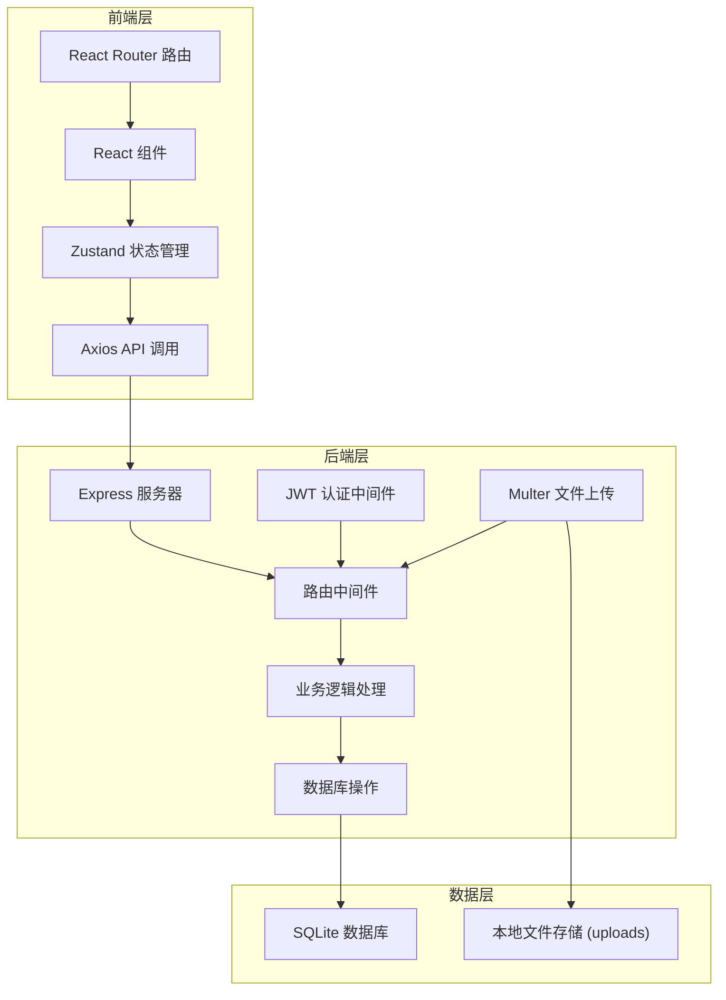
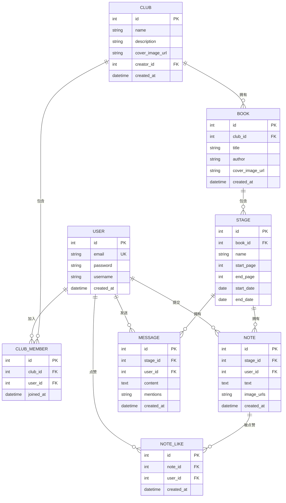

## 1. 架构设计



## 2. 技术描述

- **前端**：React 18 + TypeScript + Vite
- **状态管理**：Zustand
- **路由**：React Router DOM v6
- **HTTP 客户端**：Axios
- **后端**：Express 4 + TypeScript
- **数据库**：SQLite (better-sqlite3)
- **认证**：JSON Web Token (jsonwebtoken)
- **文件上传**：Multer
- **跨域**：CORS
- **构建工具**：Vite 5

## 3. 项目结构

```
auto297/
├── src/
│   ├── client/                 # 前端代码
│   │   ├── App.tsx            # 根组件，路由配置
│   │   ├── main.tsx           # 入口文件
│   │   ├── store/
│   │   │   └── useBookClubStore.ts  # Zustand 全局状态
│   │   ├── pages/             # 页面组件
│   │   │   ├── Dashboard.tsx
│   │   │   ├── BookClubDetail.tsx
│   │   │   ├── BookDetail.tsx
│   │   │   ├── Discussion.tsx
│   │   │   ├── Login.tsx
│   │   │   └── Register.tsx
│   │   ├── components/        # 可复用组件
│   │   │   ├── Navbar.tsx
│   │   │   ├── BookClubCard.tsx
│   │   │   ├── CircularProgress.tsx
│   │   │   ├── StageTimeline.tsx
│   │   │   ├── NoteCard.tsx
│   │   │   ├── MessageBubble.tsx
│   │   │   ├── Avatar.tsx
│   │   │   ├── MentionInput.tsx
│   │   │   ├── ImageUpload.tsx
│   │   │   └── ProtectedRoute.tsx
│   │   ├── hooks/             # 自定义 Hooks
│   │   │   ├── useAuth.ts
│   │   │   └── usePolling.ts
│   │   ├── utils/             # 工具函数
│   │   │   ├── api.ts
│   │   │   ├── colors.ts
│   │   │   └── formatDate.ts
│   │   ├── types/             # 类型定义
│   │   │   └── index.ts
│   │   └── styles/            # 全局样式
│   │       └── index.css
│   └── server/                # 后端代码
│       ├── server.ts          # Express 入口
│       ├── db/
│       │   └── database.ts    # SQLite 数据库操作
│       ├── routes/
│       │   ├── bookClubRoutes.ts
│       │   └── discussionRoutes.ts
│       ├── middleware/
│       │   └── auth.ts        # JWT 认证中间件
│       ├── uploads/           # 上传文件存储目录
│       └── types/
│           └── index.ts
├── index.html
├── vite.config.js
├── tsconfig.json
├── package.json
└── database.db                # SQLite 数据库文件（运行时生成）
```

## 4. 路由定义

| 路由 | 页面 | 权限 | 说明 |
|------|------|------|------|
| /login | Login | 公开 | 用户登录 |
| /register | Register | 公开 | 用户注册 |
| /books | Dashboard | 需要登录 | 首页仪表板，书会列表 |
| /club/:id | BookClubDetail | 需要登录 | 书会详情页 |
| /book/:id | BookDetail | 需要登录 | 书籍详情页，阶段时间线 |
| /discussion/:stageId | Discussion | 需要登录 | 分阶段讨论区 |
| * | Dashboard | - | 404 重定向 |

## 5. API 定义

### 5.1 认证接口

```typescript
// POST /api/auth/register
interface RegisterRequest {
  email: string;
  password: string;
  username: string;
}

interface AuthResponse {
  token: string;
  user: {
    id: number;
    email: string;
    username: string;
  };
}

// POST /api/auth/login
interface LoginRequest {
  email: string;
  password: string;
}
```

### 5.2 书会接口

```typescript
// POST /api/clubs - 创建书会
interface CreateClubRequest {
  name: string;
  description: string;
  coverImage?: File;
}

interface Club {
  id: number;
  name: string;
  description: string;
  coverImageUrl: string;
  creatorId: number;
  createdAt: string;
}

// GET /api/clubs?userId=xxx - 获取用户书会列表
// GET /api/clubs/:id - 获取书会详情
// GET /api/clubs/:id/books - 获取书会书籍列表

// POST /api/books - 添加书籍及阅读阶段
interface CreateBookRequest {
  clubId: number;
  title: string;
  author: string;
  coverImage?: File;
  stages: {
    name: string;
    startPage: number;
    endPage: number;
    startDate: string;
    endDate: string;
  }[];
}

interface Book {
  id: number;
  clubId: number;
  title: string;
  author: string;
  coverImageUrl: string;
  stages: Stage[];
}

interface Stage {
  id: number;
  bookId: number;
  name: string;
  startPage: number;
  endPage: number;
  startDate: string;
  endDate: string;
  isActive: boolean;
  hasEnded: boolean;
}

// GET /api/books/:id/stages - 获取书籍阅读阶段
```

### 5.3 讨论与笔记接口

```typescript
// POST /api/notes - 提交笔记
interface CreateNoteRequest {
  stageId: number;
  text: string;
  imageUrls: string[];
}

interface Note {
  id: number;
  stageId: number;
  userId: number;
  username: string;
  text: string;
  imageUrls: string[];
  likes: number;
  isLikedByMe: boolean;
  createdAt: string;
}

// GET /api/notes?stageId=xxx - 获取阶段笔记
// POST /api/notes/:id/like - 点赞笔记

// POST /api/messages - 发送讨论消息
interface CreateMessageRequest {
  stageId: number;
  content: string;
  mentions: number[]; // userIds
}

interface Message {
  id: number;
  stageId: number;
  userId: number;
  username: string;
  content: string;
  mentions: number[];
  createdAt: string;
}

// GET /api/messages?stageId=xxx - 获取阶段讨论消息
// POST /api/upload - 上传图片
interface UploadResponse {
  url: string;
}
```

## 6. 数据模型

### 6.1 ER 图



### 6.2 数据流向说明

**前端数据流向**：
1. 页面组件通过 `useBookClubStore` 获取状态
2. Store 调用 `api.ts` 中的请求函数
3. Axios 发送请求到 `/api/*`
4. 响应数据更新 Store 状态
5. 组件自动重新渲染

**后端数据流向**：
1. Express 接收 HTTP 请求
2. JWT 中间件验证 token（需要认证的接口）
3. 路由匹配到对应处理函数
4. 调用 `database.ts` 中的 CRUD 方法
5. 操作 SQLite 数据库文件
6. 返回 JSON 响应

## 7. 性能优化策略

1. **LCP 优化**：
   - 关键资源预加载
   - 图片懒加载
   - 代码分割，首屏只加载必要代码
   - 骨架屏减少感知等待时间

2. **接口响应优化**：
   - 数据库索引优化
   - 笔记提交接口异步处理图片压缩
   - 使用连接池（better-sqlite3 同步 API 本身高效）

3. **讨论区实时性优化**：
   - 前端每 3 秒轮询未读消息数
   - 仅当未读数变化时请求完整消息列表
   - 消息列表虚拟滚动（如消息超过 100 条）

4. **前端缓存**：
   - Zustand 状态持久化（可选）
   - 图片 CDN 缓存
   - API 响应缓存（GET 请求短时间缓存）
