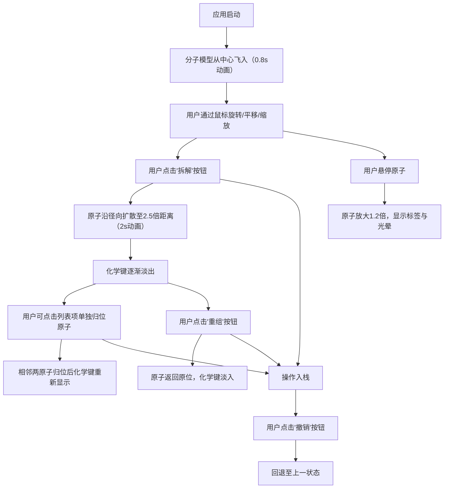

## 1. 产品概述

一个基于 Three.js 的 3D 分子结构交互式拆解与组装应用，用户可以在三维空间中旋转、拆解并重新组装咖啡因或葡萄糖等分子模型，提供沉浸式的化学分子可视化体验。

- 面向用户：化学学习者、教育工作者、科学可视化爱好者
- 核心价值：通过交互式 3D 可视化让抽象的分子结构变得直观可感

## 2. 核心功能

### 2.1 功能模块

1. **3D 分子场景**：实时渲染分子原子与化学键，支持旋转、平移、缩放
2. **拆解/重组控制**：一键拆解或重组整个分子，带平滑动画效果
3. **原子信息预览**：鼠标悬停显示原子元素信息和角色描述
4. **拆解原子管理**：列表显示已拆解原子，支持单独归位
5. **操作历史撤销**：记录操作历史，支持最多 20 步连续撤销

### 2.2 页面详情

| 页面名称 | 模块名称 | 功能描述 |
|-----------|-------------|---------------------|
| 主页面 | 3D 场景渲染 | 渲染咖啡因分子模型，支持鼠标交互（旋转、平移、缩放） |
| 主页面 | UI 控制面板 | 左侧毛玻璃面板，包含拆解/重组/撤销/重置视角按钮 |
| 主页面 | 原子信息标签 | 悬停时显示元素符号与角色描述，带光晕效果 |
| 主页面 | 拆解原子列表 | 显示所有原子，高亮选中，点击单独归位 |

## 3. 核心流程

## 4. 用户界面设计

### 4.1 设计风格

- **主题色**：科技感深色主题，主色 cyan #00D2FF，辅色蓝紫渐变 #00D2FF → #3A7BD5
- **背景**：深空渐变 #0B0C10 到 #1F2833，半透明淡蓝网格地面
- **原子配色**：碳 #555555、氧 #FF0000、氮 #3050F8、氢 #FFFFFF
- **按钮风格**：渐变背景，圆角 8px，悬停亮度+15%，点击缩放 0.95
- **面板风格**：毛玻璃 rgba(30, 39, 51, 0.8)，模糊 12px，边框 rgba(255,255,255,0.2)，圆角 12px

### 4.2 页面设计概览

| 页面名称 | 模块名称 | UI 元素 |
|-----------|-------------|-------------|
| 主页面 | 3D 场景 | 深空渐变背景、网格地面、球形原子、圆柱化学键、OrbitControls |
| 主页面 | 左侧面板 | 宽度 300px、毛玻璃、cyan 标题色、渐变按钮、原子列表 |
| 主页面 | 原子标签 | 半透明白底 rgba(255,255,255,0.9)、文字 #2C3E50、字号 14px |
| 主页面 | 列表高亮 | 选中背景 #3498DB |

### 4.3 响应式设计

桌面端优先，UI 面板固定左侧 300px，3D 场景占满剩余空间。

### 4.4 3D 场景指导

- **环境**：深空渐变背景，营造太空/实验室氛围
- **光照**：AmbientLight + DirectionalLight，确保原子立体感
- **相机**：PerspectiveCamera，初始距离 5 单位，fov 50
- **交互**：OrbitControls，左键旋转、右键平移、滚轮缩放
- **动画**：原子生成时从中心飞入（0.8s spring），拆解/重组（2s 匀速），悬停放大与光晕（spring 刚度200阻尼20）
- **后处理**：可选 Bloom 效果增强光晕
