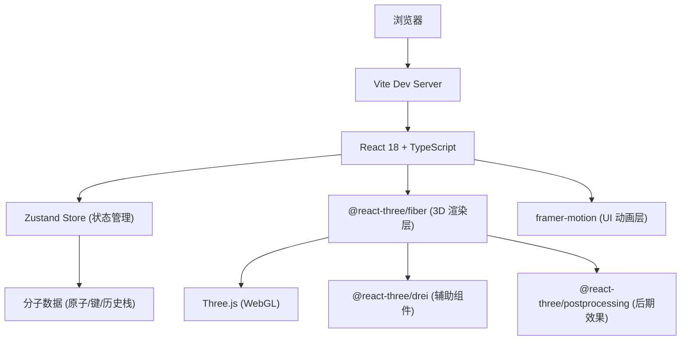

## 1. 架构设计



## 2. 技术选型

- **前端框架**：React 18 + TypeScript
- **构建工具**：Vite 5 + @vitejs/plugin-react
- **3D 渲染**：Three.js + @react-three/fiber 9 + @react-three/drei 9
- **状态管理**：Zustand 4
- **UI 动画**：framer-motion 11
- **后期处理**：@react-three/postprocessing
- **包管理器**：npm

## 3. 路由定义

单页应用，无需路由。

## 4. 数据模型

### 4.1 数据结构定义

```typescript
interface Atom {
  id: string;           // 唯一标识，如 "C1", "O2"
  element: 'C' | 'O' | 'N' | 'H';  // 元素类型
  originalPosition: [number, number, number];  // 原始坐标
  currentPosition: [number, number, number];   // 当前坐标
  role: string;        // 角色描述，如 "环骨架"
  isAssembled: boolean; // 是否已归位
}

interface Bond {
  id: string;
  atom1Id: string;
  atom2Id: string;
}

interface MoleculeState {
  atoms: Atom[];
  bonds: Bond[];
  selectedAtomId: string | null;
  hoveredAtomId: string | null;
  isDisassembled: boolean;
  history: HistoryEntry[];
}

interface HistoryEntry {
  atoms: Atom[];
  isDisassembled: boolean;
  timestamp: number;
}
```

### 4.2 Zustand Store Actions

- `disassembleAll()`: 拆解所有原子
- `assembleAll()`: 重组所有原子
- `assembleAtom(atomId: string)`: 单独归位某原子
- `setHoveredAtom(atomId: string | null)`: 设置悬停原子
- `setSelectedAtom(atomId: string | null)`: 设置选中原子
- `undo()`: 撤销操作
- `resetCamera()`: 重置相机视角

## 5. 文件结构

```
d:\Pro\tasks\auto299\
├── package.json
├── vite.config.ts
├── tsconfig.json
├── index.html
└── src/
    ├── main.tsx              # React 挂载入口
    ├── App.tsx               # 根组件
    ├── store.ts              # Zustand 状态管理
    ├── data/
    │   └── molecule.ts       # 咖啡因分子数据
    └── components/
        ├── Molecule.tsx      # 3D 分子场景
        ├── Atom3D.tsx        # 单个原子组件
        ├── Bond3D.tsx        # 单个化学键组件
        ├── UIPanel.tsx       # UI 控制面板
        └── AtomLabel.tsx     # 原子悬停标签
```

## 6. 性能优化策略

- 使用 Three.js InstancedMesh 减少 draw call（若原子数量 > 30）
- 动画使用 requestAnimationFrame 驱动，避免不必要的重渲染
- Zustand 选择器避免全组件重渲染
- 悬停检测使用 raycaster，每帧限制检测频率
