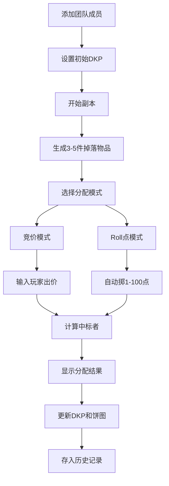

## 1. 产品概述

公会战利品分配模拟器是一款专为游戏公会设计的DKP（Dragon Kill Points）分配工具，解决团队副本掉落物品时手动分配效率低、易起争执的问题。面向公会会长、团长及团队管理成员，提供自动化、透明化的战利品分配方案。

- 核心价值：通过竞价和Roll点两种分配模式，实现公平、高效的战利品分配
- 目标用户：游戏公会管理层、团队副本指挥
- 市场定位：MMORPG游戏公会管理工具

## 2. 核心功能

### 2.1 用户角色
| 角色 | 注册方式 | 核心权限 |
|------|---------|----------|
| 公会管理员 | 直接使用 | 团队管理、物品分配、历史记录查看与导出 |

### 2.2 功能模块
1. **团队管理模块**：玩家添加、编辑、移除，职业绑定，DKP分值管理
2. **掉落模拟模块**：Boss击杀掉落生成，品质概率控制，物品属性展示
3. **分配引擎模块**：竞价分配模式，Roll点分配模式，DKP计算与扣除
4. **结果可视化模块**：分配结果弹窗，Chart.js饼图展示职业DKP占比
5. **历史记录模块**：时间线展示，筛选功能，CSV导出

### 2.3 页面详情
| 页面名称 | 模块名称 | 功能描述 |
|---------|----------|----------|
| 主界面 | 团队管理面板 | 左侧固定显示团队列表和添加玩家表单，支持实时刷新 |
| 主界面 | 掉落展示区 | 右侧上方展示3-5件掉落物品卡片，悬停放大显示详细属性 |
| 主界面 | 分配控制区 | 右侧下方模式切换按钮、出价输入、分配执行按钮 |
| 主界面 | 结果弹窗 | 显示中标者、物品信息、消耗DKP |
| 主界面 | DKP占比图 | Chart.js饼图实时展示各职业剩余DKP占比 |
| 历史面板 | 时间线展示 | 按时间顺序展示分配记录，支持职业/日期筛选 |

## 3. 核心流程

用户进入应用后，首先在左侧面板添加团队成员并设置初始DKP。点击"开始副本"按钮模拟Boss击杀，系统随机生成3-5件掉落物品。选择分配模式（竞价/Roll点），竞价模式下输入各玩家出价，Roll点模式下系统自动掷点。分配完成后弹窗显示结果，自动更新DKP和饼图，所有记录存入历史面板。

## 4. 用户界面设计

### 4.1 设计风格
- **主色调**：暗色主题，背景`#1a1a2e`，卡片`#16213e`，强调色`#e94560`
- **品质颜色**：史诗紫色、精良蓝色、优秀绿色
- **按钮风格**：圆角矩形，悬停放大效果，点击反馈动画
- **字体**：显示字体使用Cinzel（游戏风格衬线体），正文字体使用Noto Sans SC
- **布局**：左窄右宽，左侧280px固定宽度，右侧弹性布局
- **图标**：使用Font Awesome或内联SVG图标，时钟图标用于历史记录

### 4.2 页面设计概述
| 页面名称 | 模块名称 | UI元素 |
|---------|----------|---------|
| 主界面 | 团队管理面板 | 玩家卡片（职业图标、名称、DKP分值），添加表单（职业下拉、名称输入、DKP输入），编辑/删除按钮 |
| 主界面 | 掉落展示区 | 物品卡片（80x80px，品质边框，悬停放大1.1倍，tooltip显示属性） |
| 主界面 | 分配控制区 | 模式切换标签按钮，出价输入框组，执行分配按钮，状态提示 |
| 主界面 | 结果弹窗 | 物品大图标，中标者名称，消耗DKP数值，确认按钮 |
| 主界面 | DKP饼图 | Chart.js环形饼图，图例显示各职业，动画更新 |
| 历史面板 | 时间线 | 时间轴节点，记录卡片（日期、Boss、物品、中标者、模式），筛选器，导出按钮 |

### 4.3 响应式
- **桌面端**（>768px）：左窄右宽布局，左侧固定280px
- **移动端**（≤768px）：左侧面板折叠为顶部导航栏，可展开/收起
- 触摸优化：按钮最小高度44px，合理的触摸间距

### 4.4 动画效果
- 卡片入场：弹性动画 `cubic-bezier(0.68, -0.55, 0.27, 1.55)`，延迟错峰出现
- 物品悬停：`transform: scale(1.1)`，阴影加深
- 分配结果：弹窗从下往上滑入，带弹性效果
- 饼图更新：数据变化时平滑过渡动画（30fps+）

### 4.5 性能要求
- 40人团队、500条历史记录时，操作响应时间≤50ms
- Chart.js更新动画帧率≥30fps
- 使用虚拟滚动处理长列表（如需要）
