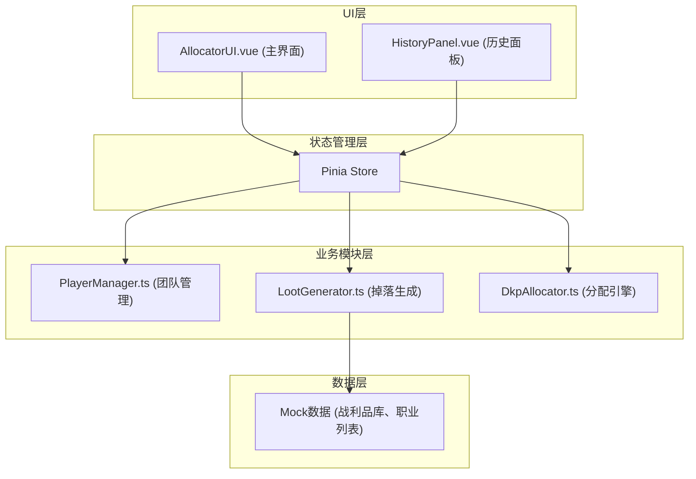

## 1. 架构设计



## 2. 技术描述

- **前端框架**：Vue 3.4 + TypeScript 5.3 + Composition API
- **构建工具**：Vite 5.0
- **状态管理**：Pinia 2.1
- **图表库**：Chart.js 4.4 + vue-chartjs 5.3
- **工具库**：@vueuse/core 10.7
- **样式方案**：原生CSS + CSS变量（不使用Tailwind，按用户自定义主题）
- **初始化方式**：npm create vite-init@latest . -- --template vue-ts

## 3. 目录结构

```
d:\Pro\tasks\auto3\
├── package.json
├── vite.config.js
├── tsconfig.json
├── index.html
├── src/
│   ├── main.ts
│   ├── App.vue
│   ├── stores/
│   │   └── allocation.ts          (Pinia状态管理)
│   ├── modules/
│   │   ├── player/
│   │   │   └── PlayerManager.ts   (团队管理模块)
│   │   ├── loot/
│   │   │   └── LootGenerator.ts   (掉落生成模块)
│   │   ├── dkp/
│   │   │   └── DkpAllocator.ts    (DKP分配引擎)
│   │   ├── ui/
│   │   │   ├── AllocatorUI.vue    (主界面组件)
│   │   │   └── HistoryPanel.vue   (历史面板组件)
│   │   └── shared/
│   │       └── types.ts           (共享类型定义)
│   └── assets/
│       └── mock/
│           └── lootDatabase.ts    (战利品库Mock数据)
```

## 4. 数据模型

### 4.1 类型定义

```typescript
// 职业枚举
type PlayerClass = 'warrior' | 'mage' | 'priest' | 'rogue' | 'hunter' | 'warlock' | 'paladin' | 'shaman'

// 物品品质
type ItemQuality = 'epic' | 'rare' | 'uncommon'

// 物品部位
type ItemSlot = 'head' | 'neck' | 'shoulder' | 'chest' | 'back' | 'wrist' | 'hands' | 'waist' | 'legs' | 'feet' | 'ring' | 'trinket' | 'weapon' | 'shield'

// 分配模式
type AllocationMode = 'bidding' | 'rolling'

// 玩家接口
interface Player {
  id: string
  name: string
  playerClass: PlayerClass
  dkp: number
  gearScore: number
  demandHistory: string[]
}

// 物品接口
interface LootItem {
  id: string
  name: string
  slot: ItemSlot
  quality: ItemQuality
  baseDkp: number
  stats: Record<string, number>
  bossName: string
}

// 分配记录接口
interface AllocationRecord {
  id: string
  timestamp: number
  bossName: string
  item: LootItem
  winner: Player
  mode: AllocationMode
  bidAmount?: number
  rollAmount?: number
}

// 出价记录
interface Bid {
  playerId: string
  amount: number
}
```

### 4.2 Mock数据

战利品库包含8个职业可用的各种部位装备，按Boss分类，每件物品有基础DKP值和属性。

## 5. 模块职责说明

### 5.1 PlayerManager.ts
- 管理玩家CRUD操作
- 维护玩家列表、职业、DKP、装备分数
- 提供玩家需求记录追踪
- 输出给分配模块使用

### 5.2 LootGenerator.ts
- 维护预设战利品库（按Boss分类）
- 根据品质概率（史诗10%、精良30%、优秀60%）随机生成3-5件物品
- 为每件物品生成唯一ID和属性

### 5.3 DkpAllocator.ts
- 竞价模式：接收玩家出价，计算最高出价者，扣除对应DKP
- Roll点模式：为符合条件玩家掷1-100随机数，最高者获得并扣除物品基础DKP
- 维护分配历史记录
- 输出分配结果给UI

### 5.4 AllocatorUI.vue
- 主界面布局：左侧团队管理、右侧掉落展示和分配控制
- 集成Chart.js展示职业DKP占比饼图
- 处理用户交互：添加/编辑/删除玩家、开始副本、执行分配
- 显示分配结果弹窗

### 5.5 HistoryPanel.vue
- 时间线形式展示历史记录
- 支持按职业、日期范围筛选
- 支持导出CSV格式
- 响应式设计适配移动端

## 6. 性能优化方案

1. **使用Pinia的computed缓存**：玩家列表、职业DKP统计等派生数据使用computed缓存
2. **虚拟滚动**：历史记录超过100条时启用虚拟滚动
3. **Chart.js优化**：使用`animation: { duration: 300 }`控制动画时长，禁用不必要的交互
4. **防抖处理**：搜索、筛选输入使用防抖
5. **批量更新**：多个状态更新使用`$patch`批量处理
6. **组件拆分**：将大组件拆分为小组件，利用Vue的更新粒度优化
7. **Object.freeze**：静态配置数据（如战利品库、职业列表）使用Object.freeze冻结

## 7. 关键算法

### 7.1 品质随机算法
```typescript
function rollQuality(): ItemQuality {
  const roll = Math.random() * 100
  if (roll < 10) return 'epic'      // 10%
  if (roll < 40) return 'rare'      // 30%
  return 'uncommon'                 // 60%
}
```

### 7.2 竞价分配算法
```typescript
function allocateByBidding(item: LootItem, bids: Bid[]): AllocationResult {
  const validBids = bids.filter(b => {
    const player = players.find(p => p.id === b.playerId)
    return player && player.dkp >= b.amount && b.amount > 0
  })
  if (validBids.length === 0) return { success: false }
  
  const winnerBid = validBids.reduce((max, curr) => 
    curr.amount > max.amount ? curr : max
  )
  const winner = players.find(p => p.id === winnerBid.playerId)!
  winner.dkp -= winnerBid.amount
  
  return { success: true, winner, dkpSpent: winnerBid.amount }
}
```

### 7.3 Roll点分配算法
```typescript
function allocateByRoll(item: LootItem, eligiblePlayers: Player[]): AllocationResult {
  if (eligiblePlayers.length === 0) return { success: false }
  
  const rolls = eligiblePlayers.map(p => ({
    playerId: p.id,
    roll: Math.floor(Math.random() * 100) + 1
  }))
  
  const winnerRoll = rolls.reduce((max, curr) => 
    curr.roll > max.roll ? curr : max
  )
  const winner = players.find(p => p.id === winnerRoll.playerId)!
  winner.dkp -= item.baseDkp
  
  return { success: true, winner, dkpSpent: item.baseDkp, roll: winnerRoll.roll }
}
```
